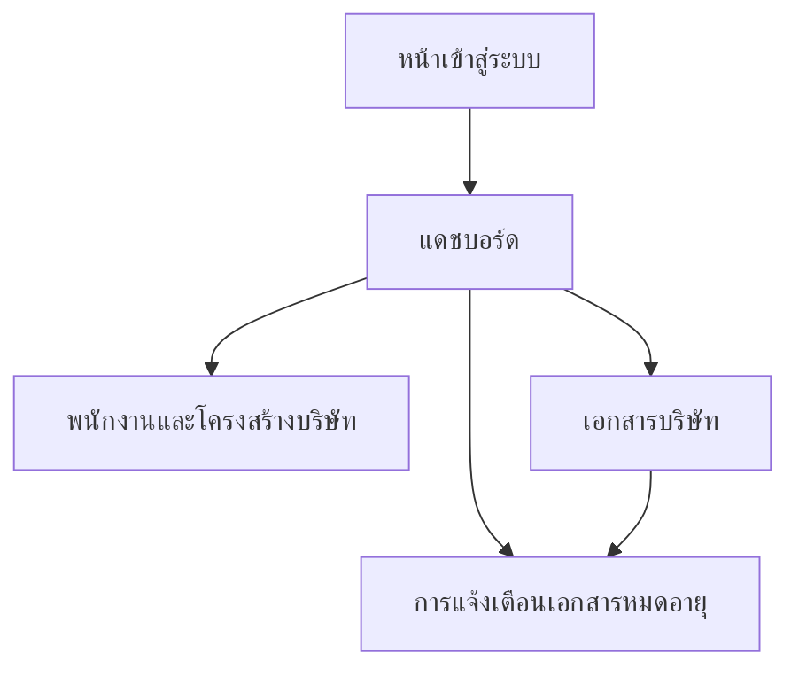

## 1. Product Overview
เว็บแอปภายในสำหรับบริหารจัดการข้อมูลบริษัทและเอกสารสำคัญในที่เดียว พร้อมแจ้งเตือนเอกสารใกล้หมดอายุ
ช่วยลดความเสี่ยงเอกสารขาดอายุ และทำให้ทีมเข้าถึงข้อมูลมาตรฐานเดียวกันได้เร็วขึ้น

### 1.1 Terminology
- **Employer (นายจ้าง) = Customer (ลูกค้า)**: ในบริบทธุรกิจนี้ “ลูกค้า” ของบริษัทเรา คือ “นายจ้าง” ที่ซื้อบริการด้านเอกสารแรงงานจากเรา จึงเป็น entity เดียวกันในระบบ (ใช้คำว่า “นายจ้าง/ลูกค้า” สลับกันตามหน้าจอ)
- **Representative (ผู้รับมอบอำนาจ/ตัวแทน)**: บุคคลที่ได้รับมอบหมายจากนายจ้าง/ลูกค้าให้ดำเนินการด้านเอกสารแทน โดยอาจมีบัญชีเข้าใช้งานระบบแบบจำกัดขอบเขต

## 2. Core Features

### 2.1 User Roles
| Role | วิธีใช้งาน | สิทธิ์หลัก |
|------|----------|-----------|
| ผู้ดูแลระบบ (Admin) | บัญชีบริษัท | จัดการทุกโมดูล, จัดการผู้ใช้/กำหนด Role, ตั้งค่าระบบ/เกณฑ์แจ้งเตือน |
| ฝ่ายขาย (Sale) | บัญชีบริษัท | จัดการข้อมูลลูกค้า, จัดการคำสั่งซื้อ, ดูบริการ (Service) เพื่ออ้างอิง, ดูสถานะงานเพื่ออัปเดตลูกค้า |
| ฝ่ายปฏิบัติการ (Operation) | บัญชีบริษัท | จัดการการดำเนินงาน, จัดการข้อมูลแรงงานต่างด้าว, จัดการเอกสารที่เกี่ยวข้อง, ปิดงาน/อัปเดตสถานะ |
| นายจ้าง (Employer) | บัญชีสำหรับลูกค้า (จำกัดตามองค์กร) | ดูข้อมูล/สถานะเฉพาะขององค์กรตนเอง, ดูคำสั่งซื้อและความคืบหน้า, ดู/ดาวน์โหลดเอกสารที่ได้รับสิทธิ์ |
| ผู้รับมอบอำนาจ (Representative) | บัญชีสำหรับตัวแทน | จัดการนายจ้าง/ลูกค้าของตน, จัดการแรงงานของตน, และจัดการคำขอ POA ของตน (ทั้ง 3 ส่วนแยกจากกัน) |

### 2.1.1 Permission Model (High-level)
- ระบบใช้ RBAC (Role-based access control) เป็นหลัก และสามารถจำกัดขอบเขตข้อมูลด้วยองค์กร (Organization scope) สำหรับ Employer/Representative
- ทุกหน้าที่เป็น “จัดการ (Create/Update/Delete)” ต้องตรวจ Role และบันทึกผู้กระทำ (audit log) ในอนาคต

### 2.1.2 Role Responsibilities (ตามกระบวนการทำงาน)
- **Sale**: สร้างนายจ้าง/ลูกค้า → สร้างคำสั่งซื้อ → เพิ่มรายการบริการเพื่อคำนวณราคา → ออก “ใบสรุปรายการบริการ/ใบเสนอราคา” → ส่งขออนุมัติ
- **Admin**: อนุมัติ/ปฏิเสธคำสั่งซื้อ (หรือกำหนดผู้มีสิทธิ์อนุมัติ)
- **Operation**: รับคำสั่งซื้อที่อนุมัติแล้ว → ดำเนินงานตามขั้นตอน → จัดการข้อมูลแรงงานและเอกสารที่เกี่ยวข้อง
- **Representative**: มี 3 โมดูลแยกกัน
  - จัดการนายจ้าง/ลูกค้าของตน (เพิ่ม/แก้ไข/ดูรายการ)
  - จัดการแรงงานของตน (เพิ่ม/แก้ไข/ดูรายการและเอกสาร)
  - ส่ง/ติดตามคำขอ POA (แนบเอกสารประกอบ) โดยเลือกอ้างอิงนายจ้าง/แรงงานจากข้อมูลที่ตนจัดการ
- **Employer/Customer**: เข้าดูคำสั่งซื้อของตน, สถานะความคืบหน้า, รายการแรงงาน และรับการแจ้งเตือนเอกสารแรงงานใกล้หมดอายุ

### 2.2 Feature Module
ระบบประกอบด้วยโมดูลหลักดังนี้:
1. **การจัดการ Service**: จัดการรายการบริการ/แพ็กเกจ (ใช้เป็นข้อมูลอ้างอิงในการขายและการดำเนินงาน)
2. **การจัดการข้อมูลนายจ้าง/ลูกค้า**: เก็บข้อมูลนายจ้าง/ลูกค้า (โปรไฟล์, ข้อมูลติดต่อ, เอกสารประกอบ)
2.1 **การจัดการผู้แทน/ผู้รับมอบอำนาจของนายจ้าง/ลูกค้า (Representative Management)**: รายชื่อผู้แทนของแต่ละนายจ้าง/ลูกค้า, ออก/เพิกถอนสิทธิ์, กำหนดขอบเขตงานที่เข้าถึงได้
3. **การจัดการคำสั่งซื้อ**: สร้าง/ติดตามคำสั่งซื้อ, สถานะงาน, เชื่อมโยงนายจ้าง/ลูกค้า-บริการ-แรงงาน
3.1 **คำนวณใบเสนอราคาและออกใบสรุปรายการบริการ**: เพิ่มรายการบริการ (service line items), คำนวณยอดรวม, ออกเอกสารสรุปเพื่อส่งลูกค้า, ส่งขออนุมัติ
4. **การจัดการข้อมูลแรงงานต่างด้าว**: ข้อมูลส่วนตัว/พาสปอร์ต/วีซ่า/ใบอนุญาตทำงาน, ความสัมพันธ์กับคำสั่งซื้อ
5. **การจัดการการดำเนินงาน**: ขั้นตอนงาน, ใบงาน, กำหนดผู้รับผิดชอบ, อัปเดตความคืบหน้า
6. **การจัดการออกเอกสารหนังสือมอบอำนาจ**: สร้าง/จัดเก็บ/ติดตามเอกสาร POA และเอกสารที่ต้องใช้ร่วม
6.1 **POA Request List + Pricing**: กำหนดรายการประเภทคำขอ POA ที่อนุญาต พร้อมราคากำหนดไว้ เพื่อใช้คำนวณค่าคำขอของตัวแทน
7. **ระบบแจ้งเตือนเอกสารใกล้หมดอายุ**: แจ้งเตือนเมื่อเอกสารแรงงานใกล้หมดอายุ (เช่น พาสปอร์ต/วีซ่า/ใบอนุญาต)

### 2.2.1 Document Storage Policy
- เอกสารทุกประเภทในระบบ “ไม่อัปโหลดเข้า storage ของระบบ” แต่ใช้การแนบ **ลิงก์ไป Google Drive** (เช่น WebView link หรือ fileId)
- ครอบคลุมเอกสาร:
  - เอกสารนายจ้าง/ลูกค้า (customer/employer documents)
  - เอกสารแรงงาน (worker documents)
  - เอกสารคำสั่งซื้อ (order/quote/poa/attachments)
- สิทธิ์การเข้าถึงเอกสารกำหนดที่ Google Drive (Shared Drive/Folder) และระบบบังคับ “สิทธิ์ในข้อมูล” แยกจาก “สิทธิ์ไฟล์”
- UX: ปุ่ม “เปิดเอกสาร” จะเปิดแท็บใหม่ไปยัง Google Drive และบันทึก log การเข้าดู (optional)

### 2.3 Page Details
| Page Name | Module Name | Feature description |
|-----------|-------------|---------------------|
| หน้าเข้าสู่ระบบ | เข้าสู่ระบบ | ล็อกอินด้วยอีเมล/รหัสผ่านบริษัท และพาไปหน้าแดชบอร์ดเมื่อสำเร็จ |
| หน้าเข้าสู่ระบบ | ออกจากระบบ | ออกจากระบบจากเมนูผู้ใช้ใน Header |
| แดชบอร์ด | สรุปเอกสารใกล้หมดอายุ | แสดงจำนวนเอกสารตามช่วงเวลา (เช่น หมดอายุภายใน 30 วัน/หมดอายุแล้ว) และลิงก์ไปหน้ารายการเอกสาร |
| แดชบอร์ด | การนำทางหลัก | แสดง Header + Sidebar สำหรับเข้าโมดูล พนักงาน/เอกสาร/การแจ้งเตือน |
| พนักงานและโครงสร้างบริษัท | รายการพนักงาน | แสดงตารางรายชื่อ ค้นหา และเปิดดูรายละเอียดพนักงาน |
| พนักงานและโครงสร้างบริษัท | รายละเอียดพนักงาน | แสดงข้อมูลพื้นฐานที่จำเป็น (ชื่อ, แผนก, ตำแหน่ง, ช่องทางติดต่อ) |
| เอกสารบริษัท | รายการเอกสาร | แสดงรายการเอกสารพร้อมวันหมดอายุ, ค้นหา/กรองตามสถานะ (ใกล้หมดอายุ/หมดอายุแล้ว) |
| เอกสารบริษัท | จัดการไฟล์เอกสาร | อัปโหลดไฟล์, ดาวน์โหลดไฟล์, ดูรายละเอียดเอกสาร (ชื่อ, ประเภท, วันหมดอายุ, เจ้าของ/หน่วยงาน) |
| เอกสารบริษัท | ตั้งค่าวันหมดอายุ | กำหนด/แก้ไขวันหมดอายุเพื่อใช้สร้างการแจ้งเตือน |
| การแจ้งเตือนเอกสารหมดอายุ | กล่องแจ้งเตือน | แสดงรายการแจ้งเตือนเรียงล่าสุด, เปิดดูรายละเอียด และทำเครื่องหมายว่าอ่านแล้ว |
| ตัวแทน (Representative) | จัดการตัวแทนของนายจ้าง/ลูกค้า | เพิ่ม/แก้ไข/ปิดการใช้งานตัวแทน, กำหนดสิทธิ์และขอบเขตงานที่เข้าถึงได้ |
| คำสั่งซื้อ | ใบเสนอราคา/ใบสรุปรายการบริการ | เพิ่มรายการบริการเพื่อคำนวณราคา และออกเอกสารสรุปรายการบริการเพื่อส่งลูกค้า |
| คำสั่งซื้อ | ส่งขออนุมัติ/อนุมัติคำสั่งซื้อ | เปลี่ยนสถานะจากร่าง → รออนุมัติ → อนุมัติ/ปฏิเสธ |
| หนังสือมอบอำนาจ | คำขอหนังสือมอบอำนาจ (POA request) | ตัวแทนส่งคำขอและเอกสารประกอบ เพื่อให้ Operation ออกหนังสือจากระบบ |
| หนังสือมอบอำนาจ | POA Request Pricing | ระบุ “นายจ้าง/ลูกค้า, จำนวนแรงงาน, เหตุผล/ประเภทคำขอ” เพื่อคำนวณค่าคำขอจากราคาที่กำหนดไว้ |
| พอร์ทัลนายจ้าง/ลูกค้า | ดูคำสั่งซื้อและแรงงาน | นายจ้าง/ลูกค้าดูคำสั่งซื้อ สถานะ และรายการแรงงานของตน พร้อมรับแจ้งเตือนวันหมดอายุเอกสาร |
| เอกสาร (ทุกโมดูล) | เปิดเอกสารจาก Google Drive | ทุกเอกสารถูกเก็บเป็นลิงก์ Google Drive และเปิดดูด้วยการกดปุ่มไปยัง Drive |

## 3. Core Process
**Admin Flow**
1) เข้าสู่ระบบ → แดชบอร์ด
2) เพิ่มผู้ใช้และกำหนด Role (Sale/Operation/Employer/Representative)
3) ตั้งค่าเกณฑ์แจ้งเตือนเอกสาร (เช่น 90/60/30 วัน)

**Sale Flow**
1) เข้าสู่ระบบ → ค้นหา/สร้างข้อมูลลูกค้า
2) สร้างคำสั่งซื้อและเพิ่มรายการบริการ (Service line items) เพื่อคำนวณราคา
3) ออกใบสรุปรายการบริการ/ใบเสนอราคา และส่งขออนุมัติ
4) เมื่อต้องการ อัปเดตลูกค้าด้วยสถานะคำสั่งซื้อ/งาน

**Approval Flow (Admin)**
1) ตรวจคำสั่งซื้อที่ “รออนุมัติ”
2) อนุมัติ → ส่งต่อให้ Operation ดำเนินการ หรือ ปฏิเสธพร้อมเหตุผล

**Operation Flow**
1) เข้าสู่ระบบ → รับงานจากคำสั่งซื้อที่อนุมัติแล้ว
2) เพิ่ม/อัปเดตข้อมูลแรงงานและเอกสารที่เกี่ยวข้อง
3) อัปเดตขั้นตอนการดำเนินงาน และตรวจรายการเอกสารใกล้หมดอายุจากการแจ้งเตือน

**Representative Flow (POA Request)**
1) เข้าสู่ระบบ → ไปที่หน้าคำขอ POA
2) สร้างคำขอ POA โดยระบุ
   - นายจ้าง/ลูกค้าที่ต้องการขอ
   - จำนวนแรงงาน
   - เหตุผล/ประเภทคำขอ (เลือกจาก POA Request List)
3) ระบบคำนวณ “ค่าคำขอ” ตามราคาที่กำหนดไว้ และแสดงสรุปก่อนส่ง
4) แนบลิงก์เอกสารประกอบ (Google Drive) และส่งคำขอ
5) ติดตามสถานะคำขอ (รอตรวจ/ต้องแก้ไข/ออกหนังสือแล้ว) และสถานะการชำระเงิน (ถ้ามี)

**Employer/Customer Flow**
1) เข้าสู่ระบบ → ดูรายการคำสั่งซื้อของตน
2) เปิดดูรายละเอียดคำสั่งซื้อ: สถานะ, ขั้นตอนดำเนินงาน, รายการแรงงาน
3) รับการแจ้งเตือนเมื่อเอกสารแรงงานใกล้หมดอายุ และดำเนินการตามที่ระบบแจ้ง

**Employer/Representative Flow**
1) เข้าสู่ระบบ → ดูคำสั่งซื้อและความคืบหน้าที่ตนมีสิทธิ์
2) ดาวน์โหลด/อัปโหลดเอกสารตามที่ระบบร้องขอ (ตามขอบเขตสิทธิ์)
3) รับการแจ้งเตือนเมื่อเอกสารแรงงานใกล้หมดอายุ (เฉพาะที่เกี่ยวข้อง)

