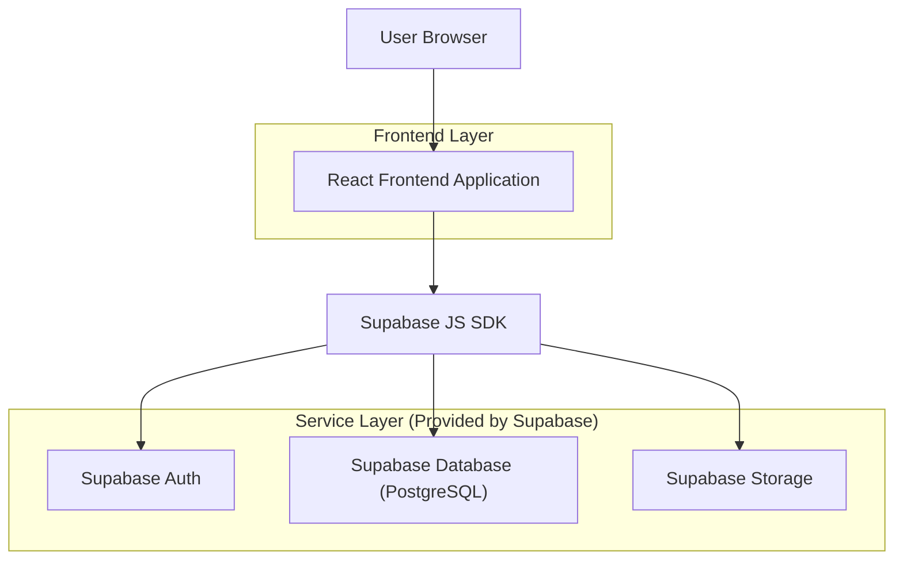
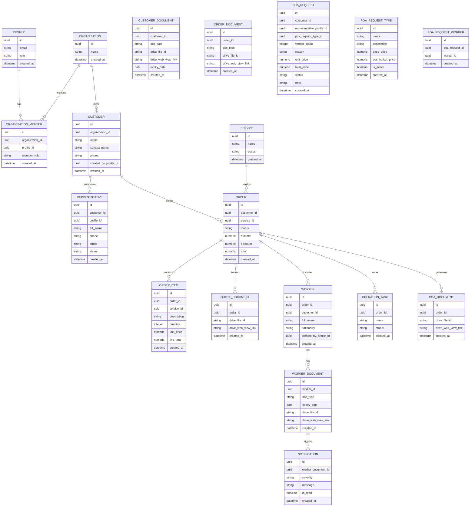

## 1.Architecture design


## 2.Technology Description
- Frontend: React@18 + vite + tailwindcss@3
- Backend: Supabase (Auth + Database + Storage)

## 2.2 Google Drive Document Linking
- เอกสารทั้งหมดอ้างอิงผ่าน Google Drive โดยเก็บ `drive_file_id` และ/หรือ `drive_web_view_link` ในฐานข้อมูล
- รูปแบบการใช้งานที่รองรับ
  - **Manual link** (เริ่มต้น): ผู้ใช้วางลิงก์ Google Drive ลงในฟอร์ม ระบบบันทึกและแสดงปุ่มเปิด
  - **Drive API integration** (ระยะถัดไป): ใช้ Google Drive API เพื่อสร้างโฟลเดอร์/อัปโหลด/กำหนดสิทธิ์อัตโนมัติ (เหมาะกับ Shared Drive)
- ข้อควรระวังด้านสิทธิ์
  - ระบบต้องไม่ assume ว่าลิงก์เป็น public; การเข้าถึงไฟล์ต้องจัดการที่ Google Drive
  - ฝั่งระบบยังต้องบังคับสิทธิ์ “ข้อมูลในระบบ” (RLS) แยกจากสิทธิ์ “ไฟล์บน Drive”

## 2.1 Authorization (RBAC)
- ใช้ Supabase Auth สำหรับการยืนยันตัวตน (email/password)
- เก็บ Role และขอบเขตข้อมูล (organization scope) ในตาราง `profiles` และ `organization_members`
- บังคับสิทธิ์ด้วย Supabase Row Level Security (RLS)
  - `admin`: เข้าถึงทุกองค์กรและทุกโมดูล
  - `sale`, `operation`: เข้าถึงข้อมูลภายในบริษัทตามสิทธิ์โมดูล
  - `employer`, `representative`: จำกัดข้อมูลตามองค์กรที่เป็นสมาชิก/ได้รับมอบหมาย

### Representative Constraint
- `representative` เข้าถึงได้เฉพาะข้อมูล “ของตน” และโมดูลที่เกี่ยวข้องกับงานของตน
  - `POA Requests` ของตน
  - `My Customers` (นายจ้าง/ลูกค้าของตน)
  - `My Workers` (แรงงานของตน)
- การขอ POA เป็นโมดูลแยกจากการจัดการนายจ้าง/แรงงาน โดยคำขอ POA เลือกอ้างอิง customer/worker ที่มีอยู่

## 3.Route definitions
| Route | Purpose |
|-------|---------|
| /login | เข้าสู่ระบบด้วยบัญชีบริษัท |
| / | แดชบอร์ดสรุปงานและแจ้งเตือน |
| /services | การจัดการบริการ (Service) |
| /customers | การจัดการข้อมูลนายจ้าง/ลูกค้า (Employer/Customer) |
| /representatives | จัดการรายชื่อตัวแทน/ผู้รับมอบอำนาจของนายจ้าง/ลูกค้า |
| /orders | การจัดการคำสั่งซื้อ |
| /workers | การจัดการข้อมูลแรงงานต่างด้าว |
| /operations | การจัดการการดำเนินงาน |
| /poa | การจัดการหนังสือมอบอำนาจ |
| /notifications | แจ้งเตือนเอกสารแรงงานใกล้หมดอายุ |
| /poa-requests | คำขอหนังสือมอบอำนาจ (Representative submit / Operation review) |
| /my-customers | (Representative) จัดการนายจ้าง/ลูกค้าของตน |
| /my-workers | (Representative) จัดการแรงงานของตน |

## 6.Data model(if applicable)

### 6.1 Data model definition

หมายเหตุ: เริ่มต้นสามารถใช้ logical FK ได้ แต่แนะนำให้ทำ FK จริง + index สำหรับคีย์ที่ค้นหาบ่อย (order_id, customer_id, expiry_date)

### 6.2 Data Definition Language
Profiles Table (profiles)
```
CREATE TABLE profiles (
  id UUID PRIMARY KEY REFERENCES auth.users(id) ON DELETE CASCADE,
  email TEXT,
  role TEXT NOT NULL CHECK (role IN ('admin','sale','operation','employer','representative')),
  created_at TIMESTAMPTZ DEFAULT NOW()
);
```

Organization Table (organizations)
```
CREATE TABLE organizations (
  id UUID PRIMARY KEY DEFAULT gen_random_uuid(),
  name TEXT NOT NULL,
  created_at TIMESTAMPTZ DEFAULT NOW()
);
```

Organization Member Table (organization_members)
```
CREATE TABLE organization_members (
  id UUID PRIMARY KEY DEFAULT gen_random_uuid(),
  organization_id UUID NOT NULL REFERENCES organizations(id) ON DELETE CASCADE,
  profile_id UUID NOT NULL REFERENCES profiles(id) ON DELETE CASCADE,
  member_role TEXT,
  created_at TIMESTAMPTZ DEFAULT NOW(),
  UNIQUE (organization_id, profile_id)
);
```

Representatives Table (representatives)
```
CREATE TABLE representatives (
  id UUID PRIMARY KEY DEFAULT gen_random_uuid(),
  customer_id UUID NOT NULL REFERENCES customers(id) ON DELETE CASCADE,
  profile_id UUID REFERENCES profiles(id) ON DELETE SET NULL,
  full_name TEXT NOT NULL,
  phone TEXT,
  email TEXT,
  status TEXT NOT NULL DEFAULT 'active' CHECK (status IN ('active','inactive','invited')),
  created_at TIMESTAMPTZ DEFAULT NOW()
);

CREATE INDEX idx_representatives_customer_id ON representatives(customer_id);
```

หมายเหตุ: `representatives.profile_id` ใช้ในกรณี “อนุญาตเข้าใช้งานระบบ” (role=representative) หากยังเป็นเพียงรายชื่อผู้ติดต่อสามารถปล่อยให้เป็น NULL ได้

Order Items Table (order_items)
```
CREATE TABLE order_items (
  id UUID PRIMARY KEY DEFAULT gen_random_uuid(),
  order_id UUID NOT NULL REFERENCES orders(id) ON DELETE CASCADE,
  service_id UUID REFERENCES services(id) ON DELETE SET NULL,
  description TEXT,
  quantity INT NOT NULL DEFAULT 1,
  unit_price NUMERIC(12,2) NOT NULL DEFAULT 0,
  line_total NUMERIC(12,2) GENERATED ALWAYS AS (quantity * unit_price) STORED,
  created_at TIMESTAMPTZ DEFAULT NOW()
);

CREATE INDEX idx_order_items_order_id ON order_items(order_id);
```

Quote Documents Table (quote_documents)
```
CREATE TABLE quote_documents (
  id UUID PRIMARY KEY DEFAULT gen_random_uuid(),
  order_id UUID NOT NULL REFERENCES orders(id) ON DELETE CASCADE,
  drive_file_id TEXT,
  drive_web_view_link TEXT,
  created_at TIMESTAMPTZ DEFAULT NOW()
);

CREATE INDEX idx_quote_documents_order_id ON quote_documents(order_id);
```

Customer Documents Table (customer_documents)
```
CREATE TABLE customer_documents (
  id UUID PRIMARY KEY DEFAULT gen_random_uuid(),
  customer_id UUID NOT NULL REFERENCES customers(id) ON DELETE CASCADE,
  doc_type TEXT,
  drive_file_id TEXT,
  drive_web_view_link TEXT NOT NULL,
  expiry_date DATE,
  created_at TIMESTAMPTZ DEFAULT NOW()
);

CREATE INDEX idx_customer_documents_customer_id ON customer_documents(customer_id);
CREATE INDEX idx_customer_documents_expiry_date ON customer_documents(expiry_date);
```

Order Documents Table (order_documents)
```
CREATE TABLE order_documents (
  id UUID PRIMARY KEY DEFAULT gen_random_uuid(),
  order_id UUID NOT NULL REFERENCES orders(id) ON DELETE CASCADE,
  doc_type TEXT,
  drive_file_id TEXT,
  drive_web_view_link TEXT NOT NULL,
  created_at TIMESTAMPTZ DEFAULT NOW()
);

CREATE INDEX idx_order_documents_order_id ON order_documents(order_id);
```

Worker Documents Table (worker_documents) (update)
```
ALTER TABLE worker_documents
  ADD COLUMN drive_file_id TEXT,
  ADD COLUMN drive_web_view_link TEXT;

CREATE INDEX idx_worker_documents_expiry_date ON worker_documents(expiry_date);
```

Customers Table (customers) (update)
```
ALTER TABLE customers
  ADD COLUMN created_by_profile_id UUID REFERENCES profiles(id) ON DELETE SET NULL;

CREATE INDEX idx_customers_created_by_profile_id ON customers(created_by_profile_id);
```

Workers Table (workers) (update)
```
ALTER TABLE workers
  ADD COLUMN customer_id UUID REFERENCES customers(id) ON DELETE SET NULL,
  ADD COLUMN created_by_profile_id UUID REFERENCES profiles(id) ON DELETE SET NULL,
  ALTER COLUMN order_id DROP NOT NULL;

CREATE INDEX idx_workers_customer_id ON workers(customer_id);
CREATE INDEX idx_workers_created_by_profile_id ON workers(created_by_profile_id);
```

POA Requests Tables (poa_requests, poa_request_workers)
```
CREATE TABLE poa_request_types (
  id UUID PRIMARY KEY DEFAULT gen_random_uuid(),
  name TEXT NOT NULL,
  description TEXT,
  base_price NUMERIC(12,2) NOT NULL DEFAULT 0,
  per_worker_price NUMERIC(12,2) NOT NULL DEFAULT 0,
  is_active BOOLEAN NOT NULL DEFAULT TRUE,
  created_at TIMESTAMPTZ DEFAULT NOW()
);

CREATE INDEX idx_poa_request_types_is_active ON poa_request_types(is_active);

CREATE TABLE poa_requests (
  id UUID PRIMARY KEY DEFAULT gen_random_uuid(),
  customer_id UUID REFERENCES customers(id) ON DELETE SET NULL,
  representative_profile_id UUID NOT NULL REFERENCES profiles(id) ON DELETE CASCADE,
  poa_request_type_id UUID NOT NULL REFERENCES poa_request_types(id) ON DELETE RESTRICT,
  worker_count INT NOT NULL DEFAULT 1,
  reason TEXT,
  unit_price NUMERIC(12,2) NOT NULL DEFAULT 0,
  total_price NUMERIC(12,2) NOT NULL DEFAULT 0,
  status TEXT NOT NULL DEFAULT 'submitted' CHECK (status IN ('submitted','need_info','issued','rejected')),
  note TEXT,
  created_at TIMESTAMPTZ DEFAULT NOW()
);

CREATE INDEX idx_poa_requests_rep ON poa_requests(representative_profile_id);
CREATE INDEX idx_poa_requests_status ON poa_requests(status);
CREATE INDEX idx_poa_requests_customer_id ON poa_requests(customer_id);
CREATE INDEX idx_poa_requests_type_id ON poa_requests(poa_request_type_id);

CREATE TABLE poa_request_workers (
  id UUID PRIMARY KEY DEFAULT gen_random_uuid(),
  poa_request_id UUID NOT NULL REFERENCES poa_requests(id) ON DELETE CASCADE,
  worker_id UUID NOT NULL REFERENCES workers(id) ON DELETE CASCADE,
  created_at TIMESTAMPTZ DEFAULT NOW(),
  UNIQUE (poa_request_id, worker_id)
);

CREATE INDEX idx_poa_request_workers_req ON poa_request_workers(poa_request_id);
```

RLS Notes (Representative)
- `poa_requests`: representative `SELECT/INSERT/UPDATE` เฉพาะแถวที่ `representative_profile_id = auth.uid()`
- `poa_request_types`: อ่านได้ทุกคนที่ authenticated (หรือจำกัดเฉพาะ role ที่เกี่ยวข้อง)
- `customers`: representative `INSERT` ได้โดยตั้ง `created_by_profile_id = auth.uid()` และ `SELECT/UPDATE` เฉพาะของตน
- `workers`: representative `INSERT/SELECT/UPDATE` เฉพาะของตนผ่าน `created_by_profile_id = auth.uid()`

Pricing Notes
- แนะนำให้บันทึก `unit_price` และ `total_price` เป็น snapshot ตอนส่งคำขอ เพื่อไม่ให้เปลี่ยนตามการปรับราคาในอนาคต
- การคำนวณตัวอย่าง: `total_price = base_price + (per_worker_price * worker_count)` (ปรับตามนโยบายบริษัท)

Order Status (suggested)
- `draft` (Sale กำลังจัดทำ)
- `pending_approval` (ส่งขออนุมัติ)
- `approved` / `rejected`
- `in_progress` (Operation กำลังดำเนินงาน)
- `completed` / `cancelled`

หมายเหตุ: ในการใช้งานจริงให้เปิด RLS และเขียน policy ตาม Role/Organization scope แทนการ GRANT แบบกว้าง

Storage
- ไม่ใช้ Supabase Storage สำหรับเอกสารหลัก แต่ใช้ Google Drive link/fileId (เก็บในตารางเอกสารแต่ละประเภท)
