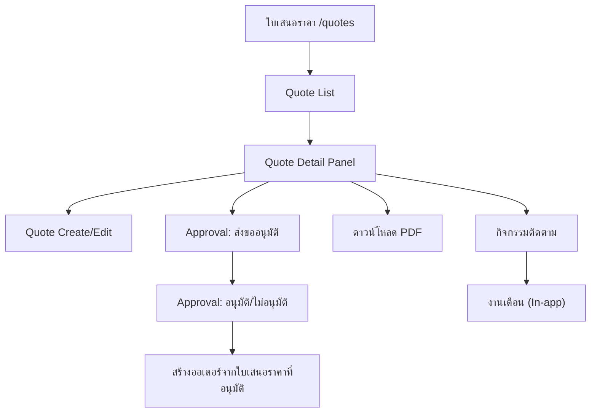

## 1. Product Overview
เพิ่มโมดูล **ใบเสนอราคา (Quotation)** เพื่อให้คุณสร้าง/ติดตาม/อนุมัติใบเสนอราคา และออก **ออเดอร์จากใบเสนอราคาที่อนุมัติแล้ว** ได้ในที่เดียว
ช่วยลดงานเอกสารซ้ำ พร้อมกิจกรรมติดตามและงานเตือนกันงานหลุด

## 2. Core Features

### 2.1 User Roles
| Role | Registration Method | Core Permissions |
|------|---------------------|------------------|
| Sales | เข้าระบบด้วยบัญชีพนักงาน | สร้าง/แก้ไขใบเสนอราคา, เพิ่มกิจกรรมติดตามและงานเตือน, ดาวน์โหลด PDF, ส่งขออนุมัติ |
| Approver (Manager) | เข้าระบบด้วยบัญชีพนักงาน | อนุมัติ/ไม่อนุมัติใบเสนอราคา, ดูประวัติการติดตาม |
| Admin | เข้าระบบด้วยบัญชีพนักงาน | สิทธิ์เทียบเท่า Approver + จัดการข้อมูลได้ทั้งหมด |

### 2.2 Feature Module
ข้อกำหนดนี้ประกอบด้วยหน้าหลักดังนี้:
1. **ใบเสนอราคา**: ลิสต์ใบเสนอราคา, สร้าง/แก้ไข, อนุมัติ, ดาวน์โหลด PDF, สร้างออเดอร์จากใบเสนอราคาที่อนุมัติ, กิจกรรมติดตามและงานเตือน

### 2.3 Page Details
| Page Name | Module Name | Feature description |
|-----------|-------------|---------------------|
| ใบเสนอราคา (/quotes) | Quote List | แสดงตารางใบเสนอราคา (เลขที่/ลูกค้า/ยอดรวม/สถานะ/ผู้สร้าง/อัปเดตล่าสุด) พร้อมค้นหา/กรองพื้นฐาน (สถานะ, ช่วงวันที่) |
| ใบเสนอราคา (/quotes) | Quote Create/Edit | สร้าง/แก้ไขใบเสนอราคา: ข้อมูลผู้รับใบเสนอราคา, รายการสินค้า/บริการ (จำนวน/ราคา/ส่วนลด), เงื่อนไข, วันหมดอายุ และคำนวณยอดรวม |
| ใบเสนอราคา (/quotes) | Quote Detail Panel | เปิดดูรายละเอียดใบเสนอราคาจากรายการ (เช่น แผงด้านขวาหรือ drawer) เพื่อดูสรุป, รายการ, สถานะอนุมัติ และการทำงานต่อเนื่อง |
| ใบเสนอราคา (/quotes) | Approval Workflow | ส่งขออนุมัติ และให้ผู้มีสิทธิ์กด อนุมัติ/ไม่อนุมัติ พร้อมบันทึก approved_by/approved_at และล็อกการแก้ไขเมื่ออนุมัติแล้ว (ยกเว้นผู้มีสิทธิ์) |
| ใบเสนอราคา (/quotes) | PDF Download | สร้างไฟล์ PDF จากข้อมูลใบเสนอราคาและให้ดาวน์โหลดได้ พร้อมแสดงตัวอย่างก่อนดาวน์โหลด (ขั้นต่ำ: ปุ่มดาวน์โหลด) |
| ใบเสนอราคา (/quotes) | Create Order From Approved Quote | สร้างออเดอร์จากใบเสนอราคาที่ “อนุมัติแล้ว” โดยดึงข้อมูลรายการ/ยอดรวมไปเป็นค่าเริ่มต้น และบันทึกความสัมพันธ์ว่าออเดอร์มาจากใบเสนอราคาใด |
| ใบเสนอราคา (/quotes) | Follow-up Activities | เพิ่ม/แก้ไขกิจกรรมติดตามที่ผูกกับใบเสนอราคา (เช่น โทร/อีเมล/นัด/งาน) พร้อมโน้ต, ผู้รับผิดชอบ และสถานะเสร็จ/ไม่เสร็จ |
| ใบเสนอราคา (/quotes) | Reminder Tasks | ตั้ง due date/time และ reminder time ให้กิจกรรม/งาน พร้อมแสดงงานใกล้ถึงกำหนด/เกินกำหนด และแจ้งเตือนในแอปเมื่อถึงเวลา |

## 3. Core Process
**Flow: สร้างและอนุมัติใบเสนอราคา**
1) คุณเข้า /quotes เพื่อดูรายการใบเสนอราคาและกดสร้างใหม่
2) คุณกรอกข้อมูลผู้รับ + รายการสินค้า/บริการ + เงื่อนไข แล้วบันทึกเป็น Draft
3) คุณส่งขออนุมัติ → ผู้อนุมัติเปิดดูรายละเอียดและกด อนุมัติ/ไม่อนุมัติ
4) เมื่ออนุมัติแล้ว คุณดาวน์โหลด PDF และ/หรือสร้างออเดอร์จากใบเสนอราคานั้น

**Flow: ติดตามงานและงานเตือน**
1) คุณเพิ่มกิจกรรมติดตามผูกกับใบเสนอราคา และตั้ง due/reminder
2) เมื่อทำงานเสร็จ คุณกด completed
3) ระบบรวมงานใกล้ถึงกำหนด/เกินกำหนด และแจ้งเตือนในแอปตามเวลาที่ตั้งไว้

