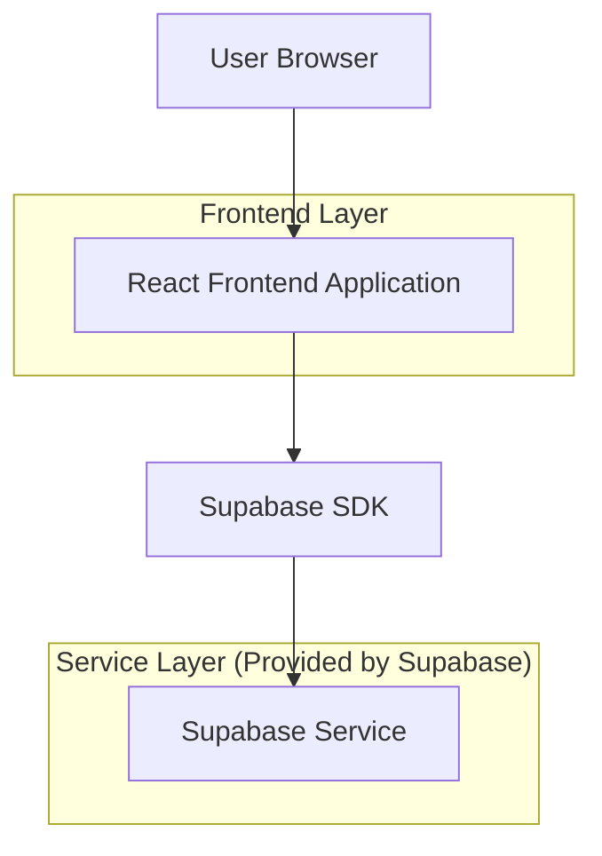
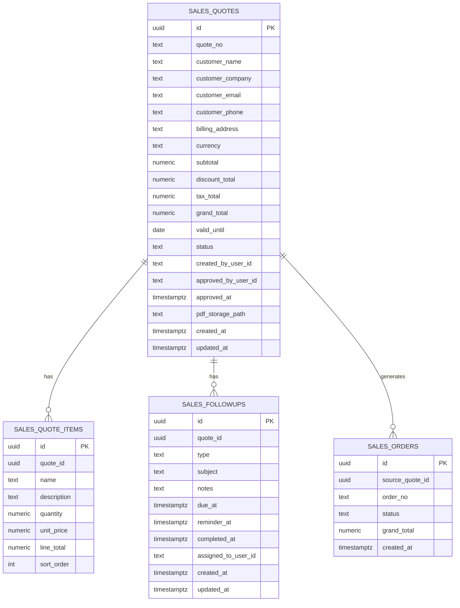

## 1.Architecture design


## 2.Technology Description
- Frontend: React@18 + vite + TypeScript + tailwindcss@3
- Backend: Supabase (Auth + PostgreSQL + Storage)

## 3.Route definitions
| Route | Purpose |
|-------|---------|
| /quotes | หน้าหลักใบเสนอราคา: ลิสต์/สร้าง/แก้ไข, อนุมัติ, ดาวน์โหลด PDF, สร้างออเดอร์จากใบเสนอราคาที่อนุมัติ, กิจกรรมติดตามและงานเตือน |
| /quotes/:quoteId | รองรับ deep-link ไปยังใบเสนอราคารายเดียว (เปิด detail panel/แท็บอัตโนมัติ) |

## 6.Data model(if applicable)

### 6.1 Data model definition


### 6.2 Data Definition Language
> หมายเหตุ: ใช้ “logical foreign keys” (เก็บ quote_id/source_quote_id เป็นคอลัมน์) โดยไม่บังคับ physical FK constraints

Quotes (sales_quotes)
```
CREATE TABLE sales_quotes (
  id UUID PRIMARY KEY DEFAULT gen_random_uuid(),
  quote_no TEXT NOT NULL,
  customer_name TEXT NOT NULL,
  customer_company TEXT,
  customer_email TEXT,
  customer_phone TEXT,
  billing_address TEXT,
  currency TEXT NOT NULL DEFAULT 'THB',
  subtotal NUMERIC(12,2) NOT NULL DEFAULT 0,
  discount_total NUMERIC(12,2) NOT NULL DEFAULT 0,
  tax_total NUMERIC(12,2) NOT NULL DEFAULT 0,
  grand_total NUMERIC(12,2) NOT NULL DEFAULT 0,
  valid_until DATE,
  status TEXT NOT NULL DEFAULT 'draft' CHECK (status IN ('draft','pending_approval','approved','rejected','cancelled')),
  created_by_user_id TEXT,
  approved_by_user_id TEXT,
  approved_at TIMESTAMPTZ,
  pdf_storage_path TEXT,
  created_at TIMESTAMPTZ NOT NULL DEFAULT NOW(),
  updated_at TIMESTAMPTZ NOT NULL DEFAULT NOW()
);

CREATE UNIQUE INDEX idx_sales_quotes_quote_no ON sales_quotes (quote_no);
CREATE INDEX idx_sales_quotes_status ON sales_quotes (status);
CREATE INDEX idx_sales_quotes_created_at ON sales_quotes (created_at DESC);
```

Quote items (sales_quote_items)
```
CREATE TABLE sales_quote_items (
  id UUID PRIMARY KEY DEFAULT gen_random_uuid(),
  quote_id UUID NOT NULL,
  name TEXT NOT NULL,
  description TEXT,
  quantity NUMERIC(12,2) NOT NULL DEFAULT 1,
  unit_price NUMERIC(12,2) NOT NULL DEFAULT 0,
  line_total NUMERIC(12,2) NOT NULL DEFAULT 0,
  sort_order INTEGER NOT NULL DEFAULT 0
);

CREATE INDEX idx_sales_quote_items_quote_id ON sales_quote_items (quote_id);
```

Follow-ups & reminders (sales_followups)
```
CREATE TABLE sales_followups (
  id UUID PRIMARY KEY DEFAULT gen_random_uuid(),
  quote_id UUID NOT NULL,
  type TEXT NOT NULL CHECK (type IN ('call','email','meeting','task')),
  subject TEXT NOT NULL,
  notes TEXT,
  due_at TIMESTAMPTZ,
  reminder_at TIMESTAMPTZ,
  completed_at TIMESTAMPTZ,
  assigned_to_user_id TEXT,
  created_at TIMESTAMPTZ NOT NULL DEFAULT NOW(),
  updated_at TIMESTAMPTZ NOT NULL DEFAULT NOW()
);

CREATE INDEX idx_sales_followups_quote_id ON sales_followups (quote_id);
CREATE INDEX idx_sales_followups_due_at ON sales_followups (due_at);
CREATE INDEX idx_sales_followups_reminder_at ON sales_followups (reminder_at);
```

Orders (ขั้นต่ำสำหรับ "สร้างออเดอร์จากใบเสนอราคา")
```
CREATE TABLE sales_orders (
  id UUID PRIMARY KEY DEFAULT gen_random_uuid(),
  source_quote_id UUID NOT NULL,
  order_no TEXT,
  status TEXT NOT NULL DEFAULT 'draft',
  grand_total NUMERIC(12,2) NOT NULL DEFAULT 0,
  created_at TIMESTAMPTZ NOT NULL DEFAULT NOW()
);

CREATE INDEX idx_sales_orders_source_quote_id ON sales_orders (source_quote_id);
```

Storage (สำหรับ PDF)
- Bucket: quote-pdfs
- เก็บ path ลง `sales_quotes.pdf_storage_path`

Permissions (แนวทางพื้นฐาน)
```
REVOKE ALL ON sales_quotes FROM anon;
REVOKE ALL ON sales_quote_items FROM anon;
REVOKE ALL ON sales_followups FROM anon;
REVOKE ALL ON sales_orders FROM anon;

GRANT ALL PRIVILEGES ON sales_quotes TO authenticated;
GRANT ALL PRIVILEGES ON sales_quote_items TO authenticated;
GRANT ALL PRIVILEGES ON sales_followups TO authenticated;
GRANT ALL PRIVILEGES ON sales_orders TO authenticated;
```