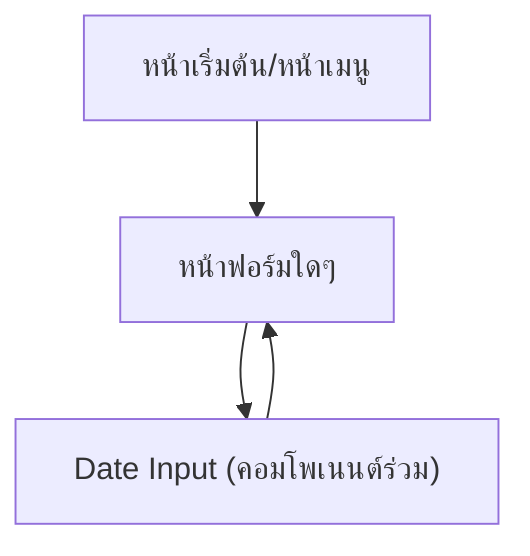

## 1. Product Overview
ทำ “Date Input Template” เป็นค่าเริ่มต้นมาตรฐานทั้งแอป เพื่อให้ทุกหน้าฟอร์มมีหน้าตา/พฤติกรรมเหมือนกันตามภาพ ลดความผิดพลาดเรื่องรูปแบบวันที่และการกรอกข้อมูล

## 2. Core Features

### 2.1 Feature Module
ความต้องการนี้ประกอบด้วยหน้าหลักขั้นต่ำดังนี้:
1. **หน้าฟอร์ม (ทุกหน้าที่มีช่องวันที่)**: ช่อง Date Input มาตรฐาน (อินพุต + ไอคอนปฏิทิน + ป๊อปอัปเลือกวัน)
2. **หน้าคู่มือคอมโพเนนต์ (สำหรับทีมภายใน)**: สเปกการใช้งาน/ข้อห้าม/ตัวอย่างโค้ดการเรียกใช้คอมโพเนนต์เดียวกัน

### 2.2 Page Details
| Page Name | Module Name | Feature description |
|---|---|---|
| หน้าฟอร์ม (ทุกหน้า) | Date Input (มาตรฐานทั้งแอป) | แสดงช่องวันที่หน้าตาเดียวกันตามภาพ: text field + ไอคอนปฏิทินด้านขวา + เปิดป๊อปอัปปฏิทินใต้ช่องเมื่อคลิก/โฟกัสแล้วกด Enter |
| หน้าฟอร์ม (ทุกหน้า) | การกรอก/แสดงผลค่า | แสดงรูปแบบวันที่แบบวัน/เดือน/ปี (dd/MM/yyyy) ในช่อง, รองรับ placeholder เมื่อว่าง, สะท้อนค่าที่เลือกจากปฏิทินลงในช่องทันที |
| หน้าฟอร์ม (ทุกหน้า) | Validation/สถานะ | รองรับสถานะ: default, hover, focus, error (แสดงข้อความใต้ช่อง), disabled (ห้ามแก้ไข/ห้ามเปิดปฏิทิน) |
| หน้าฟอร์ม (ทุกหน้า) | ข้อจำกัดช่วงวัน (ถ้ามีในฟอร์ม) | กำหนด minDate/maxDate ต่อการใช้งานแต่ละฟอร์ม และปิดการเลือกวันที่นอกช่วงในปฏิทิน |
| หน้าฟอร์ม (ทุกหน้า) | การเข้าถึง (Accessibility) | ใช้ label เชื่อมกับ input, รองรับคีย์บอร์ด: Tab โฟกัส, Enter เปิด/เลือก, Esc ปิด, ลูกศรนำทางในปฏิทิน |
| หน้าคู่มือคอมโพเนนต์ | จุดรวมศูนย์คอมโพเนนต์ | ระบุว่าทุกหน้าต้อง import “DateInput/DateField” จากที่เดียว (โฟลเดอร์ส่วนกลาง) และห้ามใช้ date picker อื่นโดยตรง |
| หน้าคู่มือคอมโพเนนต์ | ตัวอย่างการใช้งาน | แสดงตัวอย่างการใช้งานในฟอร์ม: value (รูปแบบเก็บข้อมูล), onChange, min/max, error message |

## 3. Core Process
**โฟลว์ผู้ใช้ (ผู้กรอกฟอร์ม):**
1) ผู้ใช้คลิกช่องวันที่หรือไอคอนปฏิทิน
2) ระบบเปิดป๊อปอัปปฏิทินใต้ช่อง (ยึดแนวซ้ายและกว้างใกล้เคียงช่อง)
3) ผู้ใช้เลื่อนเดือนด้วยปุ่มลูกศรซ้าย/ขวา แล้วคลิกวันที่
4) ระบบปิดป๊อปอัปและใส่ค่าที่เลือกลงในช่องทันที
5) หากเลือก/กรอกไม่ถูกต้อง (ตามกติกาฟอร์ม) ระบบแสดง error ใต้ช่องและโฟกัสกลับมาที่ช่อง

