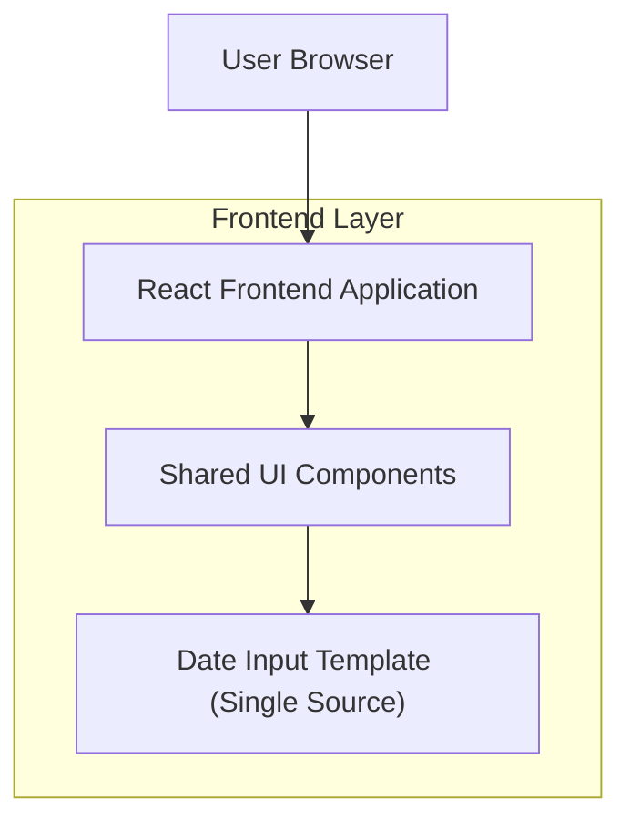

## 1.Architecture design

## 2.Technology Description
- Frontend: React@18 + TypeScript + tailwindcss@3 + vite
- Backend: None (คอมโพเนนต์ทำงานฝั่ง Frontend)
- Date utilities: date-fns (format/parse/validation)
- Calendar UI (ภายในคอมโพเนนต์): react-day-picker (หรือเทียบเท่าที่ให้ grid ปฏิทิน + keyboard nav ได้)

## 3.Route definitions
| Route | Purpose |
|---|---|
| / | หน้าเริ่มต้นของแอป (ลิงก์ไปหน้าฟอร์มต่างๆ) |
| /internal/component-guides/date-input | หน้าคู่มือภายในสำหรับสเปกและตัวอย่าง Date Input Template |

## 4.API definitions (If it includes backend services)
ไม่มี (คอมโพเนนต์ฝั่ง Frontend เท่านั้น)

## จุดรวมศูนย์คอมโพเนนต์ (สำคัญ)
**เป้าหมาย:** ให้ทุกหน้าฟอร์มใช้คอมโพเนนต์เดียวกัน 100% เพื่อล็อกหน้าตา/พฤติกรรม/รูปแบบข้อมูล

**โครงสร้างแนะนำ (Single source of truth):**
- `src/components/form/DateField/DateField.tsx` (คอมโพเนนต์หลัก)
- `src/components/form/DateField/index.ts` (re-export)
- `src/components/form/index.ts` (รวม export ของฟอร์มคอมโพเนนต์ทั้งหมด)

**สัญญาข้อมูล (Data contract):**
- ค่าใน state/ฟอร์ม: เก็บเป็น `YYYY-MM-DD` (date-only) เพื่อเลี่ยงปัญหา timezone
- ค่าแสดงผลใน UI: แสดงเป็น `dd/MM/yyyy` ตามภาพ

**ข้อกำหนดการใช้งาน:**
- ทุกหน้าฟอร์มต้อง import จาก `src/components/form` เท่านั้น
- ห้ามผูก date picker library เข้าหน้าฟอร์มโดยตรง (ต้องผ่าน DateField wrapper เสมอ)
