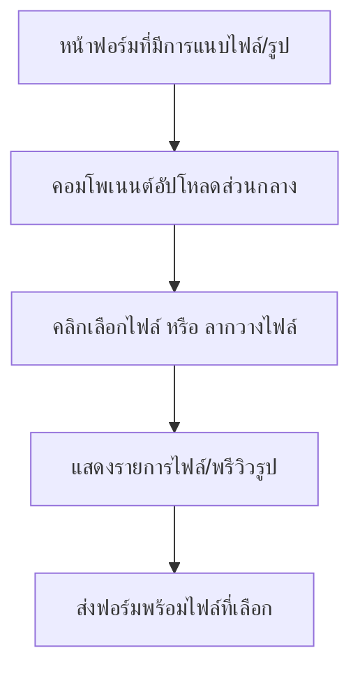

## 1. Product Overview
เทมเพลตอัปโหลดไฟล์/รูปแบบใช้ร่วมกันทั้งแอป สำหรับทุกหน้าฟอร์ม
รองรับคลิกเลือกไฟล์และลากวาง แสดงรายการ/พรีวิว และเลือกได้หลายไฟล์ พร้อมจุดรวมศูนย์คอมโพเนนต์ให้เรียกใช้มาตรฐานเดียวกัน

## 2. Core Features

### 2.1 Feature Module
ความต้องการนี้ประกอบด้วยหน้าหลักที่เกี่ยวข้องดังนี้:
1. **หน้าฟอร์มที่มีการแนบไฟล์/รูป**: กล่องอัปโหลด (คลิก+ลากวาง), รายการไฟล์ที่เลือก, พรีวิวรูป, รองรับหลายไฟล์, การเชื่อมต่อกับคอมโพเนนต์ส่วนกลาง

### 2.3 Page Details
| Page Name | Module Name | Feature description |
|-----------|-------------|---------------------|
| หน้าฟอร์มที่มีการแนบไฟล์/รูป | กล่องอัปโหลดไฟล์/รูป (คลิก+ลากวาง) | เลือกไฟล์ด้วยการคลิกเพื่อเปิดตัวเลือกไฟล์ และรองรับลากไฟล์มาวางลงในพื้นที่อัปโหลด |
| หน้าฟอร์มที่มีการแนบไฟล์/รูป | รองรับหลายไฟล์ | เพิ่มไฟล์ได้มากกว่าหนึ่งไฟล์ และสะสมรายการไฟล์ที่เลือกไว้ในฟิลด์เดียว |
| หน้าฟอร์มที่มีการแนบไฟล์/รูป | รายการไฟล์ที่เลือก | แสดงรายการไฟล์ทั้งหมดที่ถูกเลือก/ลากวาง พร้อมชื่อไฟล์และข้อมูลจำเป็นเพื่อให้ผู้ใช้ตรวจสอบก่อนส่งฟอร์ม |
| หน้าฟอร์มที่มีการแนบไฟล์/รูป | พรีวิวรูป | แสดงภาพพรีวิวสำหรับไฟล์ประเภทรูปภาพในรายการ เพื่อช่วยยืนยันความถูกต้อง |
| หน้าฟอร์มที่มีการแนบไฟล์/รูป | คอมโพเนนต์อัปโหลดส่วนกลาง | ให้ทุกหน้าฟอร์มเรียกใช้คอมโพเนนต์เดียวกัน (อินพุต/เอาต์พุต/พฤติกรรมสอดคล้องกัน) เพื่อลดการทำซ้ำและคุมมาตรฐาน UX |

## 3. Core Process
ผู้ใช้เปิดหน้าฟอร์มที่มีฟิลด์แนบไฟล์/รูป จากนั้นทำได้ 2 วิธี: (1) คลิกที่พื้นที่อัปโหลดเพื่อเลือกไฟล์ หรือ (2) ลากไฟล์มาวางในพื้นที่อัปโหลด เมื่อเลือกแล้ว ระบบจะแสดงรายการไฟล์ และถ้าเป็นรูปจะแสดงพรีวิวให้ตรวจสอบ ก่อนผู้ใช้ส่งฟอร์ม โดยหน้าฟอร์มรับ “รายการไฟล์ที่เลือก” จากคอมโพเนนต์ส่วนกลางเพื่อนำไปใช้ต่อ

