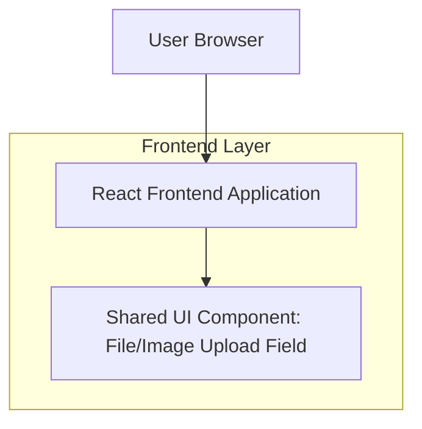

## 1.Architecture design

## 2.Technology Description
- Frontend: React@18 + TypeScript + vite + tailwindcss@3
- Backend: None (คอมโพเนนต์ส่งคืน File/File[] ให้หน้าฟอร์มจัดการต่อ)

## 3.Route definitions
| Route | Purpose |
|-------|---------|
| N/A | เป็นคอมโพเนนต์ใช้ร่วมภายในหน้าฟอร์มที่มีอยู่ ไม่จำเป็นต้องมี route เฉพาะ |

## 4.API definitions (If it includes backend services)
N/A

## 6.Data model(if applicable)
N/A
