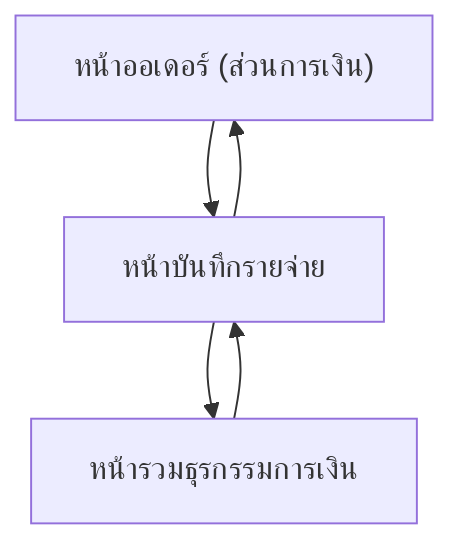

## 1. Product Overview
ระบบบันทึกรายรับ/รายจ่ายและธุรกรรมการชำระเงิน (payment transactions) สำหรับผูกกับออเดอร์และงานปฏิบัติการ เพื่อคำนวณกำไรสุทธิรายออเดอร์ได้อย่างถูกต้อง
ช่วยให้คุณบันทึก “รายรับจากลูกค้า/POA จากตัวแทน” และ “รายจ่ายงานปฏิบัติการ” ได้จากหน้าออเดอร์หรือหน้ารวม

## 2. Core Features

### 2.1 User Roles
| Role | Registration Method | Core Permissions |
|------|---------------------|------------------|
| ผู้ใช้งานที่ล็อกอินแล้ว | เข้าสู่ระบบด้วยบัญชีบริษัท | ดู/เพิ่ม/แก้ไข/ลบ ธุรกรรมรายรับ-รายจ่าย, ดูกำไรสุทธิรายออเดอร์ |

### 2.2 Feature Module
1. **หน้ารวมธุรกรรมการเงิน**: สรุปยอดตามช่วงเวลา, ตาราง payment transactions, ค้นหา/กรอง, สร้างรายการรายจ่ายใหม่
2. **หน้าออเดอร์ (ส่วนการเงินในหน้าออเดอร์)**: ตารางธุรกรรมของออเดอร์, บันทึกรายรับ/รายจ่ายของออเดอร์, คำนวณกำไรสุทธิของออเดอร์
3. **หน้าบันทึกรายจ่าย**: ฟอร์มบันทึกรายจ่าย (มาจากหน้าออเดอร์หรือหน้ารวม), เลือกผูกออเดอร์ได้/ไม่ผูกได้

### 2.3 Page Details
| Page Name | Module Name | Feature description |
|-----------|-------------|---------------------|
| หน้ารวมธุรกรรมการเงิน | ตัวกรองและสรุป | แสดงสรุปยอดรายรับ/รายจ่ายตามช่วงวันที่ที่เลือก และยอดสุทธิ (รายรับ-รายจ่าย) |
| หน้ารวมธุรกรรมการเงิน | ตาราง Payment Transactions | แสดงรายการธุรกรรมทั้งหมด (รายรับจากลูกค้า/POA จากตัวแทน/รายจ่ายงานปฏิบัติการ) พร้อมสถานะการผูกออเดอร์ |
| หน้ารวมธุรกรรมการเงิน | ค้นหา/กรอง | กรองตามช่วงวันที่, ประเภท (รายรับ/รายจ่าย), แหล่งที่มา (ลูกค้า/POA ตัวแทน/งานปฏิบัติการ), และออเดอร์ (ถ้ามี) |
| หน้ารวมธุรกรรมการเงิน | การจัดการรายการ | เพิ่ม/แก้ไข/ลบ ธุรกรรม และเปิดหน้าบันทึกรายจ่าย (เริ่มจากหน้ารวม) |
| หน้าออเดอร์ (ส่วนการเงิน) | สรุปกำไรสุทธิรายออเดอร์ | คำนวณและแสดง: รวมรายรับของออเดอร์ - รวมรายจ่ายของออเดอร์ = กำไรสุทธิ |
| หน้าออเดอร์ (ส่วนการเงิน) | ตารางธุรกรรมของออเดอร์ | แสดงรายการรายรับ/รายจ่ายที่ผูกกับออเดอร์นี้ พร้อมยอดรวมแยกประเภท |
| หน้าออเดอร์ (ส่วนการเงิน) | บันทึกรายรับ/รายจ่ายจากหน้าออเดอร์ | เพิ่มธุรกรรมใหม่โดยผูก order_id อัตโนมัติ (รายรับ: ลูกค้า/POA ตัวแทน, รายจ่าย: งานปฏิบัติการ) |
| หน้าบันทึกรายจ่าย | ฟอร์มบันทึกรายจ่าย | กรอกวันที่, จำนวนเงิน, แหล่งที่มา=งานปฏิบัติการ, รายละเอียด/หมายเหตุ, และเลือกผูกออเดอร์หรือไม่ผูก |
| หน้าบันทึกรายจ่าย | การบันทึกและตรวจสอบ | ตรวจสอบข้อมูลจำเป็น (วันที่/จำนวนเงิน) และบันทึกเป็น payment transaction ประเภท “รายจ่าย” |

## 3. Core Process
**Flow ผู้ใช้งาน (บันทึกรายจ่ายจากหน้าออเดอร์):**
1) เปิดหน้าออเดอร์ → ไปส่วน “การเงิน”
2) กด “บันทึกรายจ่าย” → ระบบเปิดหน้าบันทึกรายจ่ายโดยผูกออเดอร์ให้อัตโนมัติ
3) กรอกข้อมูลและบันทึก → ระบบเพิ่มรายการในตารางธุรกรรมของออเดอร์
4) ระบบคำนวณกำไรสุทธิใหม่ทันทีจากยอดรวมรายรับ-รายจ่ายของออเดอร์

**Flow ผู้ใช้งาน (บันทึกรายจ่ายจากหน้ารวม):**
1) เปิดหน้ารวมธุรกรรมการเงิน
2) กด “บันทึกรายจ่าย” → ระบบเปิดหน้าบันทึกรายจ่าย
3) เลือก “ผูกออเดอร์” หรือ “ไม่ผูก” → กรอกข้อมูลและบันทึก
4) กลับมาหน้ารวม → เห็นรายการใหม่ในตาราง และยอดสรุปอัปเดต

