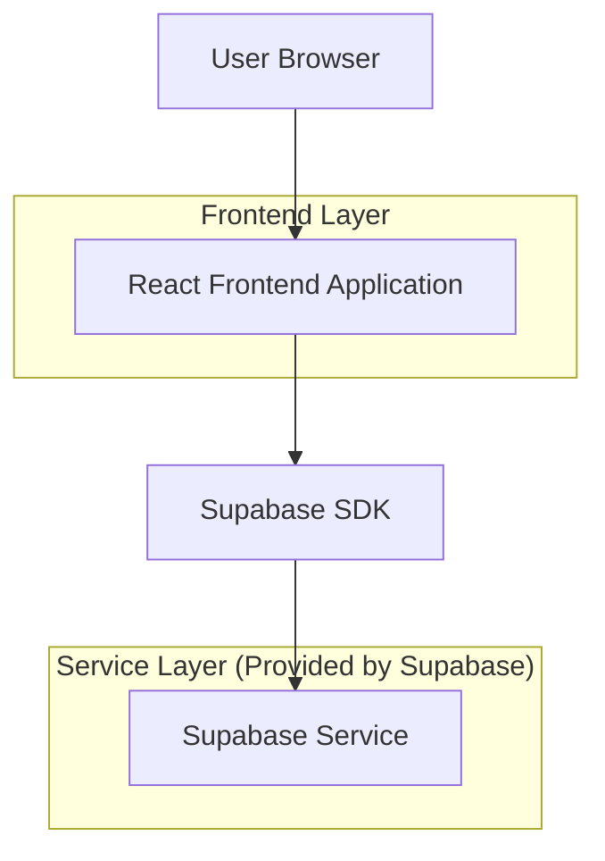
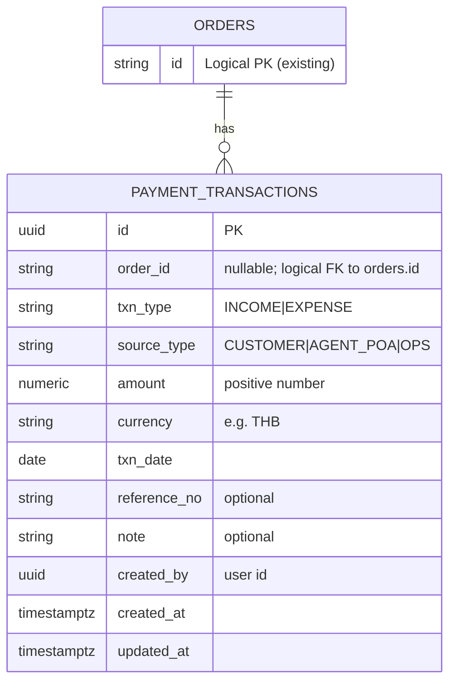

## 1.Architecture design


## 2.Technology Description
- Frontend: React@18 + TypeScript + vite + tailwindcss@3
- Backend: Supabase (Auth + Database)

## 3.Route definitions
| Route | Purpose |
|-------|---------|
| /finance | หน้ารวมธุรกรรมการเงิน: สรุปยอดและตาราง payment transactions |
| /orders/:orderId | หน้าออเดอร์ (รวมส่วนการเงินในหน้าออเดอร์) |
| /finance/expenses/new?orderId=:orderId | หน้าบันทึกรายจ่าย (orderId เป็น optional เพื่อเปิดจากหน้าออเดอร์หรือหน้ารวม) |

## 6.Data model(if applicable)

### 6.1 Data model definition


### 6.2 Data Definition Language
Payment Transactions (payment_transactions)
```sql
-- create table
CREATE TABLE payment_transactions (
  id UUID PRIMARY KEY DEFAULT gen_random_uuid(),
  order_id TEXT NULL,
  txn_type TEXT NOT NULL CHECK (txn_type IN ('INCOME','EXPENSE')),
  source_type TEXT NOT NULL CHECK (source_type IN ('CUSTOMER','AGENT_POA','OPS')),
  amount NUMERIC(12,2) NOT NULL CHECK (amount >= 0),
  currency TEXT NOT NULL DEFAULT 'THB',
  txn_date DATE NOT NULL,
  reference_no TEXT NULL,
  note TEXT NULL,
  created_by UUID NOT NULL,
  created_at TIMESTAMPTZ NOT NULL DEFAULT NOW(),
  updated_at TIMESTAMPTZ NOT NULL DEFAULT NOW()
);

-- indexes
CREATE INDEX idx_payment_transactions_order_id ON payment_transactions(order_id);
CREATE INDEX idx_payment_transactions_txn_date ON payment_transactions(txn_date);
CREATE INDEX idx_payment_transactions_type_source ON payment_transactions(txn_type, source_type);

-- basic grants (supabase guideline)
GRANT SELECT ON payment_transactions TO anon;
GRANT ALL PRIVILEGES ON payment_transactions TO authenticated;
```

**Profit per Order (computed on frontend):**
- income_total = SUM(amount) WHERE order_id = :orderId AND txn_type = 'INCOME'
- expense_total = SUM(amount) WHERE order_id = :orderId AND txn_type = 'EXPENSE'
- net_profit = income_total - expense_total
