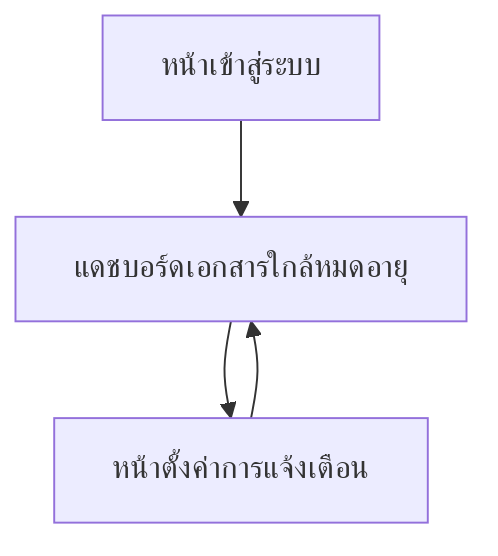

## 1. Product Overview
ระบบแจ้งเตือน “เอกสารแรงงานใกล้หมดอายุ/หมดอายุ” (พาสปอร์ต/วีซ่า/ใบอนุญาตทำงาน) เพื่อให้คุณตั้งค่ากติกาการแจ้งเตือนและส่งถึง “นายจ้าง” และ “ทีมขาย” ได้อัตโนมัติ
ลดความเสี่ยงเอกสารหมดอายุและช่วยทีมขายติดตามงานต่ออายุได้ทันเวลา

## 2. Core Features

### 2.1 User Roles
| Role | Registration Method | Core Permissions |
|------|---------------------|------------------|
| ผู้ดูแลระบบ/HR | เชิญผ่านอีเมล/ลิงก์เชิญ | ตั้งค่ากติกาและช่องทางแจ้งเตือน, จัดการข้อมูลแรงงานและเอกสาร, ดูประวัติการแจ้งเตือนทั้งหมด |
| ทีมขาย (Sales) | เชิญผ่านอีเมล/ลิงก์เชิญ | รับแจ้งเตือน, ดูรายการแรงงาน/เอกสารที่ใกล้หมดอายุที่เกี่ยวข้อง, ดูประวัติการแจ้งเตือน |
| นายจ้าง | เชิญผ่านอีเมล/ลิงก์เชิญ | รับแจ้งเตือนของบริษัทตน, ดูรายการเอกสารใกล้หมดอายุของบริษัทตน |

### 2.2 Feature Module
ระบบประกอบด้วยหน้าหลักดังนี้:
1. **หน้าเข้าสู่ระบบ**: เข้าสู่ระบบด้วยอีเมล/รหัสผ่าน, ลืมรหัสผ่าน
2. **แดชบอร์ดเอกสารใกล้หมดอายุ**: สรุปภาพรวม, รายการเอกสารใกล้หมดอายุ/หมดอายุ, จัดการข้อมูลเอกสาร (เพิ่ม/แก้ไขวันหมดอายุ), ประวัติการแจ้งเตือน
3. **หน้าตั้งค่าการแจ้งเตือน**: กำหนดกติกา (ก่อนหมดอายุกี่วัน/ความถี่), เลือกช่องทาง, ตั้งค่าผู้รับ (นายจ้าง/ทีมขาย), ตั้งค่าแม่แบบข้อความ, ทดสอบการส่ง

### 2.3 Page Details
| Page Name | Module Name | Feature description |
|-----------|-------------|---------------------|
| หน้าเข้าสู่ระบบ | Login | เข้าสู่ระบบด้วยอีเมล/รหัสผ่าน และจำสถานะการล็อกอิน |
| หน้าเข้าสู่ระบบ | Forgot password | ขอรีเซ็ตรหัสผ่านผ่านอีเมลและตั้งรหัสผ่านใหม่ |
| แดชบอร์ดเอกสารใกล้หมดอายุ | ภาพรวมสถานะ | แสดงตัวเลขสรุป: ใกล้หมดอายุ (ตามช่วงวัน), หมดอายุแล้ว, ต้องติดตามวันนี้ |
| แดชบอร์ดเอกสารใกล้หมดอายุ | รายการเอกสาร | แสดงรายการแรงงานและเอกสาร (พาสปอร์ต/วีซ่า/ใบอนุญาตทำงาน) พร้อมวันหมดอายุ, สถานะ (ปกติ/ใกล้หมดอายุ/หมดอายุ) และตัวกรองตามบริษัท/ประเภทเอกสาร/ช่วงวัน |
| แดชบอร์ดเอกสารใกล้หมดอายุ | จัดการข้อมูลเอกสาร | เพิ่ม/แก้ไขข้อมูลเอกสารขั้นต่ำที่จำเป็น: บริษัทนายจ้าง, ชื่อแรงงาน, ประเภทเอกสาร, เลขเอกสาร (ถ้ามี), วันหมดอายุ |
| แดชบอร์ดเอกสารใกล้หมดอายุ | ประวัติการแจ้งเตือน | ดูบันทึกการแจ้งเตือนที่ระบบส่ง (เวลา, ช่องทาง, ผู้รับ, ผลลัพธ์สำเร็จ/ล้มเหลว) |
| หน้าตั้งค่าการแจ้งเตือน | กติกาการแจ้งเตือน (Rules) | ตั้งค่าระยะเตือนล่วงหน้า (เช่น 90/60/30/14/7 วัน) และความถี่ (รายวัน/เฉพาะวันครบกำหนด) สำหรับแต่ละประเภทเอกสาร |
| หน้าตั้งค่าการแจ้งเตือน | ช่องทาง (Channels) | เลือกและเปิด/ปิดช่องทางที่ใช้งาน (เช่น อีเมล, LINE) และตั้งค่าพารามิเตอร์ขั้นต่ำที่จำเป็นต่อการส่ง |
| หน้าตั้งค่าการแจ้งเตือน | ผู้รับ (Recipients) | กำหนดว่าแต่ละเหตุการณ์จะส่งถึงใคร: นายจ้าง, ทีมขาย, หรือทั้งคู่ พร้อมกำหนดผู้รับรายบุคคล/รายบริษัท |
| หน้าตั้งค่าการแจ้งเตือน | แม่แบบข้อความ (Templates) | แก้ไขข้อความแจ้งเตือนด้วยตัวแปร (เช่น ชื่อแรงงาน, ประเภทเอกสาร, วันหมดอายุ, จำนวนวันที่เหลือ) |
| หน้าตั้งค่าการแจ้งเตือน | ทดสอบการส่ง | ส่ง “ข้อความทดสอบ” ไปยังผู้รับที่เลือก เพื่อยืนยันการตั้งค่าช่องทางและแม่แบบ |

## 3. Core Process
**Flow: ผู้ดูแลระบบ/HR**
1) ล็อกอิน → เปิดหน้าตั้งค่าการแจ้งเตือน → กำหนดกติกา (ก่อนหมดอายุกี่วัน/ความถี่) และเลือกช่องทาง
2) ระบุผู้รับ: นายจ้าง/ทีมขาย (ผูกตามบริษัทหรือกำหนดรายบุคคล) และตั้งค่าแม่แบบข้อความ
3) กลับแดชบอร์ด → เพิ่ม/แก้ไขข้อมูลเอกสารแรงงานและวันหมดอายุให้ครบถ้วน
4) ระบบทำงานตามรอบที่กำหนด (เช่น ทุกวัน) → สร้างรายการแจ้งเตือนและส่งไปยังผู้รับ → บันทึกผลการส่งในประวัติ

**Flow: ทีมขาย / นายจ้าง**
1) รับแจ้งเตือนตามช่องทางที่ตั้งค่าไว้
2) ล็อกอินเข้าแดชบอร์ดเพื่อดูรายการที่ใกล้หมดอายุ/หมดอายุ และตรวจสอบประวัติการแจ้งเตือน

