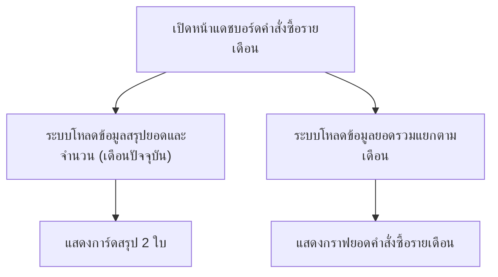

## 1. Product Overview
แดชบอร์ดสำหรับสรุป “ยอดคำสั่งซื้อรายเดือน” และ “จำนวนคำสั่งซื้อรายเดือน” ด้วยการ์ด และแสดงกราฟยอดคำสั่งซื้อรายเดือนเพื่อดูแนวโน้มได้อย่างรวดเร็ว
เหมาะสำหรับทีมปฏิบัติการ/ผู้บริหารที่ต้องการภาพรวมแบบเดือนต่อเดือน

## 2. Core Features

### 2.1 Feature Module
ข้อกำหนดของระบบประกอบด้วยหน้าหลักดังนี้:
1. **แดชบอร์ดคำสั่งซื้อรายเดือน**: การ์ดสรุปยอดรวมรายเดือน, การ์ดสรุปจำนวนออเดอร์รายเดือน, กราฟยอดรวมรายเดือน

### 2.3 Page Details
| Page Name | Module Name | Feature description |
|-----------|-------------|---------------------|
| แดชบอร์ดคำสั่งซื้อรายเดือน | โหลดข้อมูลสรุปรายเดือน | ดึงข้อมูล “ยอดคำสั่งซื้อรายเดือน” และ “จำนวนคำสั่งซื้อรายเดือน” เพื่อแสดงบนการ์ดสรุป |
| แดชบอร์ดคำสั่งซื้อรายเดือน | การ์ด: ยอดคำสั่งซื้อรายเดือน | แสดงยอดรวมของคำสั่งซื้อในเดือนปัจจุบัน (ตัวเลขเด่น อ่านง่าย) |
| แดชบอร์ดคำสั่งซื้อรายเดือน | การ์ด: จำนวนคำสั่งซื้อรายเดือน | แสดงจำนวนคำสั่งซื้อในเดือนปัจจุบัน (ตัวเลขเด่น อ่านง่าย) |
| แดชบอร์ดคำสั่งซื้อรายเดือน | กราฟยอดคำสั่งซื้อรายเดือน | แสดงกราฟของยอดรวมคำสั่งซื้อรายเดือนตามช่วงเดือน (เช่น 12 เดือนล่าสุด) |
| แดชบอร์ดคำสั่งซื้อรายเดือน | สถานะการแสดงผล | แสดงสถานะกำลังโหลด/ไม่มีข้อมูล/เกิดข้อผิดพลาด สำหรับส่วนการ์ดและกราฟ |

## 3. Core Process
ผู้ใช้เปิดหน้าแดชบอร์ด ระบบโหลดข้อมูลสรุปยอดและจำนวนคำสั่งซื้อของเดือนปัจจุบันเพื่อแสดงบนการ์ด จากนั้นโหลดข้อมูลยอดรวมแยกตามเดือนเพื่อแสดงเป็นกราฟแนวโน้มรายเดือน

