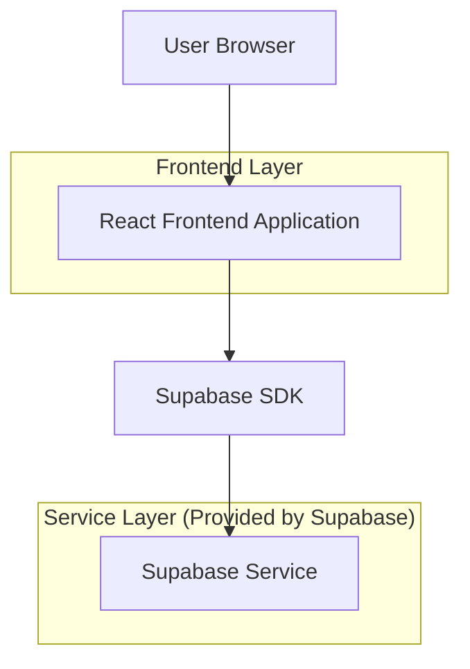
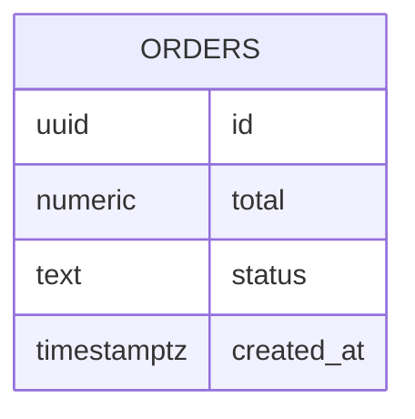

## 1.Architecture design


## 2.Technology Description
- Frontend: Next.js App Router + React + TypeScript + Tailwind + Recharts
- Backend: Supabase (Auth + PostgreSQL)

## 3.Route definitions
| Route | Purpose |
|-------|---------|
| / | หน้าแดชบอร์ดสรุปยอดและจำนวนคำสั่งซื้อรายเดือน พร้อมกราฟยอดรายเดือน |

## 6.Data model(if applicable)

### 6.1 Data model definition


### 6.2 Data Definition Language
Orders Table (orders)
```
-- create table
CREATE TABLE orders (
  id UUID PRIMARY KEY DEFAULT gen_random_uuid(),
  total NUMERIC(12,2) NOT NULL,
  status TEXT NOT NULL,
  created_at TIMESTAMP WITH TIME ZONE DEFAULT NOW()
);

-- indexes for monthly aggregation
CREATE INDEX idx_orders_created_at ON orders(created_at);

-- permissions (typical Supabase baseline)
GRANT SELECT ON orders TO anon;
GRANT ALL PRIVILEGES ON orders TO authenticated;
```

หมายเหตุการคิวรีฝั่ง Frontend (แนวทาง)
- สรุปเดือนปัจจุบัน: รวมยอด `total` และนับจำนวนแถวที่ `created_at` อยู่ในช่วงเดือนปัจจุบัน (แนะนำกรองสถานะที่เกี่ยวข้อง)
- กราฟรายเดือน: group by เดือนจาก `created_at` แล้ว sum(`total`) ตามช่วงเดือนที่ต้องการแสดง (เช่น 12 เดือนล่าสุด)
