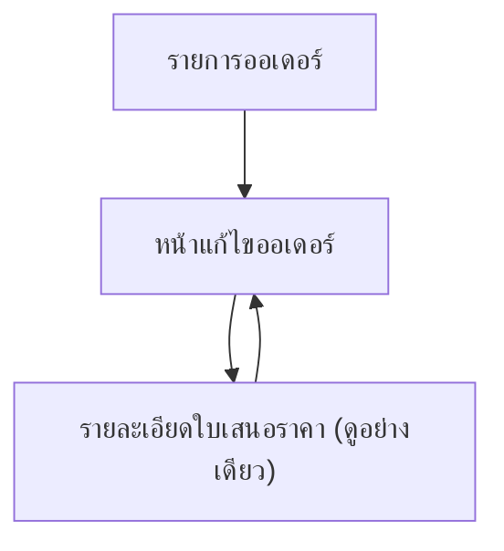

## 1. Product Overview
ปรับปรุงหน้า “แก้ไขออเดอร์” เพื่อผูก “ช่าง/คนงาน (Workers)” เข้ากับ “บริการ (Services)” รายรายการ และทำให้ข้อมูลลูกค้า/การเงินถูกล็อกเมื่อออเดอร์ถูกสร้างมาจากใบเสนอราคา (Quote) เพื่อลดความผิดพลาดและคุมความสอดคล้องของราคา

## 2. Core Features

### 2.1 User Roles
| บทบาท | วิธีเข้าระบบ/ได้สิทธิ์ | สิทธิ์หลักที่เกี่ยวข้องกับหน้าแก้ไขออเดอร์ |
|------|-------------------------|-------------------------------------------|
| Admin/Owner | บัญชีภายในองค์กร | แก้ไขได้ทุกฟิลด์, ปลดล็อก (override) ฟิลด์ที่ล็อกได้, เปลี่ยนสถานะทั้งหมด |
| Ops/Dispatcher | บัญชีภายในองค์กร | แก้ไขข้อมูลงานและตาราง, ผูกช่างกับบริการ, เปลี่ยนสถานะตามขั้นตอน, แก้ไขฟิลด์ที่ไม่ถูกล็อก |
| Finance | บัญชีภายในองค์กร | ดูข้อมูลทั้งหมด, แก้ไขการเงินเฉพาะออเดอร์ที่ “ไม่ได้สร้างจาก Quote” หรือ “ถูกปลดล็อกโดย Admin” |
| Worker (ดูอย่างเดียว) | บัญชีช่าง/คนงาน | ดูงานที่ได้รับมอบหมายและรายละเอียดบริการที่ผูกกับตน (อ่านอย่างเดียว) |

### 2.2 Feature Module
ความต้องการนี้ประกอบด้วยหน้าหลักดังนี้:
1. **รายการออเดอร์**: ค้นหา/เปิดออเดอร์เพื่อเข้าแก้ไข
2. **หน้าแก้ไขออเดอร์**: ข้อมูลออเดอร์, รายการบริการ, ผูกช่างต่อบริการ, สถานะงาน, ล็อกข้อมูลจาก Quote, ปุ่มการทำงานใหม่
3. **รายละเอียดใบเสนอราคา (ดูอย่างเดียว)**: เปิดดู Quote ต้นทางจากลิงก์ในออเดอร์

### 2.3 Page Details
| Page Name | Module Name | Feature description |
|-----------|-------------|---------------------|
| รายการออเดอร์ | รายการและการเข้าถึง | แสดงรายการออเดอร์และเปิดหน้าแก้ไขออเดอร์ตามสิทธิ์ผู้ใช้ |
| หน้าแก้ไขออเดอร์ | ส่วนหัวออเดอร์ + แถบปุ่ม (ปรับตำแหน่ง) | แสดงเลขที่ออเดอร์/สถานะ/แหล่งที่มา (Created from Quote) และวางปุ่มการทำงานในตำแหน่งใหม่: ปุ่มหลัก “บันทึก” อยู่มุมขวาบนแบบ sticky, ปุ่มรองอยู่ในเมนู “การทำงานเพิ่มเติม” |
| หน้าแก้ไขออเดอร์ | สถานะออเดอร์ (Status) | เปลี่ยนสถานะตาม flow ที่กำหนด พร้อมแสดง timestamp/ผู้ทำรายการ (อย่างน้อย: ล่าสุดเปลี่ยนโดยใคร/เมื่อไร) |
| หน้าแก้ไขออเดอร์ | ข้อมูลลูกค้า (Customer) | แสดงข้อมูลลูกค้า; หากออเดอร์สร้างจาก Quote ให้ทุกฟิลด์ในส่วนนี้เป็น read-only (ยกเว้น Admin ทำการปลดล็อก) |
| หน้าแก้ไขออเดอร์ | ข้อมูลงาน/นัดหมาย | แก้ไขวัน-เวลา/ที่อยู่หน้างาน/หมายเหตุงาน ตามสิทธิ์ (ไม่ถูกล็อกจาก Quote เว้นแต่ระบบเดิมล็อกอยู่แล้ว) |
| หน้าแก้ไขออเดอร์ | การเงินและราคา (Financial) | แสดงราคา/ส่วนลด/ภาษี/ยอดรวม; หากออเดอร์สร้างจาก Quote ให้เป็น read-only ทั้งหมด (ยกเว้น Admin ปลดล็อก) |
| หน้าแก้ไขออเดอร์ | รายการบริการ (Services) | แสดงรายการบริการแบบรายการ/การ์ด; เพิ่ม/ลบ/แก้ไขบริการได้เฉพาะออเดอร์ที่ไม่ถูกล็อกจาก Quote หรือถูกปลดล็อกโดย Admin |
| หน้าแก้ไขออเดอร์ | ผูกช่างกับบริการ (Worker ↔ Service Linking) | กำหนดช่างให้ “แต่ละบริการ” ได้ (รองรับหลายคนต่อ 1 บริการ); เลือกช่างจากรายการ, กำหนดบทบาทต่อบริการ (หัวหน้าทีม/ผู้ช่วย เป็นตัวเลือก), ใส่หมายเหตุการปฏิบัติงานต่อบริการ; แสดงสรุปช่างที่ผูกแล้วบนแต่ละบริการ |
| หน้าแก้ไขออเดอร์ | การมอบหมายแบบกลุ่ม | มอบหมายช่างให้หลายบริการพร้อมกัน (เลือกหลายบริการ → เลือกช่าง → ยืนยัน) เพื่อเพิ่มความเร็วงานของ Ops |
| หน้าแก้ไขออเดอร์ | การตรวจสอบความครบถ้วน | บล็อกการเปลี่ยนสถานะไป “พร้อมเริ่มงาน/กำลังดำเนินการ” หากยังไม่มีช่างถูกผูกกับบริการอย่างน้อย 1 รายการ (หรือไม่มีบริการเลย) พร้อมข้อความบอกสาเหตุ |
| หน้าแก้ไขออเดอร์ | ล็อกจาก Quote + การปลดล็อก (Override) | แสดง badge “ล็อกจากใบเสนอราคา”; ซ่อน/ปิดการแก้ไขฟิลด์ลูกค้า+การเงิน+บริการตามกติกา; เปิดการปลดล็อกได้เฉพาะ Admin พร้อมเหตุผลการปลดล็อก (ข้อความบังคับ) และบันทึกการกระทำ (อย่างน้อย: ใคร/เมื่อไร/เหตุผล) |
| หน้าแก้ไขออเดอร์ | ลิงก์ไป Quote ต้นทาง | เปิดหน้า “รายละเอียดใบเสนอราคา (ดูอย่างเดียว)” จากปุ่ม/ลิงก์ในส่วนหัว เพื่ออ้างอิงข้อมูลเดิม |
| รายละเอียดใบเสนอราคา (ดูอย่างเดียว) | แสดงข้อมูล Quote | แสดงข้อมูล Quote ที่เกี่ยวข้องกับออเดอร์: ลูกค้า, รายการบริการ, ราคา, เงื่อนไข เพื่อใช้เทียบ/อ้างอิง (อ่านอย่างเดียว) |

## 3. Core Process
### Ops/Dispatcher Flow
1) เปิด “รายการออเดอร์” → เลือกออเดอร์ → เข้าหน้า “แก้ไขออเดอร์”
2) ตรวจสอบว่าออเดอร์ “สร้างจาก Quote” หรือไม่ (เห็น badge ในหัวหน้า)
3) จัดการตารางงาน/หมายเหตุหน้างาน (ส่วนที่แก้ได้)
4) ไปที่ “รายการบริการ” → กด “กำหนดช่าง” ในแต่ละบริการ หรือใช้ “มอบหมายแบบกลุ่ม”
5) หากต้องเริ่มงาน: เปลี่ยนสถานะไป “กำลังดำเนินการ” (ระบบตรวจว่ามีช่างถูกผูกแล้ว)
6) กด “บันทึก” (ปุ่มหลัก sticky มุมขวาบน)

### Admin/Owner Flow
1) ทำทุกอย่างแบบ Ops ได้
2) หากต้องแก้ไขข้อมูลที่ถูกล็อกจาก Quote: เปิดเมนู “การทำงานเพิ่มเติม” → “ปลดล็อกการแก้ไข (Override)” → ใส่เหตุผล → ยืนยัน
3) แก้ไขข้อมูลลูกค้า/การเงิน/บริการตามจำเป็น → บันทึก

### Status Flow (ข้อกำหนด)
- Quote Approved → Order Created (ล็อกจาก Quote)
- Order Created → Scheduled → In Progress → Completed
- Order Created/Scheduled/In Progress → Cancelled (ตามสิทธิ์)

