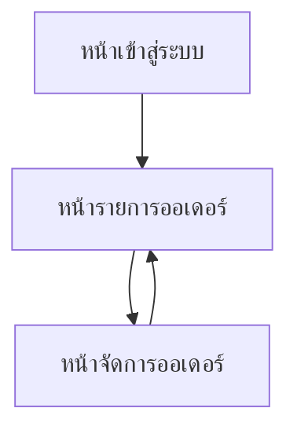

## 1. Product Overview
หน้าจัดการออเดอร์สำหรับทีมปฏิบัติการ เพื่ออัปเดตสถานะงานรายบริการในออเดอร์, ยืนยันการชำระยอดคงค้าง และปิดออเดอร์เมื่อเงื่อนไขครบถ้วน
ช่วยให้สถานะงานและการเงินของออเดอร์ถูกต้อง ตรวจสอบได้ และปิดงานได้อย่างมีมาตรฐาน

## 2. Core Features

### 2.1 User Roles
| บทบาท | วิธีเข้าใช้งาน | สิทธิ์หลัก |
|------|-----------------|------------|
| ทีมปฏิบัติการ (Operations) | ล็อกอินด้วยบัญชีองค์กร | ค้นหา/เปิดออเดอร์, อัปเดตสถานะงานรายบริการ (เริ่มดำเนินการ/เสร็จสิ้น), ยืนยันชำระยอดคงค้าง, ปิดออเดอร์เมื่อเข้าเงื่อนไข |
| หัวหน้าทีมปฏิบัติการ (Ops Lead) | ล็อกอินด้วยบัญชีองค์กร | สิทธิ์ทั้งหมดของ Operations + แก้ไข/ย้อนสถานะ (ตามนโยบาย), เพิ่มหมายเหตุบังคับเมื่อมีการย้อนสถานะ |

### 2.2 Feature Module
หน้าที่จำเป็นของระบบมีดังนี้:
1. **หน้าเข้าสู่ระบบ**: ฟอร์มล็อกอิน, จัดการเซสชัน/ออกจากระบบ
2. **หน้ารายการออเดอร์**: ค้นหา/กรองออเดอร์, สรุปสถานะงาน-ยอดคงค้าง, เข้าไปหน้าจัดการออเดอร์
3. **หน้าจัดการออเดอร์**: รายละเอียดออเดอร์, จัดการสถานะรายบริการ (เริ่มดำเนินการ/เสร็จสิ้น), ยืนยันชำระยอดคงค้าง, เช็กลิสต์เงื่อนไขและปิดออเดอร์

### 2.3 Page Details
| Page Name | Module Name | Feature description |
|-----------|-------------|---------------------|
| หน้าเข้าสู่ระบบ | ล็อกอิน | เข้าสู่ระบบด้วยอีเมล/รหัสผ่าน และแสดงข้อผิดพลาดเมื่อข้อมูลไม่ถูกต้อง |
| หน้าเข้าสู่ระบบ | จัดการเซสชัน | เก็บสถานะการล็อกอิน, รองรับออกจากระบบ, ส่งต่อไปหน้ารายการออเดอร์เมื่อสำเร็จ |
| หน้ารายการออเดอร์ | ค้นหา/กรอง | ค้นหาด้วยเลขออเดอร์/ชื่อลูกค้า/เบอร์โทร และกรองตามสถานะออเดอร์ (เปิด/ปิด) และสถานะงานรวม |
| หน้ารายการออเดอร์ | ตารางสรุปออเดอร์ | แสดงเลขออเดอร์, ลูกค้า, จำนวนบริการทั้งหมด/เสร็จแล้ว, ยอดรวม, ยอดคงค้าง, สถานะออเดอร์ และปุ่ม “จัดการ” |
| หน้ารายการออเดอร์ | การเข้าถึงออเดอร์ | เปิดหน้าจัดการออเดอร์ของรายการที่เลือก และคงค่า filter/search ล่าสุด |
| หน้าจัดการออเดอร์ | สรุปหัวออเดอร์ | แสดงเลขออเดอร์, ลูกค้า, ยอดรวม, ยอดที่ชำระแล้ว, ยอดคงค้าง (คำนวณ/แสดงล่าสุด), สถานะออเดอร์ |
| หน้าจัดการออเดอร์ | รายการบริการในออเดอร์ | แสดงรายการบริการแบบตาราง/การ์ด (ชื่อบริการ, ผู้รับผิดชอบ, สถานะ, เวลาเริ่ม/เสร็จ) |
| หน้าจัดการออเดอร์ | เปลี่ยนสถานะบริการ | กด “เริ่มดำเนินการ” เพื่อเปลี่ยนเป็นกำลังดำเนินการ และกด “เสร็จสิ้น” เพื่อเปลี่ยนเป็นเสร็จสิ้น; บันทึกผู้เปลี่ยนสถานะและเวลา |
| หน้าจัดการออเดอร์ | ยืนยันชำระยอดคงค้าง | แสดงยอดคงค้างและรายการชำระเงินที่รอการยืนยัน; กด “ยืนยันชำระ” เพื่อทำให้ยอดคงค้างเป็นศูนย์ตามจำนวนที่ยืนยัน (เมื่อยอดชำระครบ) |
| หน้าจัดการออเดอร์ | ตรวจเงื่อนไขปิดออเดอร์ | แสดงเช็กลิสต์: (1) ทุกบริการเสร็จสิ้น (2) ยอดคงค้าง = 0 (3) ไม่มีรายการชำระที่ยังไม่ยืนยัน; แจ้งเหตุผลเมื่อยังปิดไม่ได้ |
| หน้าจัดการออเดอร์ | ปิดออเดอร์ | อนุญาตปิดออเดอร์เมื่อเงื่อนไขครบถ้วนเท่านั้น และบันทึกเวลา/ผู้ปิดออเดอร์ |
| หน้าจัดการออเดอร์ | ประวัติการเปลี่ยนสถานะ | แสดงไทม์ไลน์เหตุการณ์หลัก (เริ่ม/เสร็จบริการ, ยืนยันชำระ, ปิดออเดอร์) เพื่อการตรวจสอบย้อนหลัง |

## 3. Core Process
### 3.1 Operations Flow
1) คุณล็อกอินเข้าสู่ระบบ
2) คุณไปที่หน้ารายการออเดอร์ แล้วค้นหาหรือกรองเพื่อหาออเดอร์ที่ต้องดำเนินการ
3) คุณเปิดหน้าจัดการออเดอร์ และอัปเดตสถานะงานรายบริการ
- เมื่อเริ่มทำบริการ: กด “เริ่มดำเนินการ”
- เมื่อทำเสร็จ: กด “เสร็จสิ้น”
4) หากยังมียอดคงค้าง คุณตรวจสอบรายการชำระเงิน และกด “ยืนยันชำระ” ให้ครบตามยอด
5) เมื่อทุกบริการ “เสร็จสิ้น” และ “ยอดคงค้าง = 0” (รวมถึงไม่มีรายการชำระรอยืนยัน) ระบบจะแสดงว่าพร้อมปิดออเดอร์
6) คุณกด “ปิดออเดอร์” ระบบบันทึกผู้ปิดและเวลา และกันไม่ให้เปลี่ยนสถานะต่อ (ตามนโยบาย)

### 3.2 Page navigation flowchart

