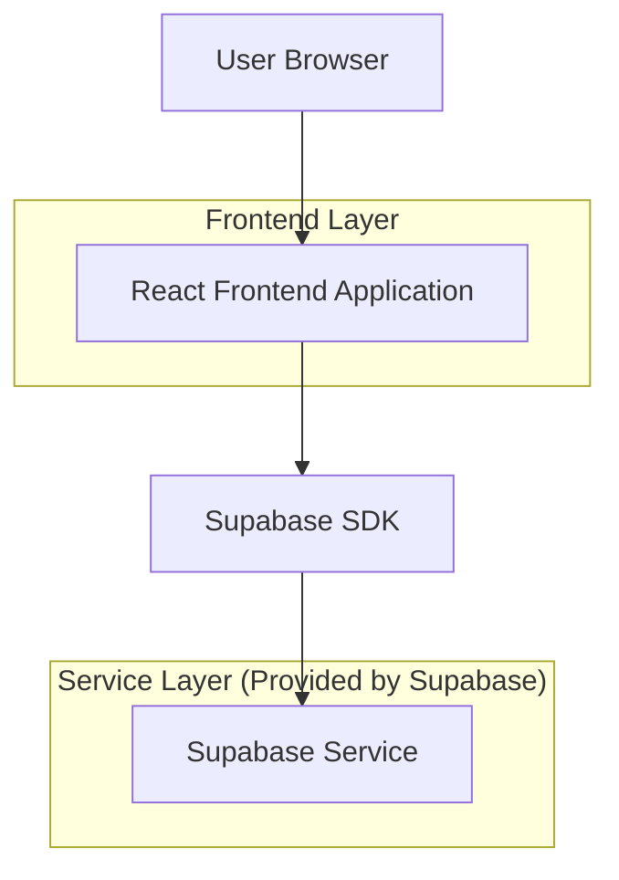
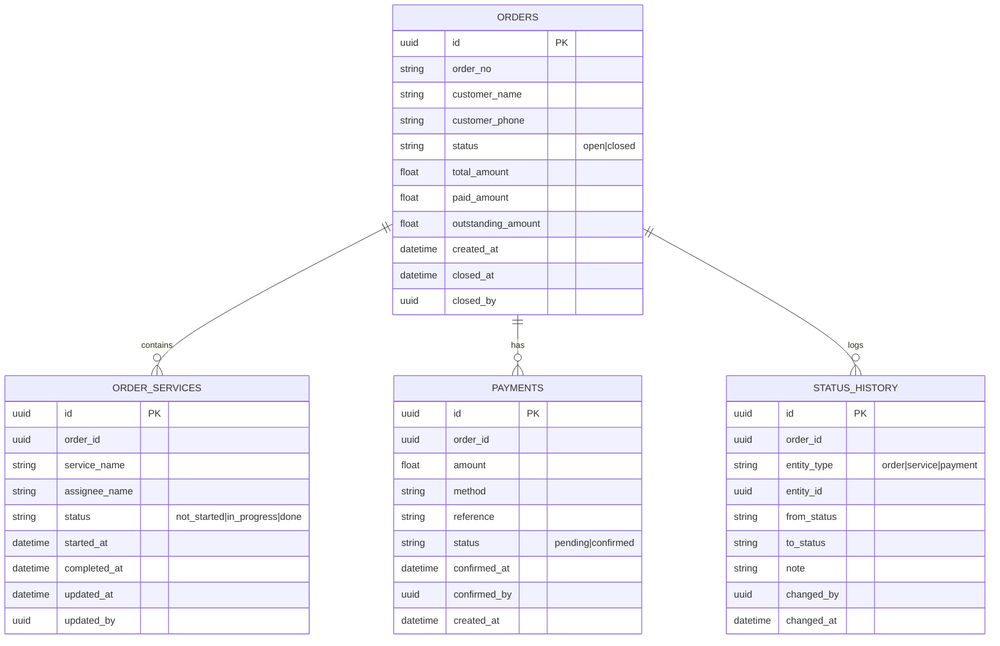

## 1.Architecture design


## 2.Technology Description
- Frontend: React@18 + TypeScript + vite + tailwindcss@3
- Backend: Supabase (Auth + PostgreSQL)

## 3.Route definitions
| Route | Purpose |
|-------|---------|
| /login | หน้าเข้าสู่ระบบทีมปฏิบัติการ |
| /orders | หน้ารายการออเดอร์ (ค้นหา/กรอง/สรุปสถานะ) |
| /orders/:orderId | หน้าจัดการออเดอร์ (สถานะบริการ, ยืนยันชำระ, ปิดออเดอร์) |

## 6.Data model(if applicable)

### 6.1 Data model definition


### 6.2 Data Definition Language
Orders (orders)
```sql
CREATE TABLE orders (
  id UUID PRIMARY KEY DEFAULT gen_random_uuid(),
  order_no TEXT UNIQUE NOT NULL,
  customer_name TEXT,
  customer_phone TEXT,
  status TEXT NOT NULL DEFAULT 'open' CHECK (status IN ('open','closed')),
  total_amount NUMERIC(12,2) NOT NULL DEFAULT 0,
  paid_amount NUMERIC(12,2) NOT NULL DEFAULT 0,
  outstanding_amount NUMERIC(12,2) NOT NULL DEFAULT 0,
  created_at TIMESTAMPTZ NOT NULL DEFAULT NOW(),
  closed_at TIMESTAMPTZ,
  closed_by UUID
);

CREATE INDEX idx_orders_status_created_at ON orders(status, created_at DESC);
CREATE INDEX idx_orders_order_no ON orders(order_no);
```

Order services (order_services)
```sql
CREATE TABLE order_services (
  id UUID PRIMARY KEY DEFAULT gen_random_uuid(),
  order_id UUID NOT NULL,
  service_name TEXT NOT NULL,
  assignee_name TEXT,
  status TEXT NOT NULL DEFAULT 'not_started' CHECK (status IN ('not_started','in_progress','done')),
  started_at TIMESTAMPTZ,
  completed_at TIMESTAMPTZ,
  updated_at TIMESTAMPTZ NOT NULL DEFAULT NOW(),
  updated_by UUID
);

CREATE INDEX idx_order_services_order_id ON order_services(order_id);
CREATE INDEX idx_order_services_status ON order_services(status);
```

Payments (payments)
```sql
CREATE TABLE payments (
  id UUID PRIMARY KEY DEFAULT gen_random_uuid(),
  order_id UUID NOT NULL,
  amount NUMERIC(12,2) NOT NULL,
  method TEXT,
  reference TEXT,
  status TEXT NOT NULL DEFAULT 'pending' CHECK (status IN ('pending','confirmed')),
  confirmed_at TIMESTAMPTZ,
  confirmed_by UUID,
  created_at TIMESTAMPTZ NOT NULL DEFAULT NOW()
);

CREATE INDEX idx_payments_order_id ON payments(order_id);
CREATE INDEX idx_payments_status ON payments(status);
```

Status history (status_history)
```sql
CREATE TABLE status_history (
  id UUID PRIMARY KEY DEFAULT gen_random_uuid(),
  order_id UUID NOT NULL,
  entity_type TEXT NOT NULL CHECK (entity_type IN ('order','service','payment')),
  entity_id UUID NOT NULL,
  from_status TEXT,
  to_status TEXT NOT NULL,
  note TEXT,
  changed_by UUID,
  changed_at TIMESTAMPTZ NOT NULL DEFAULT NOW()
);

CREATE INDEX idx_status_history_order_id_changed_at ON status_history(order_id, changed_at DESC);
```

Permissions (baseline)
```sql
GRANT SELECT ON orders, order_services, payments, status_history TO anon;
GRANT ALL PRIVILEGES ON orders, order_services, payments, status_history TO authenticated;
```
