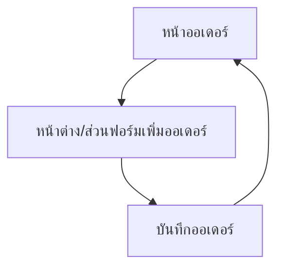

## 1. Product Overview
หน้า “ออเดอร์” สำหรับสร้างออเดอร์บริการ โดยเลือก “ลูกค้า” และเพิ่ม “หลายบริการ” ต่อ 1 ออเดอร์ได้
รองรับการใส่ “ส่วนลด” และ “VAT” ในรูปแบบเดียวกับใบเสนอราคา เพื่อให้ยอดรวมถูกต้องและสอดคล้องกัน

## 2. Core Features

### 2.1 Feature Module
หน้าที่จำเป็นสำหรับความต้องการนี้มีดังนี้:
1. **หน้าออเดอร์**: เปลี่ยนชื่อเมนู, แสดงรายการออเดอร์, ปุ่มเพิ่มออเดอร์, ฟอร์มเพิ่มออเดอร์ (ซ่อนไว้จนกดเพิ่ม), เลือกลูกค้า, เพิ่มหลายบริการ, สรุปราคา (ส่วนลด + VAT)

### 2.3 Page Details
| Page Name | Module Name | Feature description |
|---|---|---|
| หน้าออเดอร์ | ชื่อเมนู | เปลี่ยนชื่อเมนูในแถบนำทางให้แสดงเป็น “ออเดอร์” |
| หน้าออเดอร์ | รายการออเดอร์ | แสดงรายการออเดอร์ที่มีอยู่ (เพื่อเข้าใจสถานะและกลับมาแก้ไข/ดูได้) |
| หน้าออเดอร์ | เพิ่มออเดอร์ (ปุ่ม) | กดปุ่ม “เพิ่มออเดอร์” เพื่อเปิดฟอร์มสร้างออเดอร์ |
| หน้าออเดอร์ | ฟอร์มสร้างออเดอร์ (ซ่อน/แสดง) | ซ่อนฟอร์มไว้เป็นค่าเริ่มต้น และแสดงเมื่อกดปุ่มเพิ่มออเดอร์เท่านั้น |
| หน้าออเดอร์ | เลือกลูกค้า | เลือกลูกค้าสำหรับออเดอร์ 1 ราย (ค้นหา/เลือกจากรายการ) |
| หน้าออเดอร์ | รายการบริการในออเดอร์ | เพิ่ม/ลบหลายบริการต่อออเดอร์ พร้อมระบุจำนวน/ราคา (ตามรูปแบบบริการที่มีในระบบ) |
| หน้าออเดอร์ | ส่วนลดและ VAT | ใส่ส่วนลดและ VAT “แบบใบเสนอราคา” และคำนวณยอดรวมตามลำดับเดียวกับใบเสนอราคา |
| หน้าออเดอร์ | บันทึกออเดอร์ | บันทึกออเดอร์ที่สร้าง/แก้ไข พร้อมตรวจสอบความครบถ้วนของข้อมูลก่อนบันทึก |

## 3. Core Process
**User Flow (ผู้ใช้งานทั่วไป)**
1. เข้ามาที่หน้า “ออเดอร์” และเห็นรายการออเดอร์เดิม
2. กด “เพิ่มออเดอร์” เพื่อเปิดฟอร์ม (เดิมถูกซ่อนไว้)
3. เลือกลูกค้า
4. เพิ่มหลายบริการในออเดอร์ (เพิ่ม/ลบบรรทัดบริการ)
5. ใส่ส่วนลดและ VAT ตามรูปแบบเดียวกับใบเสนอราคา และตรวจสอบยอดรวม
6. กดบันทึกเพื่อสร้างออเดอร์ และกลับมาที่หน้าออเดอร์

