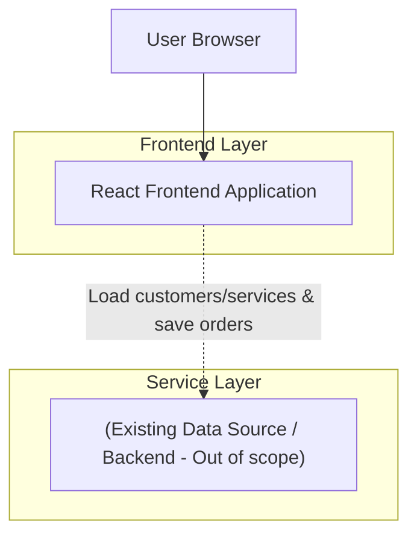

## 1.Architecture design

## 2.Technology Description
- Frontend: React@18 + TypeScript + tailwindcss@3 + vite
- Backend: (ไม่ระบุในขอบเขตคำขอนี้)

## 3.Route definitions
| Route | Purpose |
|---|---|
| /orders | หน้าออเดอร์: รายการออเดอร์ + เพิ่มออเดอร์ (ซ่อนฟอร์มจนกดปุ่ม) + เลือกลูกค้า + หลายบริการ + ส่วนลด/VAT |
