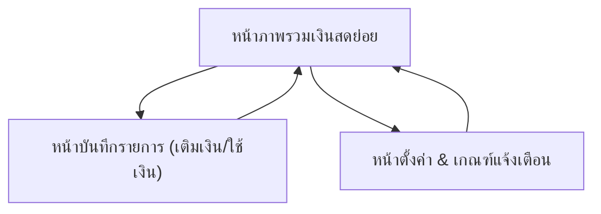

## 1. Product Overview
ระบบติดตามเงินสดย่อย (Petty Cash) สำหรับ “เติมเงินเข้า–บันทึกการใช้–ดูยอดคงเหลือ–แจ้งเตือนเงินเหลือน้อย” ในที่เดียว
ช่วยให้คุณควบคุมเงินสดย่อยได้โปร่งใส ลดการลืมบันทึก และเห็นสถานะเงินคงเหลือแบบเรียลไทม์

## 2. Core Features

### 2.1 Feature Module
ข้อกำหนดของระบบประกอบด้วยหน้าหลักดังนี้:
1. **หน้าภาพรวมเงินสดย่อย**: ยอดคงเหลือ, สรุปรับเข้า/จ่ายออก, รายการล่าสุด, แถบแจ้งเตือนเงินเหลือน้อย
2. **หน้าบันทึกรายการ (เติมเงิน/ใช้เงิน)**: ฟอร์มบันทึกรายการ, เลือกประเภท (เติมเงิน/ใช้เงิน), หมวดหมู่, หมายเหตุ, แนบหลักฐาน (ถ้ามี)
3. **หน้าตั้งค่า & เกณฑ์แจ้งเตือน**: ตั้งค่าเกณฑ์เงินเหลือน้อย, ตัวเลือกการแจ้งเตือนในแอป, จัดการหมวดหมู่พื้นฐาน

### 2.2 Page Details
| Page Name | Module Name | Feature description |
|-----------|-------------|---------------------|
| หน้าภาพรวมเงินสดย่อย | สรุปยอดคงเหลือ | แสดงยอดคงเหลือปัจจุบันจากยอดตั้งต้น + รายการเติมเงิน - รายการใช้เงิน |
| หน้าภาพรวมเงินสดย่อย | สรุปภาพรวมช่วงเวลา | แสดงยอด “เติมเงินรวม/ใช้เงินรวม” ของช่วงเวลาที่เลือก (เช่น วันนี้/สัปดาห์นี้/เดือนนี้) |
| หน้าภาพรวมเงินสดย่อย | รายการเคลื่อนไหวล่าสุด | แสดงรายการล่าสุดพร้อมประเภท, จำนวนเงิน, วันที่, หมวดหมู่ และเปิดไปหน้าแก้ไขรายการได้ |
| หน้าภาพรวมเงินสดย่อย | แจ้งเตือนเงินเหลือน้อย | แสดงแถบเตือนเมื่อยอดคงเหลือต่ำกว่าเกณฑ์ พร้อมปุ่มไปหน้าบันทึกการเติมเงิน/หน้าตั้งค่า |
| หน้าบันทึกรายการ (เติมเงิน/ใช้เงิน) | เลือกประเภทและจำนวนเงิน | บันทึกรายการโดยเลือกประเภท (เติมเงิน/ใช้เงิน) และระบุจำนวนเงิน (ต้องมากกว่า 0) |
| หน้าบันทึกรายการ (เติมเงิน/ใช้เงิน) | รายละเอียดรายการ | ระบุวันที่, หมวดหมู่ (จำเป็นสำหรับใช้เงิน), หมายเหตุ และผู้บันทึก (ถ้ามี) |
| หน้าบันทึกรายการ (เติมเงิน/ใช้เงิน) | แนบหลักฐาน (ถ้ามี) | เพิ่มไฟล์หลักฐาน (เช่น รูป/ใบเสร็จ) ให้เชื่อมกับรายการเพื่อการตรวจสอบภายหลัง |
| หน้าบันทึกรายการ (เติมเงิน/ใช้เงิน) | ตรวจสอบข้อมูลก่อนบันทึก | แสดงตัวอย่างผลกระทบยอดคงเหลือหลังบันทึก และยืนยันการบันทึก |
| หน้าบันทึกรายการ (เติมเงิน/ใช้เงิน) | แก้ไข/ลบรายการ | แก้ไขข้อมูลรายการเดิม หรือยกเลิกรายการด้วยเหตุผล (เพื่อความถูกต้องของยอด) |
| หน้าตั้งค่า & เกณฑ์แจ้งเตือน | ตั้งค่าเกณฑ์เงินเหลือน้อย | กำหนดจำนวนเงินขั้นต่ำที่ถือว่า “เงินเหลือน้อย” และบันทึกเป็นค่าเริ่มต้นของระบบ |
| หน้าตั้งค่า & เกณฑ์แจ้งเตือน | ตัวเลือกการแจ้งเตือนในแอป | เปิด/ปิดการแจ้งเตือนในแอป และกำหนดรูปแบบ (แถบบนหน้า/Toast) |
| หน้าตั้งค่า & เกณฑ์แจ้งเตือน | จัดการหมวดหมู่พื้นฐาน | เพิ่ม/แก้ไข/ซ่อนหมวดหมู่สำหรับการใช้เงิน เพื่อให้การบันทึกเป็นมาตรฐาน |

## 3. Core Process
**โฟลว์การใช้งานหลัก (ผู้ใช้ทั่วไป)**
1. คุณเข้า “หน้าภาพรวมเงินสดย่อย” เพื่อดูยอดคงเหลือและรายการล่าสุด
2. เมื่อมีการเติมเงิน คุณกด “บันทึกรายการ” เลือกประเภท “เติมเงิน” ใส่จำนวนเงินและรายละเอียด แล้วบันทึก
3. เมื่อมีการใช้เงิน คุณกด “บันทึกรายการ” เลือกประเภท “ใช้เงิน” เลือกหมวดหมู่ ใส่จำนวนเงิน/หมายเหตุ/แนบหลักฐาน แล้วบันทึก
4. ระบบคำนวณยอดคงเหลือใหม่ทันที และแสดงรายการใน “รายการล่าสุด”
5. หากยอดคงเหลือต่ำกว่าเกณฑ์ ระบบแสดง “แจ้งเตือนเงินเหลือน้อย” บนหน้าภาพรวม และคุณสามารถไปเติมเงินหรือปรับเกณฑ์ได้

