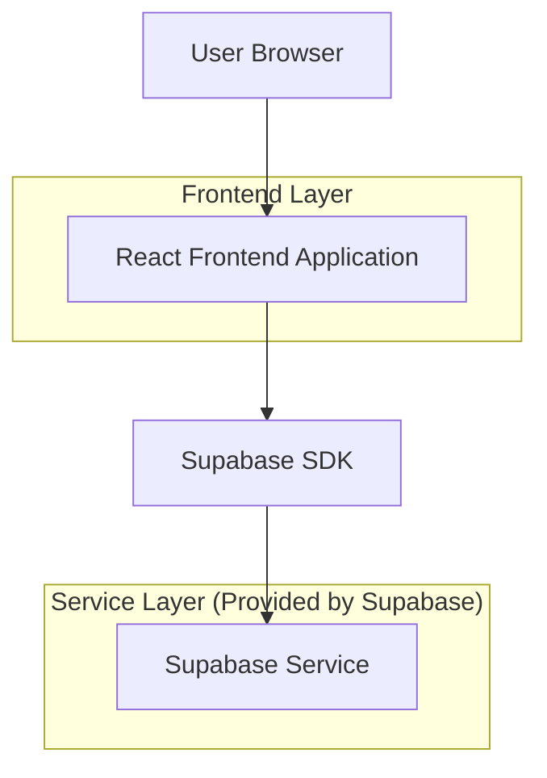
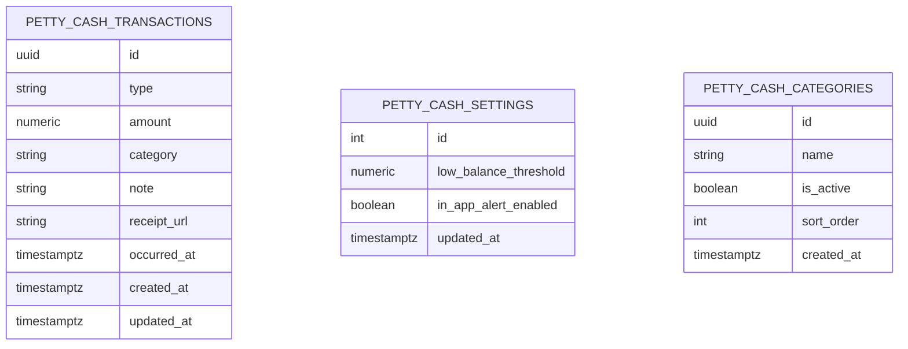

## 1.Architecture design


## 2.Technology Description
- Frontend: React@18 + tailwindcss@3 + vite
- Backend: Supabase (Database + Storage)

## 3.Route definitions
| Route | Purpose |
|-------|---------|
| / | หน้าภาพรวมเงินสดย่อย: ยอดคงเหลือ, รายการล่าสุด, แจ้งเตือนเงินเหลือน้อย |
| /transaction/new | หน้าบันทึกรายการ: เติมเงิน/ใช้เงิน, แนบหลักฐาน, ยืนยันก่อนบันทึก |
| /settings | หน้าตั้งค่า: เกณฑ์แจ้งเตือน, การแจ้งเตือนในแอป, หมวดหมู่ |

## 6.Data model(if applicable)

### 6.1 Data model definition


### 6.2 Data Definition Language
Petty Cash Transactions (petty_cash_transactions)
```
CREATE TABLE petty_cash_transactions (
  id UUID PRIMARY KEY DEFAULT gen_random_uuid(),
  type VARCHAR(10) NOT NULL CHECK (type IN ('TOP_UP','SPEND')),
  amount NUMERIC(12,2) NOT NULL CHECK (amount > 0),
  category VARCHAR(80),
  note TEXT,
  receipt_url TEXT,
  occurred_at TIMESTAMP WITH TIME ZONE NOT NULL,
  created_at TIMESTAMP WITH TIME ZONE DEFAULT NOW(),
  updated_at TIMESTAMP WITH TIME ZONE DEFAULT NOW()
);

CREATE INDEX idx_petty_cash_transactions_occurred_at ON petty_cash_transactions(occurred_at DESC);
CREATE INDEX idx_petty_cash_transactions_type ON petty_cash_transactions(type);

GRANT SELECT ON petty_cash_transactions TO anon;
GRANT ALL PRIVILEGES ON petty_cash_transactions TO authenticated;
```

Petty Cash Settings (petty_cash_settings)
```
CREATE TABLE petty_cash_settings (
  id INT PRIMARY KEY,
  low_balance_threshold NUMERIC(12,2) NOT NULL DEFAULT 0,
  in_app_alert_enabled BOOLEAN NOT NULL DEFAULT TRUE,
  updated_at TIMESTAMP WITH TIME ZONE DEFAULT NOW()
);

-- single row seed
INSERT INTO petty_cash_settings (id, low_balance_threshold, in_app_alert_enabled)
VALUES (1, 0, TRUE)
ON CONFLICT (id) DO NOTHING;

GRANT SELECT ON petty_cash_settings TO anon;
GRANT ALL PRIVILEGES ON petty_cash_settings TO authenticated;
```

Petty Cash Categories (petty_cash_categories)
```
CREATE TABLE petty_cash_categories (
  id UUID PRIMARY KEY DEFAULT gen_random_uuid(),
  name VARCHAR(80) NOT NULL,
  is_active BOOLEAN NOT NULL DEFAULT TRUE,
  sort_order INT NOT NULL DEFAULT 0,
  created_at TIMESTAMP WITH TIME ZONE DEFAULT NOW()
);

CREATE INDEX idx_petty_cash_categories_active ON petty_cash_categories(is_active, sort_order);

-- init categories (ปรับได้ในภายหลัง)
INSERT INTO petty_cash_categories (name, sort_order)
VALUES
  ('ค่าเดินทาง', 10),
  ('อุปกรณ์สำนักงาน', 20),
  ('อาหาร/เครื่องดื่ม', 30)
;

GRANT SELECT ON petty_cash_categories TO anon;
GRANT ALL PRIVILEGES ON petty_cash_categories TO authenticated;
```
