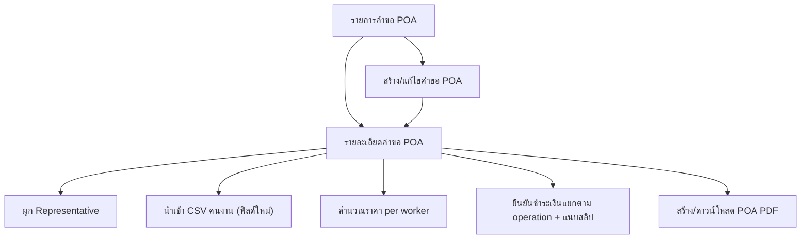

## 1. Product Overview
ปรับปรุงระบบคำขอ POA (Power of Attorney) ให้รองรับ CSV ฟิลด์ใหม่, ผูกคำขอกับตัวแทน, คำนวณราคาแบบต่อคนงาน, ยืนยันชำระเงินแนบสลิปแยกตาม operation และสร้างไฟล์ POA PDF ได้
เป้าหมายคือ ลดงานมือ/ความผิดพลาดของข้อมูล และทำให้ติดตามสถานะชำระเงิน/เอกสารได้ครบในที่เดียว

## 2. Core Features

### 2.1 Feature Module
ระบบ POA ที่ปรับปรุงประกอบด้วยหน้าหลักที่จำเป็นดังนี้:
1. **รายการคำขอ POA**: ค้นหา/กรอง, สร้างคำขอใหม่, นำเข้า CSV ฟิลด์ใหม่, เข้าหน้ารายละเอียด
2. **รายละเอียดคำขอ POA**: ผูกตัวแทน (Representative), จัดการรายการคนงาน, คำนวณราคา per worker, จัดการการชำระเงินแยกตาม operation พร้อมสลิป, สร้าง/ดาวน์โหลด POA PDF
3. **สร้าง/แก้ไขคำขอ POA**: กรอกข้อมูลคำขอ, เลือก operation ที่ต้องทำ, บันทึกเป็นร่าง/ยืนยัน

### 2.2 Page Details
| Page Name | Module Name | Feature description |
|---|---|---|
| รายการคำขอ POA | ตารางรายการ | แสดงรายการคำขอ พร้อมสถานะ (draft/submitted/paid/complete), ยอดรวมประมาณการ, ตัวแทนที่ผูก, วันที่สร้าง/อัปเดต |
| รายการคำขอ POA | ค้นหา/กรอง | ค้นหาตามเลขคำขอ/บริษัท/ตัวแทน และกรองตามสถานะ/ช่วงวันที่ |
| รายการคำขอ POA | สร้างคำขอใหม่ | เปิดฟอร์มสร้างคำขอใหม่และบันทึก |
| รายการคำขอ POA | นำเข้า CSV (ฟิลด์ใหม่) | อัปโหลดไฟล์ CSV, ตรวจ schema/หัวคอลัมน์, map ฟิลด์ใหม่ตามสเปก, แสดงสรุปก่อนนำเข้า (จำนวนแถว/ข้อผิดพลาด), และนำเข้าข้อมูลคนงานเข้าคำขอ |
| รายละเอียดคำขอ POA | สรุปคำขอ | แสดงข้อมูลคำขอหลัก (เลขคำขอ, บริษัท, สถานะ, ตัวแทน, operations ที่เลือก, timestamps) และปุ่ม action ตามสถานะ |
| รายละเอียดคำขอ POA | ผูกตัวแทน (Representative) | ค้นหา/เลือก representative ที่มีอยู่, บันทึกความสัมพันธ์กับคำขอ, แสดงข้อมูลติดต่อหลักของตัวแทนเพื่อใช้ในเอกสาร |
| รายละเอียดคำขอ POA | คนงาน (Workers) | แสดง/แก้ไขรายการคนงานที่นำเข้ามา, แจ้งแถวที่ข้อมูลไม่ครบ, อนุญาตลบ/แก้ไขเฉพาะฟิลด์ที่จำเป็นต่อเอกสาร |
| รายละเอียดคำขอ POA | คำนวณราคา per worker | คำนวณราคาแบบต่อคนงานตาม operation ที่เลือก: แสดงราคา/คน/operation, ยอดรวมแยก operation และรวมทั้งหมด, อัปเดตอัตโนมัติเมื่อจำนวนคนงานหรือ operation เปลี่ยน |
| รายละเอียดคำขอ POA | ยืนยันชำระเงินแยกตาม operation | สำหรับแต่ละ operation: ตั้งสถานะชำระเงิน (unpaid/pending/confirmed), กรอกข้อมูลการโอน (วันที่/จำนวนเงิน/อ้างอิง), แนบสลิป (ไฟล์รูป/PDF), แสดงประวัติการแก้ไขล่าสุด |
| รายละเอียดคำขอ POA | สร้าง/จัดเก็บ POA PDF | สร้าง POA PDF จากข้อมูลคำขอ+คนงาน+ตัวแทน+operations, ให้ผู้ใช้ preview/ดาวน์โหลด และจัดเก็บไฟล์ PDF ที่ผูกกับคำขอ (พร้อมเวอร์ชันล่าสุด) |
| สร้าง/แก้ไขคำขอ POA | ฟอร์มคำขอ | กรอกข้อมูลพื้นฐานของคำขอ และเลือก operation ที่ต้องทำ |
| สร้าง/แก้ไขคำขอ POA | สถานะและการบันทึก | บันทึกเป็นร่าง/ยืนยันส่ง, ตรวจความครบถ้วนก่อนยืนยัน (เช่น มีตัวแทน, มีคนงานอย่างน้อย 1, เลือก operation อย่างน้อย 1) |

## 3. Core Process
**Flow ผู้ใช้งานหลัก**
1) เข้า “รายการคำขอ POA” แล้วกด “สร้างคำขอใหม่”
2) กรอกข้อมูลคำขอและเลือก operations → บันทึกร่าง
3) เข้า “รายละเอียดคำขอ POA” → ผูก representative
4) นำเข้า CSV คนงาน (ฟิลด์ใหม่) → ตรวจข้อผิดพลาด/แก้ไขแถวจำเป็น
5) ระบบคำนวณราคา per worker แยกตาม operation และแสดงยอดรวม
6) ผู้ใช้ดำเนินการชำระเงิน “แยกตาม operation” และแนบสลิป
7) เมื่อครบเงื่อนไข ผู้ใช้กด “สร้าง POA PDF” → preview/ดาวน์โหลด และบันทึกไฟล์ลงระบบ

