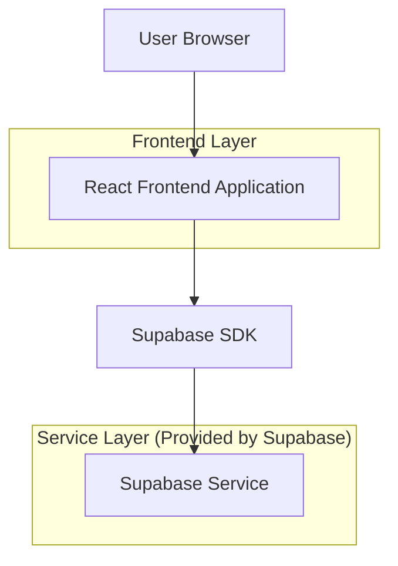
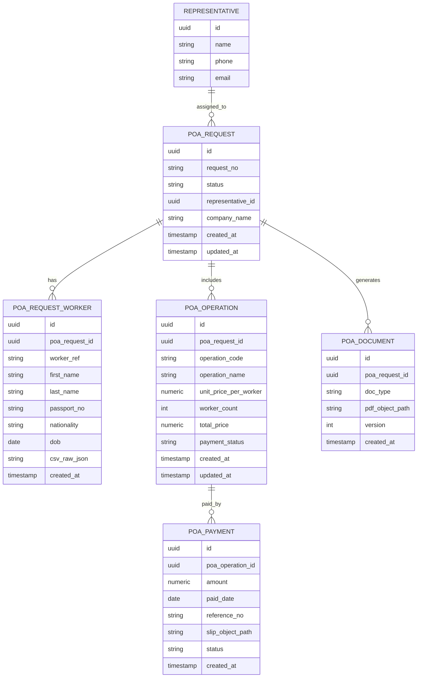

## 1.Architecture design


## 2.Technology Description
- Frontend: React@18 + TypeScript + vite + tailwindcss@3
- Backend: Supabase (Auth + PostgreSQL + Storage)
- PDF generation (client-side): pdf-lib (หรือเทียบเท่าที่ทำ PDF template ได้)

## 3.Route definitions
| Route | Purpose |
|---|---|
| /poa-requests | หน้าแสดงรายการคำขอ POA, ค้นหา/กรอง, สร้างคำขอใหม่, นำเข้า CSV |
| /poa-requests/new | หน้า/ฟอร์มสร้างคำขอ POA และเลือก operations |
| /poa-requests/:id | หน้ารายละเอียดคำขอ: ผูกตัวแทน, จัดการคนงาน, คำนวณราคา, ชำระเงินแยก operation + สลิป, สร้าง/ดาวน์โหลด POA PDF |

## 6.Data model(if applicable)

### 6.1 Data model definition


### 6.2 Data Definition Language
Representative (representatives)
```sql
CREATE TABLE representatives (
  id UUID PRIMARY KEY DEFAULT gen_random_uuid(),
  name TEXT NOT NULL,
  phone TEXT,
  email TEXT,
  created_at TIMESTAMPTZ NOT NULL DEFAULT NOW()
);

GRANT SELECT ON representatives TO anon;
GRANT ALL PRIVILEGES ON representatives TO authenticated;
```

POA Request (poa_requests)
```sql
CREATE TABLE poa_requests (
  id UUID PRIMARY KEY DEFAULT gen_random_uuid(),
  request_no TEXT UNIQUE,
  status TEXT NOT NULL DEFAULT 'draft',
  company_name TEXT,
  representative_id UUID, -- logical FK to representatives.id
  created_at TIMESTAMPTZ NOT NULL DEFAULT NOW(),
  updated_at TIMESTAMPTZ NOT NULL DEFAULT NOW()
);

CREATE INDEX idx_poa_requests_status ON poa_requests(status);
CREATE INDEX idx_poa_requests_updated_at ON poa_requests(updated_at DESC);

GRANT SELECT ON poa_requests TO anon;
GRANT ALL PRIVILEGES ON poa_requests TO authenticated;
```

Workers attached to request (poa_request_workers)
```sql
CREATE TABLE poa_request_workers (
  id UUID PRIMARY KEY DEFAULT gen_random_uuid(),
  poa_request_id UUID NOT NULL, -- logical FK to poa_requests.id
  worker_ref TEXT,              -- optional: row id from CSV
  first_name TEXT,
  last_name TEXT,
  passport_no TEXT,
  nationality TEXT,
  dob DATE,
  csv_raw_json JSONB,           -- store full imported row for traceability
  created_at TIMESTAMPTZ NOT NULL DEFAULT NOW()
);

CREATE INDEX idx_poa_workers_request_id ON poa_request_workers(poa_request_id);

GRANT SELECT ON poa_request_workers TO anon;
GRANT ALL PRIVILEGES ON poa_request_workers TO authenticated;
```

Operations per request (poa_operations)
```sql
CREATE TABLE poa_operations (
  id UUID PRIMARY KEY DEFAULT gen_random_uuid(),
  poa_request_id UUID NOT NULL,      -- logical FK
  operation_code TEXT NOT NULL,
  operation_name TEXT,
  unit_price_per_worker NUMERIC(12,2) NOT NULL DEFAULT 0,
  worker_count INT NOT NULL DEFAULT 0,
  total_price NUMERIC(12,2) NOT NULL DEFAULT 0,
  payment_status TEXT NOT NULL DEFAULT 'unpaid',
  created_at TIMESTAMPTZ NOT NULL DEFAULT NOW(),
  updated_at TIMESTAMPTZ NOT NULL DEFAULT NOW()
);

CREATE INDEX idx_poa_ops_request_id ON poa_operations(poa_request_id);
CREATE INDEX idx_poa_ops_payment_status ON poa_operations(payment_status);

GRANT SELECT ON poa_operations TO anon;
GRANT ALL PRIVILEGES ON poa_operations TO authenticated;
```

Payments per operation (poa_payments)
```sql
CREATE TABLE poa_payments (
  id UUID PRIMARY KEY DEFAULT gen_random_uuid(),
  poa_operation_id UUID NOT NULL,  -- logical FK
  amount NUMERIC(12,2) NOT NULL,
  paid_date DATE,
  reference_no TEXT,
  slip_object_path TEXT,           -- path in Supabase Storage
  status TEXT NOT NULL DEFAULT 'pending',
  created_at TIMESTAMPTZ NOT NULL DEFAULT NOW()
);

CREATE INDEX idx_poa_payments_op_id ON poa_payments(poa_operation_id);

GRANT SELECT ON poa_payments TO anon;
GRANT ALL PRIVILEGES ON poa_payments TO authenticated;
```

Generated documents (poa_documents)
```sql
CREATE TABLE poa_documents (
  id UUID PRIMARY KEY DEFAULT gen_random_uuid(),
  poa_request_id UUID NOT NULL, -- logical FK
  doc_type TEXT NOT NULL DEFAULT 'poa_pdf',
  pdf_object_path TEXT NOT NULL,
  version INT NOT NULL DEFAULT 1,
  created_at TIMESTAMPTZ NOT NULL DEFAULT NOW()
);

CREATE INDEX idx_poa_docs_request_id ON poa_documents(poa_request_id);

GRANT SELECT ON poa_documents TO anon;
GRANT ALL PRIVILEGES ON poa_documents TO authenticated;
```

Storage design (buckets)
- bucket: `poa-slips` (เก็บสลิปชำระเงินแยก operation) → object path แนะนำ: `poa/{poa_request_id}/operations/{poa_operation_id}/slips/{payment_id}/{filename}`
- bucket: `poa-documents` (เก็บไฟล์ POA PDF) → object path แนะนำ: `poa/{poa_request_id}/pdf/v{version}.pdf`

Notes: CSV import ฟิลด์ใหม่
- Frontend ทำ header validation + mapping ตามสเปก CSV ล่าสุด
- เก็บค่าเต็มของแต่ละแถวไว้ใน `csv_raw_json` เพื่อ audit และรองรับฟิลด์ใหม่ในอนาคตโดยไม่ต้องแก้ schema ทุกครั้ง

Notes: Pricing per worker
- เก็บ `unit_price_per_worker` ไว้ที่ระดับ operation และคำนวณ `total_price = unit_price_per_worker * worker_count`
- `worker_count` มาจากจำนวนคนงานที่ผูกกับคำขอ (หรือจำนวนที่ผ่าน validation ตามกติกาของเอกสาร)

Notes: Payment slip by operation
- อนุญาตหลายรายการชำระต่อ operation (หลายสลิป) โดยแยกเป็นหลายแถวใน `poa_payments`
- สถานะ operation (`poa_operations.payment_status`) สรุปจาก payment ล่าสุด/ตรรกะที่ตกลงกัน (เช่น confirmed เมื่อมี payment.status=confirmed อย่างน้อย 1 รายการและยอดครบ)
