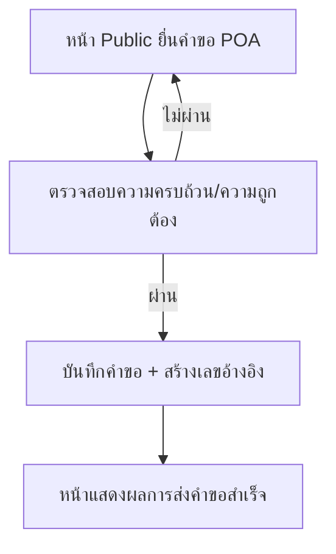

## 1. Product Overview
หน้า Public สำหรับ “ตัวแทน” ยื่นคำขอ POA ได้ทันทีโดยไม่ต้องล็อกอิน โดยต้องเลือกชื่อตัวแทน กรอกข้อมูลให้ครบ และส่งคำขอให้ทีม Operation นำไปดำเนินการต่อ

## 2. Core Features

### 2.1 User Roles
| Role | Registration Method | Core Permissions |
|------|---------------------|------------------|
| ผู้ยื่นคำขอ (ตัวแทน) | ไม่ต้องสมัคร/ไม่ต้องล็อกอิน | เลือกชื่อตัวแทน กรอกแบบฟอร์ม ส่งคำขอ และรับเลขอ้างอิง |
| Operation | นอกขอบเขตหน้านี้ (รับเรื่องไปจัดการ) | เข้าถึงรายการคำขอจากระบบหลังบ้านเพื่อดำเนินการต่อ |

### 2.2 Feature Module
ระบบหน้านี้ประกอบด้วยหน้าหลักที่จำเป็นดังนี้:
1. **หน้า Public ยื่นคำขอ POA**: เลือกชื่อตัวแทน, กรอกฟอร์ม POA, ตรวจความครบถ้วน/ความถูกต้อง, ยืนยันและส่งคำขอ
2. **หน้าแสดงผลการส่งคำขอสำเร็จ**: แสดงเลขอ้างอิง, สรุปข้อมูลสำคัญ, แนวทางขั้นตอนถัดไป

### 2.3 Page Details
| Page Name | Module Name | Feature description |
|-----------|-------------|---------------------|
| หน้า Public ยื่นคำขอ POA | ส่วนหัว + คำอธิบาย | แสดงชื่อหน้าและคำแนะนำสั้น ๆ ว่าต้องกรอกอะไรบ้างก่อนส่งคำขอ |
| หน้า Public ยื่นคำขอ POA | เลือกชื่อตัวแทน | เลือก “ชื่อตัวแทน” จากรายการที่ระบบกำหนดไว้ (จำเป็นต้องเลือกก่อนส่ง) |
| หน้า Public ยื่นคำขอ POA | ฟอร์มข้อมูล POA | กรอกข้อมูลที่จำเป็นของคำขอ POA ให้ครบถ้วน (ช่องบังคับ/ช่องไม่บังคับตามที่กำหนด) |
| หน้า Public ยื่นคำขอ POA | ตรวจสอบความถูกต้อง | ตรวจ required fields, รูปแบบข้อมูลพื้นฐาน (เช่น อีเมล/เบอร์โทร) และแสดงข้อความผิดพลาดแบบรายช่อง |
| หน้า Public ยื่นคำขอ POA | สรุปก่อนส่ง + ยืนยัน | แสดงสรุปข้อมูลสำคัญที่กรอก และให้กดยืนยันเพื่อส่งคำขอ |
| หน้า Public ยื่นคำขอ POA | ส่งคำขอ | บันทึกคำขอเข้าระบบและสร้างเลขอ้างอิง (reference) เพื่อให้ Operation ดำเนินการต่อ |
| หน้าแสดงผลการส่งคำขอสำเร็จ | เลขอ้างอิง + สถานะเริ่มต้น | แสดงเลขอ้างอิงและสถานะเริ่มต้นของคำขอ (เช่น “ส่งแล้ว”) |
| หน้าแสดงผลการส่งคำขอสำเร็จ | สรุปข้อมูลคำขอ | แสดงข้อมูลสรุปที่เกี่ยวข้อง (เช่น ชื่อตัวแทน/วันที่ส่ง) เพื่อใช้เป็นหลักฐาน |
| หน้าแสดงผลการส่งคำขอสำเร็จ | ขั้นตอนถัดไป | แจ้งว่า Operation จะรับเรื่องไปดำเนินการ และให้ผู้ยื่นเก็บเลขอ้างอิงไว้ติดตาม/อ้างอิง |

## 3. Core Process
**Flow ผู้ยื่นคำขอ (ตัวแทน)**
1) เปิดหน้า Public ยื่น POA request
2) เลือกชื่อตัวแทน
3) กรอกข้อมูลในแบบฟอร์มให้ครบ
4) ตรวจทานสรุปข้อมูล แล้วกดยืนยันส่งคำขอ
5) ระบบบันทึกคำขอและแสดงหน้า “ส่งสำเร็จ” พร้อมเลขอ้างอิง

**Flow Operation (การรับเรื่องเพื่อจัดการต่อ)**
1) ตรวจรายการคำขอใหม่จากระบบหลังบ้านโดยอ้างอิงเลขอ้างอิง/ข้อมูลผู้ยื่น
2) ดำเนินการตามกระบวนการภายในของ Operation ต่อไป (นอกขอบเขตหน้านี้)

