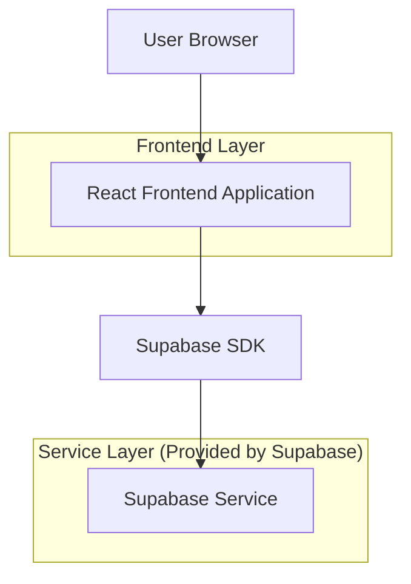
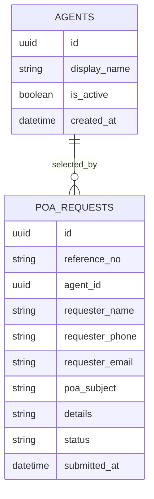

## 1.Architecture design


## 2.Technology Description
- Frontend: React@18 + tailwindcss@3 + vite
- Backend: Supabase (PostgreSQL)

## 3.Route definitions
| Route | Purpose |
|-------|---------|
| / | ทางเข้าหลัก (พาไปหน้าสร้างคำขอ) |
| /poa-request | หน้า Public ยื่นคำขอ POA (ไม่ต้องล็อกอิน) |
| /poa-request/success | หน้าแสดงผลการส่งคำขอสำเร็จ + เลขอ้างอิง |

## 6.Data model(if applicable)

### 6.1 Data model definition


### 6.2 Data Definition Language
Agents Table (agents)
```sql
CREATE TABLE agents (
  id UUID PRIMARY KEY DEFAULT gen_random_uuid(),
  display_name TEXT NOT NULL,
  is_active BOOLEAN NOT NULL DEFAULT TRUE,
  created_at TIMESTAMPTZ NOT NULL DEFAULT NOW()
);

CREATE INDEX idx_agents_is_active ON agents(is_active);

-- minimal grants
GRANT SELECT ON agents TO anon;
GRANT ALL PRIVILEGES ON agents TO authenticated;
```

POA Requests Table (poa_requests)
```sql
CREATE TABLE poa_requests (
  id UUID PRIMARY KEY DEFAULT gen_random_uuid(),
  reference_no TEXT UNIQUE NOT NULL,
  agent_id UUID NOT NULL,
  requester_name TEXT NOT NULL,
  requester_phone TEXT,
  requester_email TEXT,
  poa_subject TEXT NOT NULL,
  details TEXT,
  status TEXT NOT NULL DEFAULT 'submitted',
  submitted_at TIMESTAMPTZ NOT NULL DEFAULT NOW()
);

CREATE INDEX idx_poa_requests_submitted_at ON poa_requests(submitted_at DESC);
CREATE INDEX idx_poa_requests_agent_id ON poa_requests(agent_id);
CREATE INDEX idx_poa_requests_status ON poa_requests(status);

-- minimal grants (ตามแนวทาง Supabase)
GRANT INSERT ON poa_requests TO anon;
GRANT ALL PRIVILEGES ON poa_requests TO authenticated;
```

RLS policy (แนวทางขั้นต่ำ)
```sql
-- เปิด RLS
ALTER TABLE agents ENABLE ROW LEVEL SECURITY;
ALTER TABLE poa_requests ENABLE ROW LEVEL SECURITY;

-- Public เห็นรายชื่อ agent ที่เปิดใช้งาน
CREATE POLICY "anon_read_active_agents"
ON agents FOR SELECT
TO anon
USING (is_active = TRUE);

-- Public ส่งคำขอได้ (เฉพาะ insert)
CREATE POLICY "anon_insert_poa_request"
ON poa_requests FOR INSERT
TO anon
WITH CHECK (status = 'submitted');

-- ผู้ใช้ที่ล็อกอิน (เช่น Operation ภายหลัง) จัดการได้เต็ม
CREATE POLICY "authenticated_all_poa_requests"
ON poa_requests FOR ALL
TO authenticated
USING (true)
WITH CHECK (true);
```
