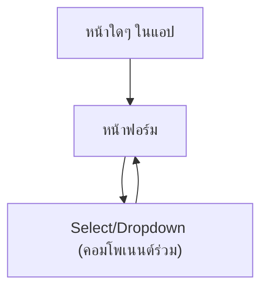

## 1. Product Overview
ทำ “Select/Dropdown Default Template” เป็นมาตรฐานทั้งแอป เพื่อให้ทุกหน้าที่มีการเลือกค่า (dropdown/select) มีหน้าตา/พฤติกรรมเหมือนกันตามภาพที่แนบ 100% และลดความไม่สม่ำเสมอของ UI

## 2. Core Features

### 2.1 Feature Module
ความต้องการนี้ประกอบด้วยหน้าหลักขั้นต่ำดังนี้:
1. **หน้าฟอร์ม (ทุกหน้าที่มี Select/Dropdown)**: ใช้คอมโพเนนต์ Select มาตรฐาน (label + field + dropdown menu)
2. **หน้าคู่มือคอมโพเนนต์ (สำหรับทีมภายใน)**: สเปกการใช้งาน/ตัวอย่าง/ข้อห้าม เพื่อให้ทุกหน้าดึงคอมโพเนนต์จากจุดรวมศูนย์เดียวกัน

### 2.2 Page Details
| Page Name | Module Name | Feature description |
|---|---|---|
| หน้าฟอร์ม (ทุกหน้า) | Select Field (มาตรฐานทั้งแอป) | แสดง Select แบบ single-select ให้หน้าตาเหมือนภาพ: label ด้านบน + ช่องเลือก (placeholder/value) + ไอคอนลูกศรด้านขวา + เปิดรายการตัวเลือกใต้ช่องเมื่อคลิก |
| หน้าฟอร์ม (ทุกหน้า) | สถานะของช่อง | รองรับสถานะ: default, hover, focus, open, selected, error (ข้อความใต้ช่อง), disabled (ห้ามเปิด dropdown/ห้ามเปลี่ยนค่า) |
| หน้าฟอร์ม (ทุกหน้า) | การเลือกค่า | เลือก option แล้วปิด dropdown ทันทีและสะท้อนค่าที่เลือกในช่อง, รองรับการเลื่อน (scroll) เมื่อรายการยาว |
| หน้าฟอร์ม (ทุกหน้า) | การเข้าถึง (Accessibility) | รองรับคีย์บอร์ด: Tab โฟกัส, Enter/Space เปิด-เลือก, ↑/↓ เลื่อนรายการ, Esc ปิด, ใช้ label เชื่อมกับ field และประกาศสถานะ error ให้ screen reader |
| หน้าคู่มือคอมโพเนนต์ | จุดรวมศูนย์คอมโพเนนต์ | ระบุว่า “ห้ามใช้ Select จากไลบรารีโดยตรงในหน้า” ต้อง import จากจุดรวมศูนย์เท่านั้น เพื่อคุม UI ให้ตรงภาพ 100% |
| หน้าคู่มือคอมโพเนนต์ | ตัวอย่างการใช้งาน | ตัวอย่างการใช้งานในฟอร์ม: options, value, onChange, placeholder, disabled, error message, ขนาด dropdown และ z-index |

## 3. Core Process
**โฟลว์ผู้ใช้ (ผู้กรอกฟอร์ม):**
1) ผู้ใช้คลิกช่อง Select (หรือกด Tab มาโฟกัสแล้วกด Enter/Space)
2) ระบบเปิด dropdown menu ใต้ช่อง (ชิดซ้าย ความกว้างเท่าช่อง)
3) ผู้ใช้เลื่อนรายการ (ถ้ามี) และคลิกเลือก option
4) ระบบปิด dropdown และแสดงค่าที่เลือกในช่องทันที
5) หากฟอร์ม validate ไม่ผ่าน ระบบแสดง error ใต้ช่องและคงค่าเดิมไว้

