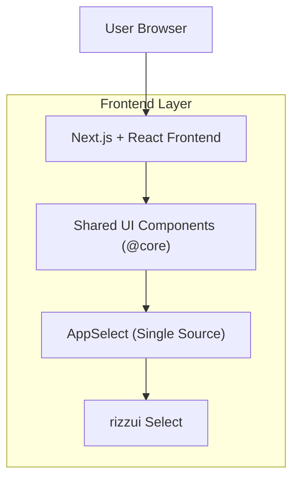

## 1.Architecture design

## 2.Technology Description
- Frontend: Next.js@15 + React@19 + TypeScript + tailwindcss
- UI Component Base: rizzui (ใช้เฉพาะผ่าน wrapper ของแอป)
- Backend: None (เป็นคอมโพเนนต์ UI ฝั่ง Frontend)

## 3.Route definitions
| Route | Purpose |
|---|---|
| /(ทุก route ที่มีฟอร์ม) | เรียกใช้คอมโพเนนต์ Select มาตรฐานเหมือนกันทุกหน้า |
| /internal/component-guides/select (ถ้ามี) | หน้าคู่มือภายในสำหรับสเปก/ตัวอย่างการใช้งาน Select Template |

## 4.API definitions (If it includes backend services)
ไม่มี

## จุดรวมศูนย์คอมโพเนนต์ (สำคัญ)
**เป้าหมาย:** ให้ทุกหน้าใช้ Select ตัวเดียวกัน 100% เพื่อคุม UI/interaction ให้ตรงภาพ

**จุดรวมศูนย์ (แนะนำตามโครงสร้าง monorepo ปัจจุบัน):**
- คอมโพเนนต์หลัก: `packages/isomorphic-core/src/ui/app-select.tsx` (Wrapper ของ rizzui Select)
- วิธี import (มาตรฐาน): `import AppSelect from '@core/ui/app-select'`

**กติกา:**
- ห้าม import `Select` จาก `rizzui` ในหน้าเพจโดยตรง (ยกเว้นภายใน `@core/ui/app-select.tsx`)
- การปรับหน้าตา (className / dropdownClassName / labelClassName / error) ต้องถูกรวมอยู่ใน AppSelect เพื่อให้สม่ำเสมอ
