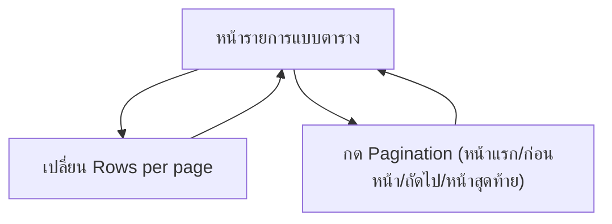

## 1. Product Overview
กำหนด “Table Template มาตรฐาน” สำหรับตารางรายการทุกหน้าภายในแอป โดยมีแถบ **Rows per page** และ **Pagination** รูปแบบเดียวกันตามภาพ
เพื่อให้ UX สม่ำเสมอและลดงานทำซ้ำ ด้วยจุดรวมศูนย์คอมโพเนนต์ที่เรียกใช้ซ้ำได้ทั้งแอป

## 2. Core Features

### 2.1 Feature Module
ความต้องการนี้ประกอบด้วยหน้าหลักขั้นต่ำดังนี้:
1. **หน้ารายการแบบตาราง (ทุกโมดูลที่เป็น List)**: ตารางข้อมูล + แถบ Rows per page + pagination มาตรฐานที่ใช้ร่วมกัน

### 2.3 Page Details
| Page Name | Module Name | Feature description |
|-----------|-------------|---------------------|
| หน้ารายการแบบตาราง (ทุกโมดูลที่เป็น List) | ตารางข้อมูล (Table) | แสดงข้อมูลเป็นตารางพร้อมหัวตารางและแถวข้อมูล |
| หน้ารายการแบบตาราง (ทุกโมดูลที่เป็น List) | Table Template (มาตรฐาน) | รวมรูปแบบส่วนท้ายตารางให้เหมือนกันทุกหน้า โดยประกอบด้วย: Rows per page + pagination |
| หน้ารายการแบบตาราง (ทุกโมดูลที่เป็น List) | Rows per page | เปลี่ยนจำนวนแถวต่อหน้า (เช่น 5/10/15/20/25) และรีเฟรชรายการตามจำนวนใหม่ |
| หน้ารายการแบบตาราง (ทุกโมดูลที่เป็น List) | Pagination | เปลี่ยนหน้าเพื่อดูรายการถัดไป/ก่อนหน้า และปิดการใช้งานปุ่มเมื่อไปต่อไม่ได้ |
| หน้ารายการแบบตาราง (ทุกโมดูลที่เป็น List) | จุดรวมศูนย์เพื่อใช้ซ้ำ | กำหนดคอมโพเนนต์ส่วนกลาง 1 จุดสำหรับแถบ Rows per page + pagination เพื่อให้ทุกตารางเรียกใช้คอมโพเนนต์เดียวกัน |

## 3. Core Process
ผู้ใช้เข้า “หน้ารายการแบบตาราง” แล้วดูข้อมูลในตาราง จากนั้นสามารถเลือกจำนวนแถวต่อหน้า (Rows per page) เพื่อเปลี่ยนปริมาณข้อมูลที่แสดงในแต่ละหน้า และกดปุ่ม pagination เพื่อไปหน้าถัดไป/ก่อนหน้า โดยระบบต้องอัปเดตตารางให้ตรงกับหน้าปัจจุบันและจำนวนแถวต่อหน้าเสมอ

