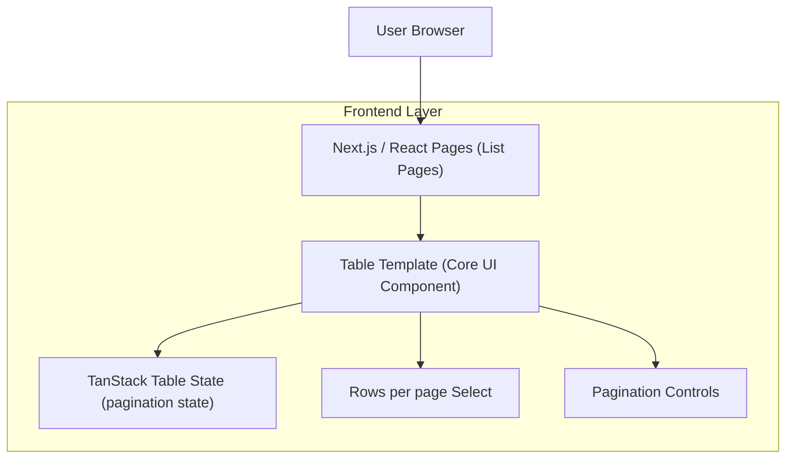

## 1.Architecture design

## 2.Technology Description
- Frontend: Next.js@15 + React@19 + TypeScript + tailwindcss@3
- UI: rizzui (Select/ActionIcon/Text/Flex/Grid)
- Table State: @tanstack/react-table@8
- Backend: None (ใช้กับแหล่งข้อมูลของแต่ละหน้าเดิม)

## 3.Route definitions
| Route | Purpose |
|-------|---------|
| /.../(list) | หน้ารายการแบบตารางในแต่ละโมดูล ซึ่งต้องใช้ Table Template มาตรฐานร่วมกัน |

## 6.Data model(if applicable)
ไม่จำเป็น (เป็นคอมโพเนนต์ UI มาตรฐาน)

---

### แนวทาง “จุดรวมศูนย์เพื่อใช้ซ้ำทั้งแอป”
- จุดรวมศูนย์ที่มีอยู่แล้วสำหรับแถบส่วนท้ายตาราง: `packages/isomorphic-core/src/components/table/pagination.tsx`
- เป้าหมายการใช้งาน: ทุกหน้าที่เป็นตารางต้องเรียกใช้คอมโพเนนต์ pagination จากจุดนี้เท่านั้น (ห้ามทำ pagination UI ซ้ำในหน้า)
- หากต้องการ “template ตารางเริ่มต้น” ให้ครบชุด แนะนำสร้าง wrapper เพิ่มใน core (เช่น `TableTemplate` หรือ `StandardTableSection`) ที่รวม:
  - `@core/components/table` (MainTable)
  - `@core/components/table/pagination` (Rows per page + pagination)
  - (ถ้ามีในหน้านั้น) `@core/components/table/footer`
