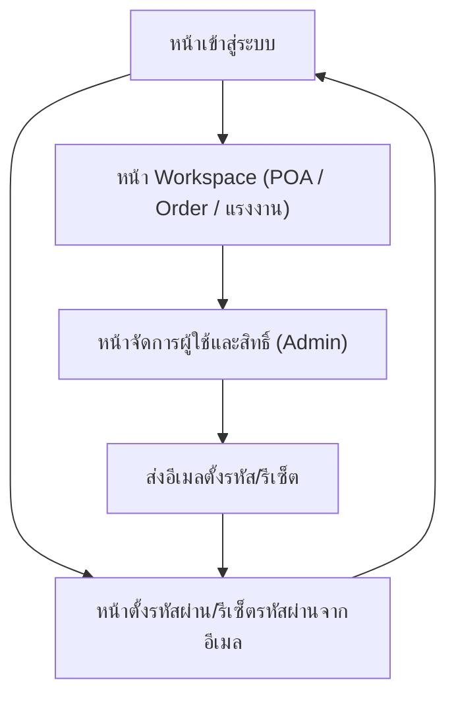

## 1. Product Overview
ระบบจัดการผู้ใช้และสิทธิ์เพื่อควบคุมการเข้าถึงข้อมูล POA (ของตัวแทนและการดำเนินการโดย Operation) และข้อมูล order/แรงงานตามบทบาทงานและความสัมพันธ์ในองค์กร
ช่วยให้ Admin จัดการวงจรผู้ใช้ (เพิ่ม/ลบ/ยืนยันอีเมล/ตั้งรหัส/รีเซ็ตรหัส) ได้อย่างเป็นมาตรฐานและตรวจสอบได้

## 2. Core Features

### 2.1 User Roles
| Role | Registration Method | Core Permissions |
|------|---------------------|------------------|
| Admin | สร้างโดยระบบ/องค์กร | เพิ่ม/ลบ/จัดการผู้ใช้, กำหนดบทบาทและความสัมพันธ์ (Employer/ทีม), ดูข้อมูลตามสิทธิ์สูงสุดที่กำหนด |
| Sale | ถูกเพิ่มโดย Admin และรับอีเมลตั้งรหัสผ่าน | เห็นข้อมูล order/แรงงานตามขอบเขตที่กำหนด (เช่น ตามนายจ้าง/ทีม/รายการที่รับผิดชอบ) |
| Operation | ถูกเพิ่มโดย Admin และรับอีเมลตั้งรหัสผ่าน | จัดการและเห็นข้อมูล POA ตามที่ได้รับมอบหมาย, เห็นข้อมูล order/แรงงานตามขอบเขตที่กำหนด |
| Employer | ถูกเพิ่มโดย Admin และ “ผูกนายจ้าง” | เห็นข้อมูล order ของ “นายจ้างที่ผูกไว้” แบบดูอย่างเดียว และแก้ไขข้อมูลแรงงานของ “นายจ้างที่ผูกไว้” ได้ |
| Representative (หัวหน้าทีม/ลูกทีม) | ถูกเพิ่มโดย Admin และกำหนดสถานะหัวหน้าทีม/ลูกทีม | เข้าได้เฉพาะหน้า/โมดูลคำขอ POA; หัวหน้าทีมเห็นคำขอของตนเองและลูกทีม, ลูกทีมเห็นเฉพาะของตนเอง |

### 2.2 Feature Module
1. **หน้าเข้าสู่ระบบ**: ลงชื่อเข้าใช้ด้วยอีเมล/รหัสผ่าน
2. **หน้าตั้งรหัสผ่าน/รีเซ็ตรหัสผ่านจากอีเมล**: ยืนยันอีเมลด้วยลิงก์, ตั้งรหัสผ่านใหม่, รีเซ็ตรหัสผ่าน
3. **หน้าจัดการผู้ใช้และสิทธิ์ (Admin)**: เพิ่ม/ลบผู้ใช้, กำหนดบทบาท, ผูกนายจ้าง, ตั้งหัวหน้าทีม/ลูกทีม, ส่งอีเมลตั้งรหัส/รีเซ็ต
4. **หน้า Workspace (แสดงโมดูลตามบทบาท)**: 
   - **คำขอ POA**: สำหรับ Representative (เฉพาะ) และ Operation (จัดการ)
   - **Order**: สำหรับ Employer (ดูอย่างเดียว) และบทบาทภายในตามขอบเขต
   - **แรงงาน**: สำหรับ Employer (แก้ไขได้) และบทบาทภายในตามขอบเขต

### 2.3 Page Details
| Page Name | Module Name | Feature description |
|-----------|-------------|---------------------|
| หน้าเข้าสู่ระบบ | แบบฟอร์มเข้าสู่ระบบ | ลงชื่อเข้าใช้ด้วยอีเมล/รหัสผ่าน และแสดงข้อผิดพลาดเมื่อข้อมูลไม่ถูกต้อง |
| หน้าเข้าสู่ระบบ | ลิงก์ลืมรหัสผ่าน | เริ่มกระบวนการรีเซ็ตรหัสผ่านโดยส่งอีเมลรีเซ็ตไปยังอีเมลที่กรอก |
| หน้าตั้งรหัสผ่าน/รีเซ็ตรหัสผ่านจากอีเมล | ตรวจสอบโทเค็นจากลิงก์ | ตรวจสอบความถูกต้องของลิงก์ (หมดอายุ/ใช้แล้ว/ไม่ถูกต้อง) และแสดงสถานะที่เหมาะสม |
| หน้าตั้งรหัสผ่าน/รีเซ็ตรหัสผ่านจากอีเมล | ตั้งรหัสผ่านใหม่ | ตั้งรหัสผ่านใหม่ตามนโยบายขั้นต่ำ และบันทึกเพื่อให้เข้าสู่ระบบได้ |
| หน้าตั้งรหัสผ่าน/รีเซ็ตรหัสผ่านจากอีเมล | รีเซ็ตรหัสผ่าน | อนุญาตตั้งรหัสผ่านใหม่จากลิงก์รีเซ็ต และแจ้งผลสำเร็จ/ล้มเหลว |
| หน้าจัดการผู้ใช้และสิทธิ์ (Admin) | รายการผู้ใช้ | แสดงรายชื่อผู้ใช้ พร้อมสถานะ (เปิดใช้งาน/ปิดใช้งาน/รอการตั้งรหัส) และบทบาทปัจจุบัน |
| หน้าจัดการผู้ใช้และสิทธิ์ (Admin) | เพิ่มผู้ใช้ | เพิ่มผู้ใช้ด้วยอีเมล และกำหนดบทบาท (Sale/Operation/Employer/Representative) พร้อมข้อมูลจำเป็น (เช่น นายจ้าง/ทีม) |
| หน้าจัดการผู้ใช้และสิทธิ์ (Admin) | ส่งอีเมลยืนยันตั้งรหัส | ส่งอีเมลให้ผู้ใช้ตั้งรหัสผ่านครั้งแรก (ลิงก์แบบใช้ครั้งเดียว/มีอายุ) |
| หน้าจัดการผู้ใช้และสิทธิ์ (Admin) | รีเซ็ตรหัสผ่านผู้ใช้ | สั่งส่งอีเมลรีเซ็ตรหัสผ่านให้ผู้ใช้เมื่อร้องขอหรือมีเหตุจำเป็น |
| หน้าจัดการผู้ใช้และสิทธิ์ (Admin) | ลบผู้ใช้ | ลบผู้ใช้ออกจากระบบ (หรือปิดใช้งานตามนโยบาย) และกันไม่ให้เข้าถึงข้อมูลอีก |
| หน้าจัดการผู้ใช้และสิทธิ์ (Admin) | ผูกนายจ้าง (สำหรับ Employer) | กำหนด/แก้ไขนายจ้างที่ผู้ใช้ Employer ถูกผูก เพื่อใช้เป็นขอบเขตการมองเห็นข้อมูล |
| หน้าจัดการผู้ใช้และสิทธิ์ (Admin) | โครงสร้างทีม (Representative) | กำหนดหัวหน้าทีม/ลูกทีม และขอบเขตที่หัวหน้าทีมมองเห็นข้อมูลของลูกทีม |
| หน้า Workspace (แสดงโมดูลตามบทบาท) | ตัวกรองตามสิทธิ์ | จำกัดตัวเลือกตัวกรองให้สอดคล้องกับสิทธิ์ (เช่น เห็นเฉพาะนายจ้าง/ทีม/รายการที่มีสิทธิ์) |
| หน้า Workspace (คำขอ POA) | รายการคำขอ POA | แสดงรายการคำขอ POA เฉพาะที่ผู้ใช้มีสิทธิ์เห็นตามบทบาทและความสัมพันธ์ของทีม (เฉพาะ Representative/Operation/Admin) |
| หน้า Workspace (Orders) | รายการข้อมูล Order | แสดงรายการ order เฉพาะที่ผู้ใช้มีสิทธิ์เห็น; สำหรับ Employer เป็น view only |
| หน้า Workspace (แรงงาน) | รายการข้อมูลแรงงาน | แสดงรายการแรงงานเฉพาะที่ผู้ใช้มีสิทธิ์เห็น; สำหรับ Employer แก้ไขข้อมูลแรงงานได้ |

## 3. Core Process
**Admin Flow (จัดการผู้ใช้และสิทธิ์)**
1) Admin เข้าสู่ระบบ → เข้า “จัดการผู้ใช้และสิทธิ์”
2) กด “เพิ่มผู้ใช้” → กรอกอีเมล → เลือกประเภทผู้ใช้ (Sale/Operation/Employer/Representative)
3) หากเป็น Employer: เลือกนายจ้างที่จะผูก
4) หากเป็น Representative: เลือกสถานะ (หัวหน้าทีม/ลูกทีม) และกำหนดความสัมพันธ์หัวหน้าทีม-ลูกทีม
5) กด “ส่งอีเมลตั้งรหัส” ให้ผู้ใช้ → ผู้ใช้กดลิงก์ในอีเมล → ตั้งรหัสผ่าน → เข้าระบบได้
6) เมื่อต้องการรีเซ็ตรหัส: Admin กด “รีเซ็ต” → ระบบส่งอีเมลรีเซ็ต → ผู้ใช้ตั้งรหัสใหม่
7) เมื่อต้องการนำผู้ใช้ออก: Admin ลบ/ปิดใช้งานผู้ใช้ → ผู้ใช้ไม่สามารถเข้าสู่ระบบ/เข้าถึงข้อมูล

**User Flow (Sale/Operation/Employer/Representative)**
1) ผู้ใช้ได้รับอีเมลตั้งรหัส → เปิดลิงก์ → ตั้งรหัสผ่าน
2) ผู้ใช้เข้าสู่ระบบ → เข้า “Workspace” และเห็นเฉพาะโมดูลที่มีสิทธิ์
3) ระบบแสดงข้อมูลตามสิทธิ์: 
- Employer: เห็น order (view only) และแรงงาน (editable) ของนายจ้างที่ผูกไว้
- Representative หัวหน้าทีม: เห็นของตนเองและลูกทีม
- Representative ลูกทีม: เห็นของตนเอง
- Sale/Operation: เห็นตามขอบเขตที่ Admin กำหนด (เช่น นายจ้าง/ทีม/รายการที่รับผิดชอบ)

