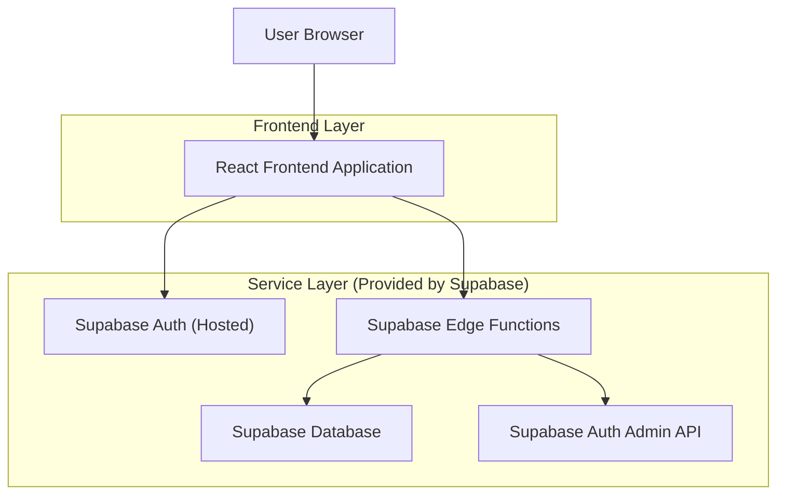
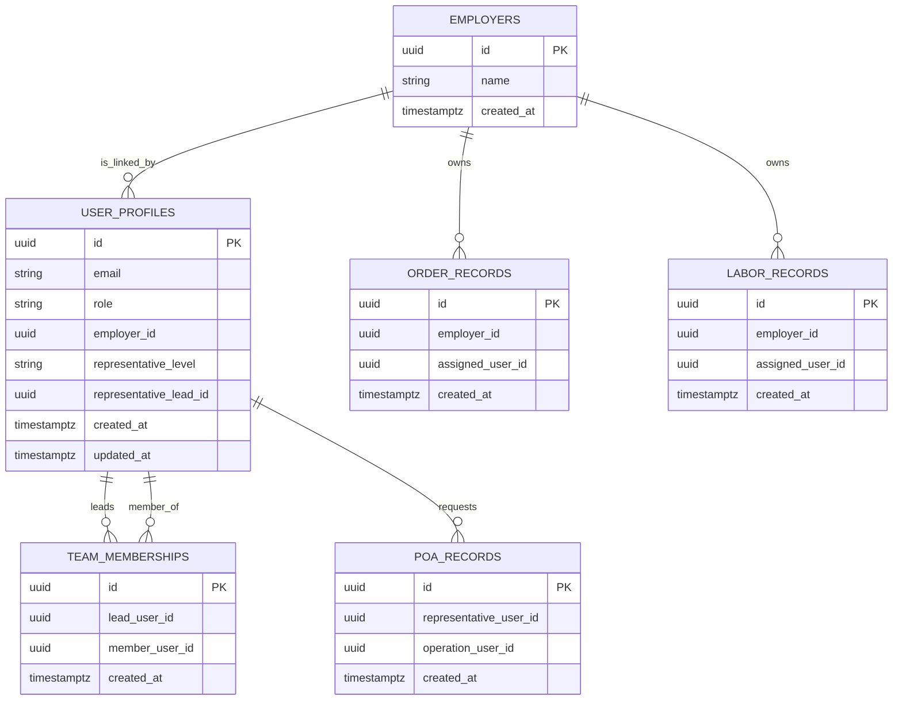

## 1.Architecture design


## 2.Technology Description
- Frontend: React@18 + TypeScript + vite + tailwindcss@3
- Backend: Supabase (Auth + Database) + Supabase Edge Functions (สำหรับงานที่ต้องใช้ service role)

## 3.Route definitions
| Route | Purpose |
|-------|---------|
| /login | หน้าเข้าสู่ระบบ และเริ่ม “ลืมรหัสผ่าน” |
| /auth/password | หน้าตั้งรหัสผ่าน/รีเซ็ตรหัสผ่านจากลิงก์อีเมล |
| /admin/users | หน้าจัดการผู้ใช้และสิทธิ์ (เฉพาะ Admin) |
| /workspace | หน้า Workspace ที่แสดงโมดูลตามบทบาท (POA/Orders/แรงงาน) |

## 4.API definitions
### 4.1 Core Types (TypeScript)
```ts
export type UserRole = "admin" | "sale" | "operation" | "employer" | "representative";

export type RepresentativeLevel = "lead" | "member";

export interface UserProfile {
  id: string; // auth.user.id
  email: string;
  role: UserRole;
  employer_id?: string | null; // สำหรับ employer ที่ผูกนายจ้าง
  representative_level?: RepresentativeLevel | null;
  representative_lead_id?: string | null; // ถ้าเป็น member จะชี้ไปที่ lead
  created_at: string;
  updated_at: string;
}

export interface Employer {
  id: string;
  name: string;
}

export interface POARecord {
  id: string;
  representative_user_id: string; // เจ้าของคำขอ (ตัวแทน)
  operation_user_id?: string | null; // ผู้ดำเนินการ (Operation) ถ้ามีการมอบหมาย
  created_at: string;
}

export interface OrderRecord {
  id: string;
  employer_id: string;
  assigned_user_id?: string | null;
  created_at: string;
}

export interface LaborRecord {
  id: string;
  employer_id: string;
  assigned_user_id?: string | null;
  created_at: string;
}
```

### 4.2 Edge Functions (Privileged)
> ฟังก์ชันเหล่านี้ต้องใช้ Supabase service role key และต้องตรวจสิทธิ์ว่า caller เป็น Admin เท่านั้น

- POST /functions/v1/admin-create-user
  - Purpose: Admin เพิ่มผู้ใช้และส่งอีเมลเชิญตั้งรหัสผ่าน
  - Body: { email, role, employer_id?, representative_level?, representative_lead_id? }

- POST /functions/v1/admin-delete-user
  - Purpose: Admin ลบ/ปิดใช้งานผู้ใช้
  - Body: { user_id }

- POST /functions/v1/admin-send-reset-password
  - Purpose: Admin ส่งอีเมลรีเซ็ตรหัสผ่านให้ผู้ใช้
  - Body: { email }

## 6.Data model(if applicable)

### 6.1 Data model definition


### 6.2 Data Definition Language
> หมายเหตุ: ใช้ logical foreign keys ตามแนวทาง (ไม่บังคับ FK จริง) และเปิด RLS ทุกตารางที่มีข้อมูลธุรกิจ

Employers (employers)
```sql
CREATE TABLE employers (
  id UUID PRIMARY KEY DEFAULT gen_random_uuid(),
  name TEXT NOT NULL,
  created_at TIMESTAMPTZ NOT NULL DEFAULT now()
);

ALTER TABLE employers ENABLE ROW LEVEL SECURITY;

GRANT SELECT ON employers TO anon;
GRANT ALL PRIVILEGES ON employers TO authenticated;
```

User Profiles (user_profiles)
```sql
CREATE TABLE user_profiles (
  id UUID PRIMARY KEY, -- equals auth.users.id
  email TEXT NOT NULL,
  role TEXT NOT NULL CHECK (role IN ('admin','sale','operation','employer','representative')),
  employer_id UUID NULL,
  representative_level TEXT NULL CHECK (representative_level IN ('lead','member')),
  representative_lead_id UUID NULL,
  created_at TIMESTAMPTZ NOT NULL DEFAULT now(),
  updated_at TIMESTAMPTZ NOT NULL DEFAULT now()
);

ALTER TABLE user_profiles ENABLE ROW LEVEL SECURITY;

GRANT SELECT ON user_profiles TO anon;
GRANT ALL PRIVILEGES ON user_profiles TO authenticated;
```

Team Memberships (team_memberships)
```sql
CREATE TABLE team_memberships (
  id UUID PRIMARY KEY DEFAULT gen_random_uuid(),
  lead_user_id UUID NOT NULL,
  member_user_id UUID NOT NULL,
  created_at TIMESTAMPTZ NOT NULL DEFAULT now()
);

ALTER TABLE team_memberships ENABLE ROW LEVEL SECURITY;

GRANT SELECT ON team_memberships TO anon;
GRANT ALL PRIVILEGES ON team_memberships TO authenticated;
```

POA / Order / Labor (ตัวอย่างโครง)
```sql
CREATE TABLE poa_records (
  id UUID PRIMARY KEY DEFAULT gen_random_uuid(),
  representative_user_id UUID NOT NULL,
  operation_user_id UUID NULL,
  created_at TIMESTAMPTZ NOT NULL DEFAULT now()
);
ALTER TABLE poa_records ENABLE ROW LEVEL SECURITY;
GRANT SELECT ON poa_records TO anon;
GRANT ALL PRIVILEGES ON poa_records TO authenticated;

CREATE TABLE order_records (
  id UUID PRIMARY KEY DEFAULT gen_random_uuid(),
  employer_id UUID NOT NULL,
  assigned_user_id UUID NULL,
  created_at TIMESTAMPTZ NOT NULL DEFAULT now()
);
ALTER TABLE order_records ENABLE ROW LEVEL SECURITY;
GRANT SELECT ON order_records TO anon;
GRANT ALL PRIVILEGES ON order_records TO authenticated;

CREATE TABLE labor_records (
  id UUID PRIMARY KEY DEFAULT gen_random_uuid(),
  employer_id UUID NOT NULL,
  assigned_user_id UUID NULL,
  created_at TIMESTAMPTZ NOT NULL DEFAULT now()
);
ALTER TABLE labor_records ENABLE ROW LEVEL SECURITY;
GRANT SELECT ON labor_records TO anon;
GRANT ALL PRIVILEGES ON labor_records TO authenticated;
```

RLS Policy (แนวคิดสรุป)
```sql
-- 1) Admin: เข้าถึงได้ทั้งหมด
-- 2) Employer: ไม่สามารถเข้าถึงข้อมูล POA (POA ไม่ผูกนายจ้าง)
-- 3) Representative Lead: เห็น poa_records.representative_user_id เป็นตนเอง หรือเป็น member ในทีม
-- 4) Representative Member: เห็น poa_records.representative_user_id เป็นตนเอง
-- 5) Operation: เห็น/จัดการ POA ที่ถูกมอบหมาย (operation_user_id เป็นตนเอง) หรือทั้งหมดตามนโยบายงานที่กำหนด
```
