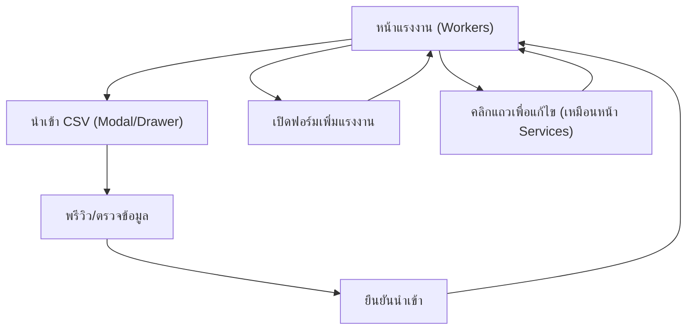

## 1. Product Overview
เพิ่มความสามารถนำเข้าไฟล์ Workers CSV ที่คุณให้มาเข้า DB และปรับ UI หน้าแรงงานให้ใช้งานเร็วขึ้น
โฟกัสคือ “นำเข้าเป็นชุด”, “แถวตารางอ่านง่ายขึ้น”, และ “ซ่อนการเพิ่ม/แก้ไขให้ทำงานเหมือนหน้า Services”

## 2. Core Features

### 2.1 User Roles
| Role | Registration Method | Core Permissions |
|------|---------------------|------------------|
| Admin | มีอยู่แล้วในระบบ | เพิ่ม/แก้ไข/นำเข้าแรงงานทั้งหมดได้ |
| Operation | มีอยู่แล้วในระบบ | เพิ่ม/แก้ไข/นำเข้าแรงงานทั้งหมดได้ |
| Representative | มีอยู่แล้วในระบบ | เพิ่ม/แก้ไข/นำเข้าแรงงานได้เฉพาะที่ตนสร้าง |
| Employer | มีอยู่แล้วในระบบ | ดูรายการแรงงาน (อ่านอย่างเดียว) |

### 2.2 Feature Module
หน้าที่จำเป็นสำหรับฟีเจอร์นี้มีดังนี้:
1. **หน้าแรงงาน (Workers)**: ปุ่มนำเข้า CSV, ฟอร์มเพิ่ม/แก้ไขแบบซ่อน (toggle), ตารางแรงงานแบบแถวใหม่, รีเฟรชและสถานะผลนำเข้า

### 2.3 Page Details
| Page Name | Module Name | Feature description |
|-----------|-------------|---------------------|
| หน้าแรงงาน (Workers) | ส่วนหัวหน้า + ปุ่มการทำงาน | แสดงชื่อหน้า/คำอธิบาย และปุ่ม “รีเฟรช”, “นำเข้า CSV”, “เพิ่มแรงงาน” ตามสิทธิ์ผู้ใช้ |
| หน้าแรงงาน (Workers) | นำเข้าไฟล์ CSV (Modal/Drawer) | อัปโหลดไฟล์ CSV ตามรูปแบบที่กำหนด • อ่าน header/แถวและตรวจความถูกต้องขั้นต่ำ (ค่าว่าง, รูปแบบ) • แสดงตัวอย่าง/สรุปจำนวนที่จะนำเข้า • แสดงรายการ error ต่อแถวพร้อมสาเหตุ • ยืนยันนำเข้า และแสดงผลลัพธ์ (สำเร็จ/ล้มเหลว/ข้าม) |
| หน้าแรงงาน (Workers) | กฎการนำเข้า/การอัปเดตข้อมูล | แปลงข้อมูลจาก CSV เป็นฟิลด์ workers ที่มีอยู่ (full_name, customer_id, passport_no, nationality) • กำหนด created_by_profile_id เป็นผู้ใช้งานปัจจุบัน • ป้องกันการนำเข้าซ้ำด้วยการ “ตรวจซ้ำตาม passport_no เมื่อมีค่า” และกำหนดพฤติกรรมเมื่อพบซ้ำ (อัปเดตหรือข้าม) |
| หน้าแรงงาน (Workers) | ฟอร์มเพิ่ม/แก้ไข (ซ่อนเหมือนหน้า Services) | ซ่อนฟอร์มไว้โดยค่าเริ่มต้น • กดปุ่ม “เพิ่มแรงงาน” เพื่อเปิดฟอร์ม • รองรับโหมด “แก้ไข” ด้วยการคลิกที่แถว (เพื่อให้พฤติกรรมสอดคล้องหน้า Services) • ปุ่มบันทึก/ยกเลิก (และลบถ้ามีสิทธิ์และอยู่ในโหมดแก้ไข) |
| หน้าแรงงาน (Workers) | ตารางแรงงาน (ปรับแถวใหม่) | แสดงรายการแรงงานเป็นตาราง/กริดที่อ่านง่ายขึ้น • แถวเป็นคลิกได้เพื่อเปิดโหมดแก้ไข • จัดวางข้อมูลหลัก-รองในแต่ละคอลัมน์ (เช่น ชื่อแรงงานเด่น, ลูกค้าเป็นรอง) • คงคอลัมน์หลักตามข้อมูลที่มีอยู่ (แรงงาน/ลูกค้า/Passport/สัญชาติ) |
| หน้าแรงงาน (Workers) | การซ่อน Action ตามบทบาท | ซ่อนปุ่ม “นำเข้า CSV” และ “เพิ่มแรงงาน/แก้ไข” สำหรับ Employer • อนุญาตเฉพาะบทบาทที่มีสิทธิ์ตามระบบเดิม |

## 3. Core Process
**โฟลว์นำเข้า CSV (Admin/Operation/Representative)**
1) ไปที่หน้าแรงงาน → กด “นำเข้า CSV”
2) เลือกไฟล์ CSV → ระบบอ่านไฟล์และตรวจความถูกต้องเบื้องต้น
3) ดูหน้าพรีวิว: จำนวนรายการ, ตัวอย่างแถว, รายการ error (ถ้ามี)
4) กดยืนยันนำเข้า → ระบบบันทึกลงตาราง workers และสรุปผล
5) ตารางรีเฟรชและแสดงข้อมูลล่าสุด

**โฟลว์ปรับปรุงข้อมูลแรงงาน (เหมือนหน้า Services)**
1) ไปที่หน้าแรงงาน → ตารางแสดงแบบแถวใหม่
2) คลิกแถวแรงงาน → เปิดฟอร์มแก้ไขด้านบน (หรือส่วนเดียวกับปุ่มเพิ่ม)
3) แก้ไขข้อมูล → กดบันทึก → รีเฟรชตาราง

