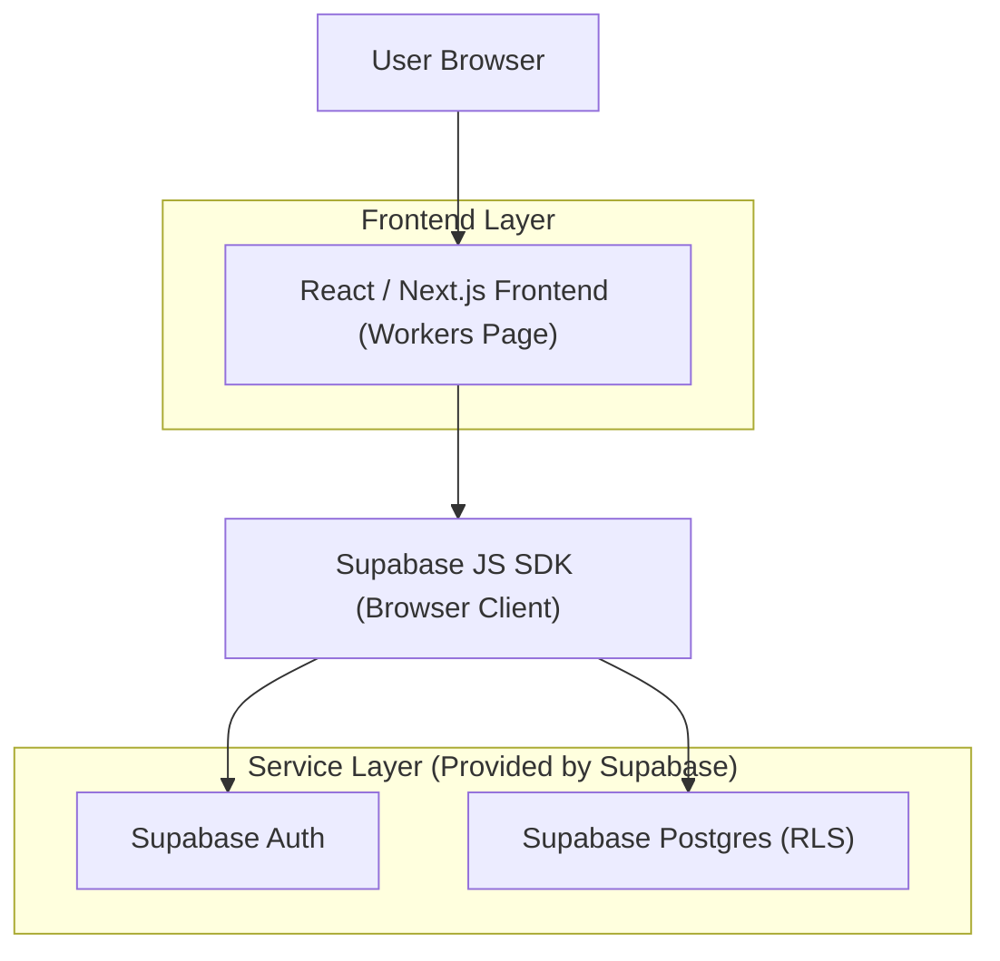
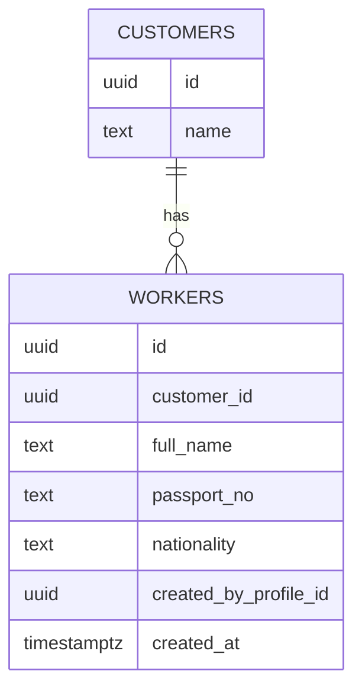

## 1.Architecture design


## 2.Technology Description
- Frontend: React@18 + Next.js (App Router) + tailwindcss + rizzui
- Backend: None (ใช้ Supabase โดยตรงจากฝั่ง Frontend)
- Database/Auth: Supabase (PostgreSQL + RLS + Auth)

## 3.Route definitions
| Route | Purpose |
|-------|---------|
| /workers | แสดงตารางแรงงาน, เปิดฟอร์มเพิ่ม/แก้ไขแบบ toggle, และนำเข้า Workers CSV |

## 4.API definitions (If it includes backend services)
- Backend services: None

## 6.Data model(if applicable)

### 6.1 Data model definition


### 6.2 Data Definition Language
Workers Table (public.workers)
```
CREATE TABLE IF NOT EXISTS public.workers (
  id UUID PRIMARY KEY DEFAULT gen_random_uuid(),
  customer_id UUID REFERENCES public.customers(id) ON DELETE SET NULL,
  full_name TEXT NOT NULL,
  passport_no TEXT,
  nationality TEXT,
  created_by_profile_id UUID REFERENCES public.profiles(id) ON DELETE SET NULL,
  created_at TIMESTAMPTZ NOT NULL DEFAULT NOW()
);

CREATE INDEX IF NOT EXISTS idx_workers_customer_id ON public.workers(customer_id);
CREATE INDEX IF NOT EXISTS idx_workers_created_by_profile_id ON public.workers(created_by_profile_id);
```

## Technical Notes (Implementation-level)
### CSV Import (Client-side)
- อ่านไฟล์ด้วย FileReader (Text) → parse เป็น rows (ใช้ไลบรารี parse เช่น papaparse หรือ parser ภายใน)
- กำหนด mapping จาก header ใน CSV ไปยังฟิลด์ที่มีอยู่ในตาราง workers: full_name, customer_id, passport_no, nationality
- Validation ขั้นต่ำก่อนส่งขึ้น DB
  - ต้องมี full_name
  - passport_no/nationality เป็น optional (แต่ถ้ามีให้ trim)
  - customer_id: ถ้า CSV ไม่มีคอลัมน์ลูกค้า ให้ผู้ใช้เลือก “ลูกค้าเดียวกันสำหรับทุกแถว” ก่อนยืนยันนำเข้า
- Import execution
  - สร้าง payload ต่อแถวและเติม created_by_profile_id = auth.uid() (ตามแนวทางเดิมของหน้า workers)
  - ทำแบบ batch (เช่น 200–500 rows/ครั้ง) เพื่อเลี่ยง request ใหญ่เกิน
  - เก็บผลลัพธ์เป็นสรุป: inserted/updated/skipped/failed พร้อมรายการ error ต่อแถว
- Duplication behavior (ตามข้อกำหนด)
  - ถ้ามี passport_no ให้ใช้เป็นตัวตรวจซ้ำหลัก
  - เมื่อพบซ้ำ: เลือกนโยบายเดียวที่ชัดเจน (เช่น upsert=อัปเดต หรือ skip=ข้าม) และแสดงผลในสรุป
  - หมายเหตุ: หากต้องการ upsert ด้วย Supabase แบบชัดเจน แนะนำเพิ่ม unique index ที่ passport_no (ต้องตัดสินใจตามข้อมูลจริงว่า passport_no ซ้ำได้หรือไม่)

### UI/UX Alignment กับหน้า Services
- ซ่อนฟอร์มเพิ่ม/แก้ไขไว้ (showForm=false) และเปิดด้วยปุ่ม
- ให้แถวตารางเป็น clickable เพื่อเข้าโหมดแก้ไข (แนวเดียวกับ Services)

### Security / RLS Considerations
- ตาราง workers มี RLS อยู่แล้ว: internal (admin/operation) ทำได้ทั้งหมด, representative ทำได้เฉพาะที่ created_by_profile_id=auth.uid(), employer อ่านอย่างเดียว
- ฝั่ง UI ต้องซ่อนปุ่ม/ฟอร์มตาม role เพื่อกัน UX ผิดพลาด แต่ยังต้องพึ่ง RLS เป็นหลัก
