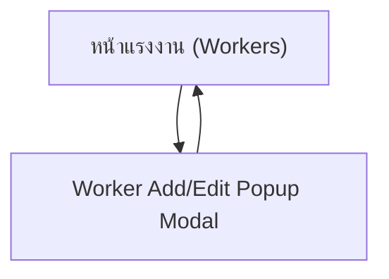

## 1. Product Overview
ปรับหน้าจอ “แก้ไขแรงงาน (Worker Edit)” จากฟอร์มในหน้า (inline/toggle) ให้เป็น **Popup Modal**
โดยใช้แพทเทิร์นเลย์เอาต์เดียวกับ “Edit Representative Popup” และ **คงฟิลด์/พฤติกรรมเดิมทั้งหมด**

## 2. Core Features

### 2.1 User Roles
| Role | Registration Method | Core Permissions |
|------|---------------------|------------------|
| Admin | มีอยู่แล้วในระบบ | เพิ่ม/แก้ไข/ลบแรงงานได้ตามสิทธิ์เดิม |
| Operation | มีอยู่แล้วในระบบ | เพิ่ม/แก้ไข/ลบแรงงานได้ตามสิทธิ์เดิม |
| Representative | มีอยู่แล้วในระบบ | เพิ่ม/แก้ไขแรงงานได้เฉพาะที่ตนสร้าง (ตามสิทธิ์เดิม) |
| Employer | มีอยู่แล้วในระบบ | ดูรายการแรงงานแบบอ่านอย่างเดียว (ตามสิทธิ์เดิม) |

### 2.2 Feature Module
หน้าที่จำเป็นสำหรับการเปลี่ยนแปลงนี้มีดังนี้:
1. **หน้าแรงงาน (Workers)**: ปุ่ม “เพิ่มแรงงาน”, การคลิกแถวเพื่อแก้ไข, และ **Worker Add/Edit Popup Modal**

### 2.3 Page Details
| Page Name | Module Name | Feature description |
|-----------|-------------|---------------------|
| หน้าแรงงาน (Workers) | การเปิดโมดัลเพิ่ม/แก้ไข | เปิดโมดัลโหมด “เพิ่ม” เมื่อกด “เพิ่มแรงงาน” • เปิดโมดัลโหมด “แก้ไข” เมื่อคลิกแถวแรงงาน • ดึงข้อมูลเดิมมา prefill ในโหมดแก้ไข |
| หน้าแรงงาน (Workers) | Worker Add/Edit Popup Modal | แสดงฟิลด์เดิม: ชื่อ-นามสกุล (required), ลูกค้า (select), Passport No., สัญชาติ • ตรวจสอบความถูกต้องตามเดิม • ปุ่ม บันทึก/อัปเดต, ยกเลิก • (ถ้ามีตามสิทธิ์เดิม) ปุ่มลบในโหมดแก้ไข |
| หน้าแรงงาน (Workers) | พฤติกรรมหลังบันทึก | บันทึกสำเร็จแล้วปิดโมดัล • รีเฟรช/อัปเดตตารางให้แสดงข้อมูลล่าสุด • แสดง error/validation แบบเดิมภายในโมดัล |
| หน้าแรงงาน (Workers) | การคงพฤติกรรม/สิทธิ์เดิม | Employer ยังแก้ไขไม่ได้และไม่เห็นปุ่มเพิ่ม • บทบาทที่แก้ไขได้ยังทำได้เหมือนเดิม • ไม่มีการเพิ่มฟิลด์ใหม่หรือเปลี่ยนกฎธุรกิจเดิม |

## 3. Core Process
**โฟลว์เพิ่มแรงงาน (Admin/Operation/Representative)**
1) ไปหน้าแรงงาน → กด “เพิ่มแรงงาน”
2) ระบบเปิด Worker Popup Modal (โหมดเพิ่ม)
3) กรอกข้อมูล → กด “บันทึก” → ปิดโมดัล → ตารางอัปเดต

**โฟลว์แก้ไขแรงงาน (Admin/Operation/Representative)**
1) ไปหน้าแรงงาน → คลิกแถวแรงงาน
2) ระบบเปิด Worker Popup Modal (โหมดแก้ไข) และ prefill
3) แก้ไขข้อมูล → กด “อัปเดต” → ปิดโมดัล → ตารางอัปเดต

