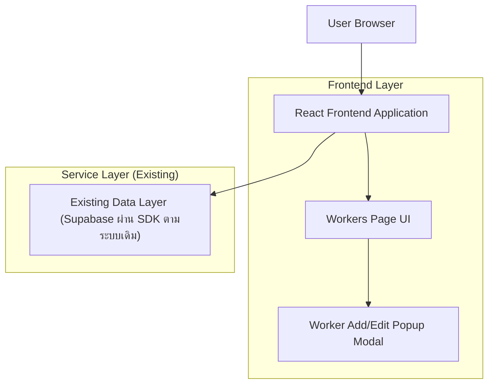

## 1.Architecture design

## 2.Technology Description
- Frontend: React@18 + (UI/Modal component ตามระบบเดิม)
- Backend: ไม่มีการเพิ่มบริการใหม่ (ใช้ Supabase/โครงเดิม)

## 3.Route definitions
| Route | Purpose |
|-------|---------|
| /workers | หน้าแรงงาน + ตารางรายการ + เปิด Worker Add/Edit เป็น Popup Modal |

## 4.API definitions (If it includes backend services)
ไม่มีการเพิ่ม/เปลี่ยน API ใหม่สำหรับงานนี้ (คงการ create/update/delete workers ตามเดิม)

## 6.Data model(if applicable)
ไม่มีการเปลี่ยนแปลง data model สำหรับงานนี้
