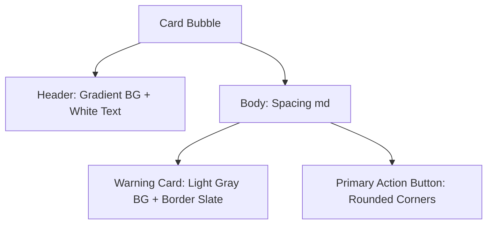

# 📖 คำภีร์การออกแบบและพัฒนา LINE Flex Cards — PERPOS

เอกสารฉบับนี้จัดทำขึ้นเพื่อเป็นคู่มือแนวทาง (Standard Guideline) สำหรับการออกแบบและพัฒนา **LINE Flex Messages** ในโครงการ PERPOS เพื่อควบคุมคุณภาพดีไซน์ให้มีความพรีเมียม สวยงาม ทันสมัย และมีมาตรฐานเดียวกันทั่วทั้งแอปพลิเคชัน

---

## 1. ปรัชญาการออกแบบ (Design Philosophy)

LINE Bot ของ PERPOS ไม่ใช่แค่แชทบอทตอบคำถามทั่วไป แต่เป็น **AI Assistant ประจำองค์กร** ดังนั้น Flex Card ทุกใบที่ส่งออกไปหาผู้ใช้งานจะต้อง:
1. **ดูพรีเมียมตั้งแต่แรกเห็น (Premium Visuals)**: หลีกเลี่ยงดีไซน์แบบเหลี่ยมมุม แบนราบ หรือการใช้สีดิบ ๆ (เช่น แดง เหลือง เขียว เพียว ๆ) โดยหันมาใช้ไล่เฉดสี (Gradients) และขอบมน (Rounded corners)
2. **แบ่งแยกความสำคัญชัดเจน (Visual Hierarchy)**: หัวข้อหลัก (Title) ข้อมูลย่อย (Metadata Grid) และปุ่มกดต้องมีน้ำหนักอักษร (Weight) และสีที่แตกต่างกันเพื่อให้อ่านง่ายใน 1 วินาที
3. **ตารางข้อมูลต้องสมมาตร (Structured Data)**: การใช้คอลัมน์ซ้าย-ขวาต้องมีการจัดระยะ (Flex ratio) ที่สม่ำเสมอ เพื่อให้อ่านง่ายไม่กระโดดไปมา

---

## 2. ระบบดีไซน์ของ PERPOS LINE (LINE UI Tokens)

การสร้างองค์ประกอบของ Flex Message ในรูปแบบ JSON ของ LINE API ควรอิงตามโทนสีและขนาดดังต่อไปนี้:

### 2.1 โทนสีและการจับคู่สีพรีเมียม (Color & Gradient Palettes)

ห้ามใช้สีหลักดิบ ๆ จากระบบแม่สี ให้ใช้ชุดสีและการไล่เฉดสี (Linear Gradient) ที่คัดสรรมาแล้วต่อไปนี้:

| ประเภทกิจกรรม | สีหลัก (Accent Color) | เฉดสีหัวการ์ด (Gradient Header) | สีตัวหนังสือหัวการ์ด | สี Badge / กล่องเนื้อหา |
| :--- | :--- | :--- | :--- | :--- |
| **สำเร็จ / เข้างาน (Success / Check-in)** | `#059669` (Emerald-600) | `Emerald Gradient`:<br>Start: `#059669`<br>End: `#34D399` | `#FFFFFF` | BG: `#F8FAFC`<br>Border: `#E2E8F0`<br>Badge BG: `#D1FAE5`<br>Badge Text: `#065F46` |
| **วิกฤต / แจ้งเตือน / ออกงาน (Critical / Alert / Check-out)** | `#DC2626` (Red-600) | `Rose-Red Gradient`:<br>Start: `#DC2626`<br>End: `#FB7185` | `#FFFFFF` | BG: `#F8FAFC`<br>Border: `#E2E8F0`<br>Badge BG: `#FEE2E2`<br>Badge Text: `#991B1B` |
| **ข้อมูลทั่วไป / อัปเดต (Info / Updates)** | `#2563EB` (Blue-600) | `Blue Gradient`:<br>Start: `#2563EB`<br>End: `#3B82F6` | `#FFFFFF` | BG: `#F8FAFC`<br>Border: `#E2E8F0`<br>Badge BG: `#DBEAFE`<br>Badge Text: `#1D4ED8` |

#### ตัวอย่างการเขียน JSON สำหรับ Gradient Header
```json
"header": {
  "type": "box",
  "layout": "vertical",
  "paddingAll": "16px",
  "background": {
    "type": "linearGradient",
    "angle": "135deg",
    "startColor": "#059669",
    "endColor": "#34D399"
  },
  "contents": [ ... ]
}
```

---

### 2.2 การจัดการอักษร (Typography & Contrast)

การเลือกขนาดและน้ำหนักของตัวหนังสือช่วยควบคุมสายตาผู้ใช้:
- **หัวข้อการ์ด (Card Title)**: ควรใช้ `size: "md"` หรือ `"lg"` ร่วมกับ `weight: "bold"` เสมอ
- **ป้ายกำกับแถวข้อมูล (Metadata Labels)**: ใช้สีเทาอ่อน เช่น `#64748B` เพื่อลดความเด่นลง
- **ค่าข้อมูลย่อย (Metadata Values)**: ใช้สีเข้มเกือบดำ เช่น `#0F172A` หรือ `#1E293B` เพื่อเน้นให้อ่านง่าย
- **การตัดบรรทัด (Wrapping)**: สำหรับฟิลด์ข้อมูลยาว ๆ (เช่น รายละเอียด หรือสถานที่) ต้องกำหนด `wrap: true` เพื่อป้องกันปัญหาข้อความถูกตัดหายในจอมือถือ

---

### 2.3 การจัดแต่งความสมดุล (Spacing, Corner Radius & Buttons)

- **ความโค้งมน (Corner Radius)**: ทุกอย่างต้องมน! กล่องข้อมูลย่อย หรือปุ่มกด ควรใช้ขอบมนแบบ `"md"` (Medium)
- **ระยะห่างภายใน (Paddings & Spacing)**: 
  - ระยะห่างรอบข้างของบับเบิ้ล (PaddingAll) ควรอยู่ที่ `12px` ถึง `16px` เพื่อให้ดูโปร่ง สบายตา
  - ระยะห่างระหว่างฟิลด์ (Spacing) ใน Body ควรใช้ `"md"` หรือ `"lg"`
- **สัดส่วนคอลัมน์ (Flex Ratio Grid)**: 
  - เมื่อนำเสนอข้อมูลแบบ Key-Value ในแถวแนวนอน (Horizontal Box) ให้กำหนด `flex` สำหรับคอลัมน์ซ้ายและขวาให้สมดุลกันเสมอ
  - **อัตราส่วนทองคำของบอท**: ป้ายกำกับซ้ายใช้ `flex: 3` และ ค่าข้อมูลขวาใช้ `flex: 7` ซึ่งจะจัดแถวข้อมูลตรงกันพอดิบพอดี

---

## 3. รูปแบบโครงสร้างการ์ดที่แนะนำ (Standard Layout Templates)

ในโปรเจกต์ PERPOS มีการอัปเกรดรูปแบบการ์ดให้ดีขึ้น โดยใช้โครงสร้างแบบมาตรฐาน 3 แนวทางดังนี้:

### รูปแบบที่ 1: การ์ดคำขอทำงาน (Request Card)
ใช้เมื่อบอทส่งปุ่มเพื่อให้พนักงานกดกระทำผ่านเว็บ (เช่น การ์ดขอเข้างาน/ออกงาน)

- **Header**: ไล่สี Gradient ตามประเภทงาน (เข้างาน = เขียว, ออกงาน = แดง) + ข้อความสีขาวเด่นชัด
- **Body**: 
  - ใช้กล่องสีเหลี่ยมพื้นหลังเทาอ่อน (`#F8FAFC` + Border `#E2E8F0` + ขอบมน `"md"`) ในการอธิบายเงื่อนไข เพื่อจำลองกล่องข้อความเตือนความปลอดภัย
  - วางปุ่ม Action ที่ขอบมนมนสวยงาม พร้อมสีที่สอดคล้องกับหัวการ์ด
- **ตัวอย่างไฟล์จริง**: [handleJustMeIn](file:///Users/iprite/perpos/apps/perpos/src/app/api/just-me/_line.ts#L78-L134)



---

### รูปแบบที่ 2: การ์ดตารางข้อมูลสรุปสำเร็จ (Metadata Success Card)
ใช้สำหรับส่งผลการทำงานเสร็จสิ้น เพื่อสรุปรายงานและบันทึกช่วยจำ (เช่น การ์ดสรุปพิกัด GPS/เวลาลงงานสำเร็จ)

- **Header**: แสดงแถบเฉดสีพรีเมียมพร้อมไอคอนสถานะ เช่น `🟢 CLOCK IN SUCCESS`
- **Body**: วางกล่องคอนเทนเนอร์ขนาดใหญ่ มีความนูนของเส้นขอบเล็กน้อย ภายในประดับประดาด้วยข้อมูลตารางชิดซ้าย-ขวา
  - แถววันที่: `📅 วันที่` (Flex 3) ➡️ `30 พ.ค. 2026` (Flex 7)
  - แถวเวลา: `⏰ เวลาเข้า` (Flex 3) ➡️ `08:15 น.` (Flex 7)
  - แถวสถานที่: `📍 สถานที่` (Flex 3) ➡️ `TMC สำนักงานใหญ่` (Flex 7, Wrap: true)
- **ตัวอย่างไฟล์จริง**: [Clock In Success](file:///Users/iprite/perpos/apps/perpos/src/app/api/just-me/_line.ts#L279-L342)

---

### รูปแบบที่ 3: การ์ดแจ้งเตือนเหตุการณ์ (Alert / Notification Card)
ใช้สำหรับส่งข้อความอัปเดตแจ้งเตือนเมื่อเกิดกิจกรรมสำคัญในระบบ (เช่น มีคนอัปเดต Issue หรือ เปลี่ยนสถานะ Solution)

- **Header**: หัวสีสะดุดตาสอดคล้องกับประเภทข้อความ
- **Body**:
  - หัวข้อเนื้อหา (ตัวหนา สีเข้มเด่นชัด)
  - กล่องคำพูดจำลอง (Quoted Box) สำหรับย่อเนื้อความ/รายละเอียดที่ส่งมา โดยมีฟิลด์จำกัดบรรทัดสูงสูด `maxLines: 4` และทำเนื้อความตัวเอียง (`style: "italic"`)
  - ท้ายกล่อง body จะใส่ข้อมูลผู้กระทำกิจกรรม `👤 ดำเนินการโดย: [ชื่อ]`
- **Footer**: ปุ่มเปิดดูรายละเอียดระบบจริง
- **ตัวอย่างไฟล์จริง**: [issueFlexBubble & statusFlexBubble](file:///Users/iprite/perpos/apps/perpos/src/app/api/crm/_notify.ts#L79-L205)

---

## 4. โครงสร้างโค้ดตัวอย่างที่พรีเมียม (TypeScript Templates)

ตัวอย่างฟังก์ชันการดีไซน์การ์ดที่ใช้งานจริงในระบบ:

### โค้ดสร้างกล่องสเตตัสการเปลี่ยนแปลง (Status Change Badge)
```typescript
function statusFlexBubble(opts: {
  solutionTitle: string;
  changerName: string;
  fromStatus: string;
  toStatus: string;
  deepLink: string;
}) {
  // 1. จัดเตรียม Badge สีสันสวยงามตาม Status ใหม่
  const statusKey = opts.toStatus.toLowerCase().replace(' ', '_');
  let badgeBg = '#F1F5F9';
  let badgeTextColor = '#475569';

  if (statusKey === 'completed') {
    badgeBg = '#D1FAE5';
    badgeTextColor = '#065F46';
  } else if (statusKey === 'cancelled') {
    badgeBg = '#FEE2E2';
    badgeTextColor = '#991B1B';
  }

  return {
    type: 'bubble',
    size: 'kilo',
    header: {
      type: 'box',
      layout: 'vertical',
      paddingAll: '12px',
      background: {
        type: 'linearGradient',
        angle: '135deg',
        startColor: '#2563EB',
        endColor: '#3B82F6'
      },
      contents: [{
        type: 'box',
        layout: 'horizontal',
        spacing: 'sm',
        alignItems: 'center',
        contents: [
          { type: 'text', text: '📋', size: 'sm', flex: 0 },
          { type: 'text', text: 'อัปเดตสถานะ', color: '#FFFFFF', weight: 'bold', size: 'sm' }
        ]
      }]
    },
    body: {
      type: 'box',
      layout: 'vertical',
      spacing: 'md',
      paddingAll: '16px',
      contents: [
        { type: 'text', text: opts.solutionTitle, weight: 'bold', size: 'md', wrap: true, color: '#0F172A' },
        {
          type: 'box',
          layout: 'horizontal',
          spacing: 'md',
          alignItems: 'center',
          backgroundColor: '#F8FAFC',
          paddingAll: '10px',
          cornerRadius: 'md',
          borderWidth: '1px',
          borderColor: '#E2E8F0',
          contents: [
            {
              type: 'box',
              layout: 'vertical',
              backgroundColor: '#E2E8F0',
              cornerRadius: 'sm',
              paddingAll: '4px',
              paddingStart: '8px',
              paddingEnd: '8px',
              contents: [{ type: 'text', text: opts.fromStatus, size: 'xs', color: '#475569', weight: 'bold', align: 'center' }]
            },
            { type: 'text', text: '➡️', size: 'xs', color: '#94A3B8', flex: 0 },
            {
              type: 'box',
              layout: 'vertical',
              backgroundColor: badgeBg,
              cornerRadius: 'sm',
              paddingAll: '4px',
              paddingStart: '8px',
              paddingEnd: '8px',
              contents: [{ type: 'text', text: opts.toStatus, size: 'xs', color: badgeTextColor, weight: 'bold', align: 'center' }]
            }
          ]
        }
      ]
    }
  };
}
```

---

## 5. การทดสอบและเครื่องมือแนะนำ (Testing & Tools)

1. **LINE Flex Message Simulator**: 
   แนะนำให้ใช้เครื่องมืออย่างเป็นทางการของ LINE ในการทดสอบและพรีวิวโครงสร้าง JSON ก่อนเสมอ โดยนำ JSON ของการ์ดไปวางและพรีวิวจริงได้ที่:
   🔗 [LINE Flex Message Simulator](https://developers.line.biz/flex-simulator/)
2. **การทำความสะอาดข้อความก่อนแสดงผล**:
   ก่อนนำข้อความอิสระ (Free text) หรือ Markdown ที่ป้อนโดยผู้ใช้มาแสดงบน Flex Card ควรผ่านฟังก์ชันกรองอักขระพิเศษ (เช่น เครื่องหมาย `#`, `*`, `` ` ``) เสมอ เพื่อรักษาความสะอาดของอินเทอร์เฟซ และป้องกันการ์ดพัง
3. **การตรวจสอบ TypeScript Compilation**:
   ตรวจสอบทุกครั้งหลังเขียน Flex Message เสร็จ เพื่อป้องกัน Syntax error หรือ Type mismatch:
   ```bash
   cd apps/perpos && pnpm exec tsc --noEmit
   ```
